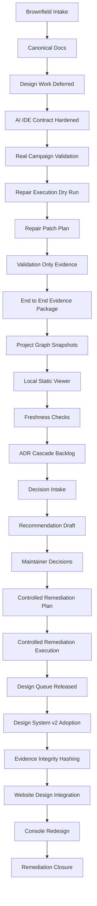

# RepoAssure Progress Snapshot

Status: RepoAssure Design System v2 Adoption v0.1 completed; evidence integrity hashing ready
Generated: 2026-07-18

## Latest Goal

RepoAssure Design System v2 Adoption v0.1

Plain-language explanation: Design System v2 已作为 `@repoassure/design-system` 落地为 workspace 包：37 个组件连同补全的类型声明、三层 token、自托管拉丁字体。官网构建产物哈希与落地前逐字节一致，证明本步骤零视觉变化。

## Next Goal

RepoAssure Evidence Integrity Hashing v0.1

Plain-language explanation: 为产出的 artifact 写入内容哈希、新增校验命令重算比对，并把 signed / cryptographically verifiable 措辞改为 content-hashed / 完整性可独立验证，同时把演示数据换成真实基准跑分产出。

## Goal Sequence

1. RepoAssure Design System v2 Adoption v0.1 — completed
2. RepoAssure Evidence Integrity Hashing v0.1 — active
3. Public Website Claude Design Integration & QA v0.1 — queued
4. Project Intelligence Console Redesign v0.1 — queued
5. Project Intelligence ADR Cascade Remediation Closure v0.1 — re-queued

## Completed Product-Core Goals

- Project Intelligence Console Graph Snapshot Generator v0.1
- Project Intelligence Console Local Static Viewer v0.1
- Project Intelligence Console Graph Freshness and Staleness Checks v0.1
- Project Intelligence ADR Cascade Remediation Backlog v0.1
- Project Intelligence ADR Cascade Remediation Decision Intake v0.1
- Project Intelligence ADR Cascade Remediation Recommendation Draft v0.1
- Project Intelligence ADR Cascade Maintainer Decision Recording v0.1
- Project Intelligence ADR Cascade Controlled Remediation Plan v0.1
- Project Intelligence ADR Cascade Controlled Remediation Execution v0.1 — 11 ADR cascade evidence gaps repaired
- RepoAssure Design System v2 Adoption v0.1 — 37 components vendored, zero bundle change

## Released Goals

- Public Website Claude Design Integration & QA v0.1 — released; `owner_finalizes_claude_design` satisfied by RepoAssure Design System v2.

## Superseded Goals

- Public Website Owner Visual Acceptance & P3 Follow-up Triage v0.1 — superseded; P3 follow-up triage items are absorbed into the redesign rather than executed against the superseded design.

## Re-queued Goals

- Project Intelligence ADR Cascade Remediation Closure v0.1 — was active and not started when the design queue was released; returns to the queue after the console redesign.

## Deferred Goals

None.

## Workflow Map

## Shape Matrix

- command_line
- mcp_server
- web_app
- sdk_package
- composite_product_shape

## Blocked Actions

- repository visibility change
- npm publication
- GitHub release
- public launch
- production marketing announcement
- public custom domain decision
- deployment
- pricing change
- customer contact
- hosted dashboard
- cloud sync
- telemetry
- target repo writes

Website visual redesign is no longer blocked. It is authorized by [ADR-0022](../../docs/adr/0022-repoassure-design-system-v2-and-information-architecture.md) for the goals listed above, and remains separate from deployment authorization.

## Document Basis

- `docs/PRD.md`
- `docs/SPEC.md`
- `docs/DESIGN.md`
- `docs/PLAN.md`
- `docs/adr/0022-repoassure-design-system-v2-and-information-architecture.md`
- `docs/operations/repoassure-design-system-v2-unfreeze-v0.1.md`
- `docs/operations/project-intelligence-adr-cascade-controlled-remediation-execution-v0.1.md`
- `docs/design/website-uiux-roadmap-v0.2.md`
