# RepoAssure Progress Snapshot

Current governance state: RepoAssure M1 Open Evidence Kernel Candidate Boundary Contract Specification Authorization Intake v0.1 completed with `k1_contract_specification_authorization_intake_prepared_without_inferred_choice_specification_schema_or_runtime_changes`. The blank intake records 0/1 decisions and leaves 1/1 pending. Active and next: RepoAssure M1 Open Evidence Kernel Candidate Boundary Contract Specification Authorization Maintainer Decision Recording v0.1 (`ready_to_execute`, `execution_authorization: null`, 尚未授权执行). Original contracts and artifact bytes remain authoritative, K1 remains non-authoritative, M1 remains incomplete, and `auth_redirect` remains `request_revision`.

Preserved K1 governance sequence: RepoAssure M1 Open Evidence Kernel Candidate Boundary Maintainer Decision Intake v0.1 (`m1_open_evidence_kernel_candidate_boundary_decision_intake_prepared_without_selected_decision_or_contract_changes`) → RepoAssure M1 Open Evidence Kernel Candidate Boundary Maintainer Decision Recording v0.1 (`maintainer_approved_k1_for_separately_gated_contract_design_without_schema_or_runtime_implementation_authorization`) → RepoAssure M1 Open Evidence Kernel Candidate Boundary Contract Design Planning v0.1 (`k1_non_authoritative_contract_design_plan_prepared_without_schema_authoritative_contract_or_runtime_implementation`).

Status: K1 contract-specification authorization intake is prepared; explicit maintainer choice remains pending
Generated: 2026-08-03 19:16 Asia/Shanghai

## Active Goal

RepoAssure M1 Open Evidence Kernel Candidate Boundary Contract Specification Authorization Maintainer Decision Recording v0.1 — ready to execute, unauthorized

Plain-language explanation: specification 授权 intake 已完成，但没有选择任何答案。当前维护者决策记录 Goal 的 `execution_authorization: null`，尚未授权执行；未来只有在它获单独授权且维护者提供一个精确 token 后才能记录选择。它仍不能起草 specification、创建 schema、接受权威 contract、实现 adapter/runtime 或推进 M1。原 contracts 与 artifact bytes 继续权威，M1 remains incomplete，auth redirect 仍为 `request_revision`。

Latest completed conclusion: `k1_contract_specification_authorization_intake_prepared_without_inferred_choice_specification_schema_or_runtime_changes`.

Historical interim conclusion: `m1_open_evidence_kernel_candidate_boundary_decision_record_prepared_without_inferred_choice`.

Decision record: `docs/product/strategy/repoassure-m1-open-evidence-kernel-candidate-boundary-maintainer-decision-record-v0.1.md`.

Operation record: `docs/operations/repoassure-m1-open-evidence-kernel-candidate-boundary-maintainer-decision-recording-v0.1.md`.

Prior decision-intake conclusion: `m1_open_evidence_kernel_candidate_boundary_decision_intake_prepared_without_selected_decision_or_contract_changes`.

Prior planning conclusion: `m1_open_evidence_kernel_contract_gap_plan_prepared_with_one_candidate_boundary_without_schema_or_runtime_changes`.

Planning record: `docs/product/strategy/repoassure-m1-open-evidence-kernel-contract-gap-plan-v0.1.md`.

Operation record: `docs/operations/repoassure-m1-open-evidence-kernel-contract-gap-planning-v0.1.md`.

Prior verification-evidence conclusion: `conditional_dead_control_verification_evidence_reconciled_with_durable_errata_without_product_or_historical_record_changes`.

Prior bounded detector audit conclusion: `bounded_detector_implementation_audit_qualified_with_material_evidence_drift_without_product_surface_changes`.

Prior bounded detector implementation conclusion: `conditional_dead_control_bounded_detector_implemented_with_visible_p1_classification_and_fail_closed_prerequisite_evidence`.

Prior detector implementation authorization intake conclusion: `bounded_detector_implementation_authorization_intake_prepared_without_inferred_choice_or_detector_changes`.

Prior manual-gate conclusion: `maintainer_approved_all_five_synthetic_fixture_manual_gates_without_detector_implementation_authorization`.

Prior manual review conclusion: `synthetic_fixture_manual_review_package_prepared_with_five_pending_gate_decisions_without_detector_changes`.

Prior synthetic fixture implementation conclusion: `synthetic_fixture_implemented_and_locally_validated_without_detector_changes_or_manual_gate_completion`.

Prior synthetic fixture implementation approval conclusion: `maintainer_approved_synthetic_fixture_implementation_for_separately_authorized_local_fixture_goal_without_fixture_or_detector_work`.

Prior synthetic fixture authorization intake conclusion: `synthetic_fixture_implementation_authorization_intake_prepared_without_inferred_choice_or_fixture_work`.

Prior synthetic fixture planning conclusion: `synthetic_fixture_bounded_plan_prepared_without_fixture_creation_execution_or_detector_changes`.

Prior fixture-decision conclusion: `maintainer_requested_synthetic_local_fixture_plan_without_fixture_access_or_detector_changes`.

Prior fixture-evidence intake conclusion: `conditional_dead_control_fixture_evidence_readiness_and_authorization_intake_prepared_without_inferred_choice_or_fixture_access`.

Prior gate-evidence conclusion: `conditional_dead_control_gate_evidence_package_prepared_with_all_manual_gates_fail_closed`.

Prior implementation-decision conclusion: `maintainer_approved_conditional_dead_control_implementation_and_requested_auth_redirect_revision_without_detector_changes`.

Prior intake conclusion: `implementation_authorization_intake_prepared_without_inferred_decisions_or_detector_changes`.

Prior design conclusion: `bounded_false_positive_detector_calibration_design_plan_prepared_without_runtime_implementation_or_behavior_change`.

Prior decision conclusion: `maintainer_approved_both_false_positive_detector_calibration_questions_for_separately_gated_design_planning_without_detector_implementation_authorization`.

Trigger conclusion: `false_positive_detector_runtime_calibration_decision_reopening_package_prepared_without_per_question_decisions_or_detector_changes`.

Historical direction conclusion: `maintainer_selected_false_positive_detector_runtime_calibration_without_underlying_work_authorization`.

Historical direction-package conclusion: `remaining_gated_product_work_direction_package_prepared_without_decision_or_execution`.

Historical interim conclusion: `maintainer_direction_decision_record_prepared_without_inferred_choice`.

Operation record: `docs/operations/repoassure-conditional-dead-control-calibration-bounded-detector-implementation-completion-audit-v0.1.md`.

Detector implementation authorization intake: `docs/product/strategy/conditional-dead-control-calibration-bounded-detector-implementation-authorization-intake-v0.1.md`.

Detector implementation authorization intake operation record: `docs/operations/repoassure-conditional-dead-control-calibration-bounded-detector-implementation-authorization-intake-v0.1.md`.

Detector implementation authorization decision record: `docs/product/strategy/conditional-dead-control-calibration-bounded-detector-implementation-authorization-maintainer-decision-record-v0.1.md`.

Detector implementation authorization decision operation record: `docs/operations/repoassure-conditional-dead-control-calibration-bounded-detector-implementation-authorization-maintainer-decision-recording-v0.1.md`.

Manual gate decision record: `docs/product/strategy/conditional-dead-control-calibration-synthetic-fixture-manual-gate-maintainer-decision-record-v0.1.md`.

Manual review package: `docs/product/strategy/conditional-dead-control-calibration-synthetic-fixture-manual-review-package-v0.1.md`.

Prior synthetic fixture implementation operation record: `docs/operations/repoassure-conditional-dead-control-calibration-synthetic-fixture-bounded-implementation-v0.1.md`.

Prior implementation approval operation record: `docs/operations/repoassure-conditional-dead-control-calibration-synthetic-fixture-implementation-authorization-maintainer-decision-recording-v0.1.md`.

Synthetic fixture implementation decision record: `docs/product/strategy/conditional-dead-control-calibration-synthetic-fixture-implementation-authorization-maintainer-decision-record-v0.1.md`.

Prior authorization-intake operation record: `docs/operations/repoassure-conditional-dead-control-calibration-synthetic-fixture-implementation-authorization-intake-v0.1.md`.

Synthetic fixture implementation intake: `docs/product/strategy/conditional-dead-control-calibration-synthetic-fixture-implementation-authorization-intake-v0.1.md`.

Prior synthetic fixture planning operation record: `docs/operations/repoassure-conditional-dead-control-calibration-synthetic-fixture-bounded-planning-v0.1.md`.

Synthetic fixture plan: `docs/product/strategy/conditional-dead-control-calibration-synthetic-fixture-bounded-plan-v0.1.md`.

Fixture decision record: `docs/product/strategy/conditional-dead-control-calibration-fixture-evidence-readiness-and-authorization-maintainer-decision-record-v0.1.md`.

Fixture evidence intake: `docs/product/strategy/conditional-dead-control-calibration-fixture-evidence-readiness-and-authorization-intake-v0.1.md`.

Evidence package: `docs/product/strategy/conditional-dead-control-calibration-implementation-gate-evidence-package-v0.1.md`.

Decision record: `docs/product/strategy/false-positive-detector-runtime-calibration-implementation-authorization-maintainer-decision-record-v0.1.md`.

Authorization intake: `docs/product/strategy/false-positive-detector-runtime-calibration-implementation-authorization-intake-v0.1.md`.

Selected direction: `false_positive_detector_runtime_calibration`.

Implementation decisions recorded: 2/2. Approved implementation directions: 1/2. Revision requested: 1/2. Pending: 0/2.

Gate evidence packets prepared: 5/5. Manual gates completed: 5/5.

Raw fixture availability/privacy confirmed: no / no.

Fixture evidence options prepared: 4/4. Decisions recorded: 1/1. Selected option: `request_synthetic_local_fixture_plan`.

Synthetic fixture plan direction and planning execution authorized: yes / yes. Fixture implementation authorization was separately granted and completed within its bounded Goal.

Synthetic states defined: 5/5. Proposed future files: 3. Expected snapshots planned: 3.

Synthetic fixture implementation options prepared: 4/4. Decisions recorded: 1/1. Pending: 0/1. Selected choice: `approve_synthetic_fixture_implementation`.

Synthetic fixture implementation direction approved: yes. Implementation Goal derivation authorized: yes. Bounded implementation execution authorized and completed: yes / yes.

Synthetic fixture files implemented: 3/3. Required states: 5/5. Expected snapshots: 3/3. Focused fixture tests: 4/4 passed.

Manual gates completed: 5/5. The maintainer explicitly approved each gate; the passing tests alone were evidence and were not treated as approval.

Review evidence packets prepared: 5/5. Gate decisions recorded: 5/5. Approved gate decisions: 5/5. Pending gate decisions: 0/5. Preselected gate decisions before the maintainer response: 0/5.

Implementation authorization options prepared: 4/4. Implementation authorization decisions recorded: 1/1. Pending implementation authorization decisions: 0/1. Preselected choice before the maintainer response: none. Selected choice: `authorize_bounded_detector_implementation`.

Goal execution authorization treated as implementation authorization choice: no.

Recommendations are non-binding. Goal execution authorization treated as gate decisions: no.

Bounded detector implementation direction authorized: yes. Goal derivation authorized: yes.

Detector implementation execution authorized and completed: yes / yes.

Detector changes performed: yes, only within the locked local allowlist.

Conditional detector behavior cases: 23/23 passed. Full driver tests: 39/39 passed. Companion tests: 76/76 passed. Downstream consumer tests: 81/81 passed. Disabled submit clicks: 0. Form state inferred: no. Public finding schema changed: no.

The acquisition conclusion remains `maintainer_explicitly_deferred_all_representative_target_acquisitions_without_target_access`.
The preceding safe-local reprioritization conclusion remains `backlog_reprioritized_to_local_product_completion_gap_audit_after_representative_acquisition_defer`.
No target was accessed, acquired, installed, analyzed, executed, or written.

## Latest Completed Goal

RepoAssure M1 Open Evidence Kernel Candidate Boundary Maintainer Decision Recording v0.1 — completed

Conclusion: `maintainer_approved_k1_for_separately_gated_contract_design_without_schema_or_runtime_implementation_authorization`.

Review state: the maintainer explicitly selected `approve_for_separately_gated_contract_design`; 1/1 decision is recorded and 0/1 is pending. Exactly one successor was created with `execution_authorization: null`. K1 remains non-authoritative, original contracts remain authoritative, schema and runtime changes remain zero, M1 remains incomplete, and auth redirect remains `request_revision`.

Prior planning conclusion: `m1_open_evidence_kernel_contract_gap_plan_prepared_with_one_candidate_boundary_without_schema_or_runtime_changes`.

Prior audit conclusion: `completion_gap_audit_refreshed_with_m1_open_evidence_kernel_contract_gap_planning_next`.

Historical direction Goal: RepoAssure Remaining Gated Product Work Maintainer Direction Decision Recording v0.1 — `maintainer_selected_false_positive_detector_runtime_calibration_without_underlying_work_authorization`.

Historical readiness conclusion remains `target_readiness_and_acquisition_authorization_package_prepared_without_target_acquisition`.

Historical cleanup conclusion remains `canonical_product_narrative_freshness_cleaned_with_gated_work_direction_preparation_next`.

Historical v0.9 audit conclusion remains `completion_gap_audit_refreshed_with_canonical_narrative_freshness_cleanup_v0.2_next`.

Historical transition conclusion: `completion_gap_audit_refreshed_with_final_product_acceptance_closure_campaign_next`.

Historical closure conclusion: `final_product_acceptance_decision_package_prepared_without_inferred_decision`.

Historical identifier decision conclusion remains `maintainer_explicitly_accepted_historical_personal_identifier_recoverability_risk`.

## Next Goal

RepoAssure M1 Open Evidence Kernel Candidate Boundary Contract Specification Authorization Maintainer Decision Recording v0.1

Plain-language explanation: K1 contract-specification authorization intake 已完成，但 0/1 decision recorded、1/1 pending。新 decision-recording Goal 的 `execution_authorization: null`，尚未授权执行；只有未来对本精确 Goal 的单独授权和一个明确 token，才可记录选择。

The active Goal is separately gated and unauthorized. It may not infer a choice, draft a specification, create or promote schemas, accept or implement an authoritative contract, implement adapters or runtime behavior, revise auth redirect, advance Roadmap milestones, access targets, issue receipts, publish, deploy, or launch. M1 remains incomplete and auth redirect remains `request_revision`.

## Goal Sequence

1. RepoAssure Design System v2 Adoption v0.1 — completed
2. RepoAssure Evidence Integrity Hashing v0.1 — completed
3. Public Website Claude Design Integration & QA v0.1 — completed
4. Project Intelligence Console Redesign v0.1 — completed
5. Project Intelligence ADR Cascade Remediation Closure v0.1 — completed
6. Project Intelligence Detection Rule Calibration v0.1 — completed
7. RepoAssure Product Completion Gap Audit v0.1 — completed
8. Project Intelligence Agent Context Export v0.1 — completed
9. Project Intelligence Watch Mode Planning v0.1 — completed
10. Project Intelligence Watch Mode Implementation v0.1 — completed
11. Project Intelligence Watch Mode Local Smoke Validation v0.1 — completed
12. Project Intelligence Watch Mode AI IDE Consumption Handoff v0.1 — completed
13. Project Intelligence Watch Mode End-to-End Local Fixture Validation v0.1 — completed
14. Project Intelligence Watch Mode Operator Playbook v0.1 — completed
15. Project Intelligence Watch Mode Operator Playbook Consumption Validation v0.1 — completed
16. Project Intelligence Watch Mode Recovery Command UX v0.1 — completed
17. Project Intelligence Watch Mode Recovery UX Real Workspace Smoke v0.1 — completed
18. Project Intelligence Watch Mode Completion Audit v0.1 — completed
19. Product False-Positive Regression Catalog Planning v0.1 — completed
20. Product False-Positive Regression Catalog Contract Implementation v0.1 — completed
21. Product False-Positive Regression Catalog Artifact Generation v0.1 — completed
22. Product False-Positive Regression Catalog Consumption Validation v0.1 — completed
23. Product False-Positive Regression Catalog Completion Audit v0.1 — completed
24. Product False-Positive Regression Catalog Real Fixture Expansion v0.1 — completed
25. Product False-Positive Regression Catalog Detector Calibration Planning v0.1 — completed
26. Product False-Positive Regression Catalog Detector Calibration Contract v0.1 — completed
27. Product False-Positive Regression Catalog Detector Calibration Contract Consumption Validation v0.1 — completed
28. Product False-Positive Regression Catalog Detector Calibration Completion Audit v0.1 — completed
29. Product False-Positive Regression Catalog Detector Calibration Authorization Intake v0.1 — completed
30. RepoAssure Product Applicability Boundary Documentation Cascade v0.1 — completed
31. Product False-Positive Regression Catalog Detector Calibration Maintainer Decision Recording v0.1 — completed
32. Product False-Positive Regression Catalog Detector Calibration Maintainer Decision Follow-up v0.1 — completed
33. RepoAssure Product Backlog Reprioritization After Detector Decision Block v0.1 — completed
34. RepoAssure Product Completion Gap Audit Refresh v0.2 — completed
35. RepoAssure Canonical Product Narrative Freshness Cleanup v0.1 — completed
36. RepoAssure Autopilot Progress Consistency Guard v0.1 — completed
37. RepoAssure Product Completion Gap Audit Refresh v0.3 — completed
38. RepoAssure AI IDE Repair Workflow CLI Productization v0.1 — completed
39. RepoAssure AI IDE Repair Workflow Installed CLI Real Campaign Validation v0.1 — completed
40. RepoAssure AI IDE Repair Workflow Packed CLI Installation Validation v0.1 — completed
41. RepoAssure Product Completion Gap Audit Refresh v0.4 — completed
42. RepoAssure Packed MCP Server Installation and Protocol Validation v0.1 — completed
43. RepoAssure Product Completion Gap Audit Refresh v0.5 — completed
44. RepoAssure AI IDE Repair Workflow MCP Convergence Decision and Contract v0.1 — completed
45. RepoAssure AI IDE Repair Handoff MCP Tool Implementation v0.1 — completed
46. RepoAssure AI IDE Repair Execution Preview MCP Tool Implementation v0.1 — completed
47. RepoAssure AI IDE Repair Patch Plan MCP Tool Implementation v0.1 — completed
48. RepoAssure AI IDE Repair Evidence Package MCP Tool Implementation v0.1 — completed
49. RepoAssure AI IDE Repair Workflow MCP Convergence Completion Audit v0.1 — completed
50. RepoAssure Product Completion Gap Audit Refresh v0.6 — completed
51. RepoAssure Multi-Repo Workspace Repair Summary Planning v0.1 — completed
52. RepoAssure Multi-Repo Workspace Repair Summary Contract Implementation v0.1 — completed
53. RepoAssure Multi-Repo Workspace Repair Summary AI IDE Consumption Validation v0.1 — completed
54. RepoAssure Multi-Repo Workspace Repair Summary Completion Audit v0.1 — completed
55. RepoAssure Product Completion Gap Audit Refresh v0.7 — completed
56. Public Release Manual Decision Input Review v0.2 — completed
57. Public Repository State and Release Boundary Reconciliation v0.1 — completed
58. Public Git History Personal-Identifier Remediation Planning v0.1 — completed
59. Public Git History Personal-Identifier Remediation Maintainer Decision Recording v0.1 — completed
60. RepoAssure Product Completion Gap Audit Refresh v0.8 — completed
61. RepoAssure Final Product Acceptance Closure Campaign v0.1 — completed
62. RepoAssure Final Product Acceptance Maintainer Decision Recording v0.1 — completed
63. RepoAssure Representative Multi-Mode Acceptance Campaign Planning v0.1 — completed
64. RepoAssure Representative Multi-Mode Acceptance Target and Execution Authorization Decision Recording v0.1 — completed
65. RepoAssure Representative Multi-Mode Acceptance Target Readiness and Acquisition Authorization Package v0.1 — completed
66. RepoAssure Representative Multi-Mode Acceptance Target Acquisition Authorization Maintainer Decision Recording v0.1 — completed
67. RepoAssure Product Backlog Reprioritization After Representative Acquisition Defer v0.1 — completed
68. RepoAssure Product Completion Gap Audit Refresh v0.9 — completed
69. RepoAssure Canonical Product Narrative Freshness Cleanup v0.2 — completed
70. RepoAssure Remaining Gated Product Work Direction Preparation v0.1 — completed
71. RepoAssure Remaining Gated Product Work Maintainer Direction Decision Recording v0.1 — completed
72. RepoAssure False-Positive Detector Runtime Calibration Decision Reopening Preparation v0.1 — completed
73. RepoAssure False-Positive Detector Runtime Calibration Per-Question Maintainer Decision Recording v0.1 — completed
74. RepoAssure False-Positive Detector Runtime Calibration Bounded Design Planning v0.1 — completed
75. RepoAssure False-Positive Detector Runtime Calibration Implementation Authorization Intake v0.1 — completed
76. RepoAssure False-Positive Detector Runtime Calibration Implementation Authorization Maintainer Decision Recording v0.1 — completed
77. RepoAssure Conditional Dead Control Calibration Implementation Gate Evidence Preparation v0.1 — completed
78. RepoAssure Conditional Dead Control Calibration Fixture Evidence Readiness and Authorization Intake v0.1 — completed
79. RepoAssure Conditional Dead Control Calibration Fixture Evidence Readiness and Authorization Maintainer Decision Recording v0.1 — completed
80. RepoAssure Conditional Dead Control Calibration Synthetic Fixture Bounded Planning v0.1 — completed
81. RepoAssure Conditional Dead Control Calibration Synthetic Fixture Implementation Authorization Intake v0.1 — completed
82. RepoAssure Conditional Dead Control Calibration Synthetic Fixture Implementation Authorization Maintainer Decision Recording v0.1 — completed
83. RepoAssure Conditional Dead Control Calibration Synthetic Fixture Bounded Implementation v0.1 — completed
84. RepoAssure Conditional Dead Control Calibration Synthetic Fixture Manual Review Package v0.1 — completed
85. RepoAssure Conditional Dead Control Calibration Synthetic Fixture Manual Gate Maintainer Decision Recording v0.1 — completed
86. RepoAssure Conditional Dead Control Calibration Bounded Detector Implementation Authorization Intake v0.1 — completed
87. RepoAssure Conditional Dead Control Calibration Bounded Detector Implementation Authorization Maintainer Decision Recording v0.1 — completed
88. RepoAssure Conditional Dead Control Calibration Bounded Detector Implementation v0.1 — completed
89. RepoAssure Conditional Dead Control Calibration Bounded Detector Implementation Completion Audit v0.1 — completed
90. RepoAssure Conditional Dead Control Calibration Verification Evidence Reconciliation v0.1 — completed
91. RepoAssure Product Completion Gap Audit Refresh v0.10 — completed
92. RepoAssure M1 Open Evidence Kernel Contract Gap Planning v0.1 — completed
93. RepoAssure M1 Open Evidence Kernel Candidate Boundary Maintainer Decision Intake v0.1 — completed without a selected decision
94. RepoAssure M1 Open Evidence Kernel Candidate Boundary Maintainer Decision Recording v0.1 — completed with explicit `approve_for_separately_gated_contract_design`
95. RepoAssure M1 Open Evidence Kernel Candidate Boundary Contract Design Planning v0.1 — completed
96. RepoAssure M1 Open Evidence Kernel Candidate Boundary Contract Specification Authorization Intake v0.1 — completed without a selected decision
97. RepoAssure M1 Open Evidence Kernel Candidate Boundary Contract Specification Authorization Maintainer Decision Recording v0.1 — ready to execute; `execution_authorization: null`

## Completed Product-Core Goals

- Project Intelligence Console Graph Snapshot Generator v0.1
- Project Intelligence Console Local Static Viewer v0.1
- Project Intelligence Console Graph Freshness and Staleness Checks v0.1
- Project Intelligence ADR Cascade Remediation Backlog v0.1
- Project Intelligence ADR Cascade Remediation Decision Intake v0.1
- Project Intelligence ADR Cascade Remediation Recommendation Draft v0.1
- Project Intelligence ADR Cascade Maintainer Decision Recording v0.1
- Project Intelligence ADR Cascade Controlled Remediation Plan v0.1
- Project Intelligence ADR Cascade Controlled Remediation Execution v0.1 — 11 ADR cascade evidence gaps repaired
- RepoAssure Design System v2 Adoption v0.1 — 37 components vendored, zero bundle change
- RepoAssure Evidence Integrity Hashing v0.1 — content hashing implemented, integrity claims made accurate
- Public Website Claude Design Integration & QA v0.1 — IA rebuilt around the ADR-0013 four questions
- Project Intelligence Console Redesign v0.1 — code graph noise removed, console reframed to state reporting
- Project Intelligence ADR Cascade Remediation Closure v0.1 — 11 findings confirmed closed, 1 previously-masked finding found and resolved
- Project Intelligence Detection Rule Calibration v0.1 — app/package ownership README detection now requires root README.md
- RepoAssure Product Completion Gap Audit v0.1 — remaining product gaps classified and next safe automatic goal selected
- Project Intelligence Agent Context Export v0.1 — local JSON/Markdown context package generated for Codex / AI IDE consumption
- Project Intelligence Watch Mode Planning v0.1 — local watch mode scope, debounce, refresh order, failure handling, and manual stop boundary defined
- Project Intelligence Watch Mode Implementation v0.1 — local watcher script, debounce controller, status artifact, package export, and `--once` smoke implemented
- Project Intelligence Watch Mode Local Smoke Validation v0.1 — isolated real file-change smoke validated accepted/ignored paths, debounce, artifact order, bounded polling hardening, and graceful abort stop
- Project Intelligence Watch Mode AI IDE Consumption Handoff v0.1 — local JSON/Markdown handoff generated for AI IDE watch artifact consumption
- Project Intelligence Watch Mode End-to-End Local Fixture Validation v0.1 — isolated fixture validated snapshot, agent context, watch status, and handoff artifact consistency
- Project Intelligence Watch Mode Operator Playbook v0.1 — local command sequence, AI IDE read order, freshness diagnosis, failure recovery, stop boundary, and prohibited actions documented
- Project Intelligence Watch Mode Operator Playbook Consumption Validation v0.1 — local contract test validated playbook and handoff consumption order, freshness failure blocking, maintainer review boundary, and no target repo write boundary
- Project Intelligence Watch Mode Recovery Command UX v0.1 — generated handoff now includes machine-readable `recoveryPlan`, Markdown recovery guidance, local-only recovery commands, and no manual generated-artifact edit path
- Project Intelligence Watch Mode Recovery UX Real Workspace Smoke v0.1 — real workspace handoff validated `not_needed`, failing fixture validated `required` recovery commands, and redaction / no target repo write boundaries held
- RepoAssure Packed MCP Server Installation and Protocol Validation v0.1 — isolated tarball consumer validated the installed MCP bin, existing eight-tool registry, protocol framing, redaction, clean shutdown, and no target repo writes
- Project Intelligence Watch Mode Completion Audit v0.1 — watch mode current local-only product slice closed as `complete_for_current_local_only_slice`
- Product False-Positive Regression Catalog Planning v0.1 — fixture categories, expected finding snapshots, severity/rationale review fields, maintainer review boundary, and no runtime detection behavior change boundary defined
- Product False-Positive Regression Catalog Contract Implementation v0.1 — local catalog contract, package exports, redaction validation, and no target repo write / no runtime detection behavior change boundary implemented
- Product False-Positive Regression Catalog Artifact Generation v0.1 — local JSON/Markdown artifacts, AI IDE read order, maintainer review boundary, redaction metadata, and `pnpm false-positive:catalog` command implemented
- Product False-Positive Regression Catalog Consumption Validation v0.1 — local JSON/Markdown consumption validation, read order checks, review boundary checks, redaction, and `pnpm false-positive:catalog:validate` command implemented
- Product False-Positive Regression Catalog Completion Audit v0.1 — catalog planning, contract, artifact generation, and consumption validation closed as `complete_for_current_local_only_catalog_slice`
- Product False-Positive Regression Catalog Real Fixture Expansion v0.1 — 2 near-real public fixtures, `real_world_fixture_regressions`, fixture origin, non-private/privacy metadata, artifact generation, and consumption validation completed without detector behavior changes
- Product False-Positive Regression Catalog Detector Calibration Planning v0.1 — detector calibration questions, manual review gates, and future implementation authorization boundary defined without detector behavior changes
- Product False-Positive Regression Catalog Detector Calibration Contract v0.1 — local JSON/Markdown calibration contract, AI IDE read order, manual gates, future implementation authorization boundary, package runner, and `pnpm false-positive:calibration-contract` command implemented without detector behavior changes
- Product False-Positive Regression Catalog Detector Calibration Contract Consumption Validation v0.1 — local JSON/Markdown consumption validation, 13 passed checks, AI IDE read order, maintainer review boundary, fail-closed checks, redaction, and `pnpm false-positive:calibration-contract:validate` command implemented without detector behavior changes
- Product False-Positive Regression Catalog Detector Calibration Completion Audit v0.1 — detector calibration planning, contract generation, consumption validation, local artifacts, tests, package exports, and documentation cascade closed as `complete_for_current_local_only_detector_calibration_slice`
- Product False-Positive Regression Catalog Detector Calibration Authorization Intake v0.1 — local decision intake created for 2 calibration questions with approve / reject / defer / accept-risk options; conclusion `authorization_intake_created_pending_maintainer_decisions`
- RepoAssure Product Applicability Boundary Documentation Cascade v0.1 — product applicability boundary documented across Core / Extended / Partner-or-Plugin / Out-of-Scope tiers; conclusion `product_applicability_boundary_documented`
- Product False-Positive Regression Catalog Detector Calibration Maintainer Decision Recording v0.1 — pending decision record created; recorded decisions: 0; pending decisions: 2; conclusion `maintainer_decision_record_created_with_pending_decisions`
- Product False-Positive Regression Catalog Detector Calibration Maintainer Decision Follow-up v0.1 — explicit maintainer decisions still missing; recorded decisions: 0; pending decisions: 2; conclusion `maintainer_decision_follow_up_recorded_without_explicit_decisions`
- RepoAssure Product Backlog Reprioritization After Detector Decision Block v0.1 — detector calibration remains blocked, backlog reprioritized to local-only gap audit, conclusion `backlog_reprioritized_to_non_blocked_local_gap_audit`; historical follow-up at that time: RepoAssure Product Completion Gap Audit Refresh v0.2
- RepoAssure Product Completion Gap Audit Refresh v0.2 — product completion gaps refreshed, conclusion `completion_gap_audit_refreshed_with_narrative_cleanup_next`; historical follow-up at that time: RepoAssure Canonical Product Narrative Freshness Cleanup v0.1
- RepoAssure Canonical Product Narrative Freshness Cleanup v0.1 — stale canonical current/next goal wording cleaned, conclusion `canonical_product_narrative_freshness_cleaned`; historical follow-up: RepoAssure Autopilot Progress Consistency Guard v0.1
- RepoAssure Autopilot Progress Consistency Guard v0.1 — local read-only 8-check guard, package/CLI contracts, unit/integration coverage, and real workspace assertion completed; conclusion `progress_consistency_guard_implemented`; historical follow-up: RepoAssure Product Completion Gap Audit Refresh v0.3
- RepoAssure Product Completion Gap Audit Refresh v0.3 — implemented, blocked/manual-gated, external-input-gated, deferred, and safe auto-executable work reconciled; conclusion `completion_gap_audit_refreshed_with_cli_productization_next`; current next goal: RepoAssure AI IDE Repair Workflow CLI Productization v0.1
- RepoAssure AI IDE Repair Workflow CLI Productization v0.1 — stable installed `hardening repair` handoff / execute / patch-plan / evidence-package commands, 60 focused tests, installed CLI smoke, `pnpm repair:*` compatibility, and no target repo writes; conclusion `repair_workflow_cli_productized_without_target_repo_writes`; current next goal: RepoAssure AI IDE Repair Workflow Installed CLI Real Campaign Validation v0.1
- RepoAssure AI IDE Repair Workflow Installed CLI Real Campaign Validation v0.1 — five built CLI external-process stages passed against the non-private campaign fixture; JSON/Markdown contracts, schemas, redaction, maintainer review, verification checklist, and no-write proof validated; conclusion `installed_cli_real_campaign_validated_without_target_repo_writes`; current next goal: RepoAssure AI IDE Repair Workflow Packed CLI Installation Validation v0.1
- RepoAssure AI IDE Repair Workflow Packed CLI Installation Validation v0.1 — local tarball installed into an isolated consumer; package allowlist, installed `hardening` bin, repair help/handoff, schema, Markdown, redaction, runtime independence, and no-write proof validated; conclusion `packed_cli_installed_and_validated_without_publication_or_target_writes`; current next goal: RepoAssure Product Completion Gap Audit Refresh v0.4
- RepoAssure Product Completion Gap Audit Refresh v0.4 — implemented, blocked/manual-gated, external-input-gated, deferred, and safe auto-executable work reconciled; conclusion `completion_gap_audit_refreshed_with_packed_mcp_protocol_validation_next`; current next goal: RepoAssure Packed MCP Server Installation and Protocol Validation v0.1
- RepoAssure Product Completion Gap Audit Refresh v0.5 — installed CLI/MCP distribution evidence and remaining product gaps reconciled; conclusion `completion_gap_audit_refreshed_with_repair_workflow_mcp_convergence_decision_next`; current next goal: RepoAssure AI IDE Repair Workflow MCP Convergence Decision and Contract v0.1
- RepoAssure AI IDE Repair Workflow MCP Convergence Decision and Contract v0.1 — ADR-0024 and `repoassure.mcp-repair-convergence-contract@1` accepted four artifact-only candidates while preserving the eight-tool registry and CLI-only validation; conclusion `repair_workflow_mcp_convergence_contract_accepted_without_registry_expansion`; current next goal: RepoAssure AI IDE Repair Handoff MCP Tool Implementation v0.1
- RepoAssure AI IDE Repair Handoff MCP Tool Implementation v0.1 — `prepare_repair_handoff` added as the ninth tool with package-owned runner reuse, bounded result, fail-closed redaction, real MCP transport, packed consumer, and no-write evidence; conclusion `repair_handoff_mcp_tool_implemented_without_target_repo_writes`; current next goal: RepoAssure AI IDE Repair Execution Preview MCP Tool Implementation v0.1
- RepoAssure AI IDE Repair Execution Preview MCP Tool Implementation v0.1 — dry-run `preview_repair_execution` added as the tenth tool with strict task selection, package-owned runner reuse, bounded result, fail-closed redaction, real MCP transport, packed consumer, command non-execution, and no-write evidence; conclusion `repair_execution_preview_mcp_tool_implemented_without_command_execution_or_target_repo_writes`; current next goal: RepoAssure AI IDE Repair Patch Plan MCP Tool Implementation v0.1
- RepoAssure AI IDE Repair Patch Plan MCP Tool Implementation v0.1 — `generate_repair_patch_plan` added as the eleventh tool with strict input allowlist, package-owned runner reuse, bounded result, fail-closed redaction, real MCP transport, packed consumer, maintainer review, verification checklist, command non-execution, patch non-application, and no-write evidence; conclusion `repair_patch_plan_mcp_tool_implemented_without_command_execution_or_target_repo_writes`; current next goal: RepoAssure AI IDE Repair Evidence Package MCP Tool Implementation v0.1
- RepoAssure AI IDE Repair Evidence Package MCP Tool Implementation v0.1 — `assemble_repair_evidence_package` added as the twelfth tool with strict artifact-path allowlist, package-owned runner reuse, bounded result, fail-closed redaction, real MCP transport, packed consumer, maintainer review, verification checklist, command non-execution, patch non-application, and no-write evidence; conclusion `repair_evidence_package_mcp_tool_implemented_without_command_execution_or_target_repo_writes`; current next goal: RepoAssure AI IDE Repair Workflow MCP Convergence Completion Audit v0.1
- RepoAssure AI IDE Repair Workflow MCP Convergence Completion Audit v0.1 — all four artifact-only tools audited as one installed-consumer workflow; the twelve-tool registry, pre-convergence contracts, redaction, maintainer review, verification checklist, command non-execution, patch non-application, and target no-write evidence remain accepted; conclusion `repair_workflow_mcp_convergence_slice_closed_without_command_execution_or_target_repo_writes`; next goal: RepoAssure Product Completion Gap Audit Refresh v0.6
- RepoAssure Product Completion Gap Audit Refresh v0.6 — current product evidence reclassified; the local multi-repo workspace manifest is implemented while a cross-repo repair summary is not; conclusion `completion_gap_audit_refreshed_with_multi_repo_workspace_repair_summary_planning_next`; current next goal: RepoAssure Multi-Repo Workspace Repair Summary Planning v0.1
- RepoAssure Multi-Repo Workspace Repair Summary Planning v0.1 — accepted `repoassure.workspace-repair-summary.v1`, JSON/Markdown outputs, deterministic P0/P1/P2 queue, repository/workspace states, structural stale/missing/collision diagnostics, AI IDE read order, redaction, maintainer review, and no-write contract; conclusion `multi_repo_workspace_repair_summary_contract_planned_without_production_implementation`; current next goal: RepoAssure Multi-Repo Workspace Repair Summary Contract Implementation v0.1
- RepoAssure Multi-Repo Workspace Repair Summary Contract Implementation v0.1 — package-owned local generator, deterministic JSON/Markdown outputs, repository/workspace states, repair artifact validation, redaction, maintainer review, and target no-write evidence implemented; conclusion `multi_repo_workspace_repair_summary_implemented_without_cli_mcp_or_target_repo_writes`; current next goal: RepoAssure Multi-Repo Workspace Repair Summary AI IDE Consumption Validation v0.1
- RepoAssure Multi-Repo Workspace Repair Summary AI IDE Consumption Validation v0.1 — package-owned read-only validator, four-state consumer behavior, JSON-first order, blocked fail-closed diagnostics, queue non-authorization, maintainer review, redaction, exact output allowlist, and target no-write evidence validated; conclusion `workspace_repair_summary_ai_ide_consumption_validated_without_entrypoints_or_target_writes`; current next goal: RepoAssure Multi-Repo Workspace Repair Summary Completion Audit v0.1
- RepoAssure Multi-Repo Workspace Repair Summary Completion Audit v0.1 — planning, implementation, package ownership, four-state AI IDE consumption, diagnostics, maintainer review, redaction, fail-closed, exact output allowlist, 10 dedicated tests, final 82-file/792-test full-suite evidence, and target no-write proof audited; conclusion `workspace_repair_summary_local_only_slice_closed_without_entrypoint_expansion_or_target_writes`; current next goal: RepoAssure Product Completion Gap Audit Refresh v0.7

## Released Goals

- Public Website Claude Design Integration & QA v0.1 — released; `owner_finalizes_claude_design` satisfied by RepoAssure Design System v2.

## Superseded Goals

- Public Website Owner Visual Acceptance & P3 Follow-up Triage v0.1 — superseded; P3 follow-up triage items are absorbed into the redesign rather than executed against the superseded design.

## Re-queued Goals

- Project Intelligence ADR Cascade Remediation Closure v0.1 — was active and not started when the design queue was released; returns to the queue after the console redesign.

## Deferred Goals

None.

## Workflow Map

```mermaid
flowchart TD
  A[Brownfield Intake] --> B[Canonical Docs]
  B --> C[Design Work Deferred]
  C --> D[AI IDE Contract Hardened]
  D --> E[Real Campaign Validation]
  E --> F[Repair Execution Dry Run]
  F --> G[Repair Patch Plan]
  G --> H[Validation Only Evidence]
  H --> I[End to End Evidence Package]
  I --> J[Project Graph Snapshots]
  J --> K[Local Static Viewer]
  K --> L[Freshness Checks]
  L --> M[ADR Cascade Backlog]
  M --> N[Decision Intake]
  N --> O[Recommendation Draft]
  O --> P[Maintainer Decisions]
  P --> Q[Controlled Remediation Plan]
  Q --> R[Controlled Remediation Execution]
  R --> T[Design Queue Released]
  T --> U[Design System v2 Adoption]
  U --> V[Evidence Integrity Hashing]
  V --> W[Website Design Integration]
  W --> X[Console Redesign]
  X --> S[Remediation Closure]
  S --> Y[Rule Calibration]
  Y --> Z[Gap Audit]
  Z --> AA[Agent Context Export]
  AA --> AB[Watch Mode Planning]
  AB --> AC[Watch Mode Implementation]
  AC --> AD[Watch Smoke Validation]
  AD --> AE[Watch Handoff]
  AE --> AF[Watch E2E Fixture]
  AF --> AG[Operator Playbook]
  AG --> AH[Playbook Consumption]
  AH --> AI[Recovery UX]
  AI --> AJ[Recovery Smoke]
  AJ --> AK[Watch Completion Audit]
  AK --> AL[False Positive Catalog]
  AL --> AM[Catalog Contract]
  AM --> AN[Catalog Artifacts]
  AN --> AO[Catalog Consumption]
  AO --> AP[Catalog Completion Audit]
  AP --> AQ[Real Fixture Expansion]
  AQ --> AR[Detector Calibration Planning]
  AR --> AS[Calibration Contract]
  AS --> AT[Contract Consumption]
  AT --> AU[Calibration Completion Audit]
  AU --> AV[Authorization Intake]
  AV --> AW[Applicability Boundary]
  AW --> AX[Maintainer Decision]
  AX --> AY[Pending Decision Record]
  AY --> AZ[Maintainer Follow-up]
  AZ --> BA[Backlog Reprioritization]
  BA --> BB[Gap Audit Refresh]
  BB --> BC[Narrative Freshness]
  BC --> BD[Progress Consistency Guard]
  BD --> BE[Gap Audit Refresh v0.3]
  BE --> BF[Repair CLI Productization]
  BF --> BG[Installed CLI Real Campaign Validation]
  BG --> BH[Packed CLI Installation Validation]
  BH --> BI[Gap Audit Refresh v0.4]
  BI --> BJ[Packed MCP Protocol Validation]
  BJ --> BK[Gap Audit Refresh v0.5]
  BK --> BL[MCP Convergence Decision]
  BL --> BM[Repair Handoff MCP Tool]
  BM --> BN[Repair Execution Preview MCP Tool]
  BN --> BO[Repair Patch Plan MCP Tool]
  BO --> BP[Repair Evidence Package MCP Tool]
  BP --> BQ[MCP Convergence Completion Audit]
  BQ --> BR[Gap Audit Refresh v0.6]
  BR --> BS[Multi Repo Summary Planning]
  BS --> BT[Multi Repo Summary Implementation]
  BT --> BU[AI IDE Consumption Validation]
  BU --> BV[Multi Repo Summary Completion Audit]
  BV --> BW[Gap Audit Refresh v0.7]
  BW --> BX[Public Release Decision Review v0.2]
  BX --> BY[Public Repository State Reconciliation]
  BY --> BZ[History Identifier Planning]
  BZ --> CA[Maintainer Decision Recording]
  CA --> CB[Gap Audit Refresh v0.8]
  CB --> CC[Final Acceptance Closure]
  CC --> CD[Maintainer Decision Recording]
  CD --> CE[Multi Mode Acceptance Planning]
  CE --> CF[Target Execution Decision]
  CF --> CG[Target Readiness Package]
  CG --> CH[Acquisition Decision]
  CH --> CI[Backlog Reprioritization]
  CI --> CJ[Gap Audit Refresh v0.9]
  CJ --> CK[Narrative Freshness v0.2]
  CK --> CL[Gated Work Direction Prep]
  CL --> CM[Maintainer Direction Decision]
  CM --> CN[Calibration Decision Reopening Prep]
  CN --> CO[Per Question Decision Recording]
  CO --> CP[Bounded Design Planning]
   CP --> CQ[Implementation Authorization Intake]
   CQ --> CR[Implementation Decision Recording]
   CR --> CS[Gate Evidence Preparation]
   CS --> CT[Fixture Evidence Intake]
   CT --> CU[Fixture Evidence Decision]
   CU --> CV[Synthetic Fixture Planning]
   CV --> CW[Synthetic Fixture Authorization Intake]
   CW --> CX[Synthetic Fixture Decision Recording]
   CX --> CY[Synthetic Fixture Bounded Implementation]
   CY --> CZ[Synthetic Fixture Manual Review Package]
   CZ --> DA[Synthetic Fixture Gate Decisions]
   DA --> DB[Detector Implementation Authorization Intake]
   DB --> DC[Detector Implementation Decision Recording]
   DC --> DD[Bounded Detector Implementation]
   DD --> DE[Bounded Detector Completion Audit]
   DE --> DF[Verification Evidence Reconciliation]
   DF --> DG[Product Completion Gap Audit v0.10]
   DG --> DH[M1 Evidence Kernel Contract Gap Planning]
   DH --> DI[M1 Candidate Boundary Decision Intake]
```

## Shape Matrix

- command_line
- mcp_server
- web_app
- sdk_package
- composite_product_shape

## Blocked Actions

- repository visibility change
- npm publication
- GitHub release
- public launch
- production marketing announcement
- public custom domain decision
- deployment
- pricing change
- customer contact
- Git history rewrite
- force push
- repository replacement
- credential rotation
- hosted dashboard
- cloud sync
- telemetry
- target repo writes
- unauthorized MCP tool registry expansion or rename
- validation-only MCP exposure or arbitrary command execution
- unauthorized MCP work outside the single queued repair evidence-package candidate
- runtime detection behavior change
- detector behavior test modification
- synthetic fixture modification
- public finding schema change
- auth-redirect change
- dependency manifest or lockfile change
- dependency installation or packed installation validation
- target repository acquisition, analysis, execution, or write
- authorization receipt issuance
- commit, push, or pull-request creation
- permission change, reviewer contact, or spend change
- finding suppression
- automatic severity downgrade
- candidate-boundary decision inference or acceptance inference
- schema creation or promotion
- contract specification, contract/runtime implementation, or adapter implementation
- external standard research without separate authorization
- Roadmap milestone advancement or M1 completion claim
- detector or behavior test execution

Website visual redesign is no longer blocked. It is authorized by [ADR-0022](../../docs/adr/0022-repoassure-design-system-v2-and-information-architecture.md) for the goals listed above, and remains separate from deployment authorization.

## Document Basis

- `docs/PRD.md`
- `docs/SPEC.md`
- `docs/DESIGN.md`
- `docs/PLAN.md`
- `docs/adr/0022-repoassure-design-system-v2-and-information-architecture.md`
- `docs/operations/repoassure-design-system-v2-unfreeze-v0.1.md`
- `docs/operations/project-intelligence-adr-cascade-controlled-remediation-execution-v0.1.md`
- `docs/operations/project-intelligence-watch-mode-implementation-v0.1.md`
- `docs/operations/project-intelligence-watch-mode-local-smoke-validation-v0.1.md`
- `docs/operations/project-intelligence-watch-mode-ai-ide-consumption-handoff-v0.1.md`
- `docs/operations/project-intelligence-watch-mode-end-to-end-local-fixture-validation-v0.1.md`
- `docs/operations/project-intelligence-watch-mode-operator-playbook-v0.1.md`
- `docs/operations/project-intelligence-watch-mode-operator-playbook-consumption-validation-v0.1.md`
- `docs/operations/project-intelligence-watch-mode-recovery-command-ux-v0.1.md`
- `docs/operations/project-intelligence-watch-mode-recovery-ux-real-workspace-smoke-v0.1.md`
- `docs/operations/project-intelligence-watch-mode-completion-audit-v0.1.md`
- `docs/operations/product-false-positive-regression-catalog-planning-v0.1.md`
- `docs/operations/product-false-positive-regression-catalog-contract-implementation-v0.1.md`
- `docs/operations/product-false-positive-regression-catalog-artifact-generation-v0.1.md`
- `docs/operations/product-false-positive-regression-catalog-detector-calibration-contract-v0.1.md`
- `docs/operations/product-false-positive-regression-catalog-detector-calibration-maintainer-decision-recording-v0.1.md`
- `docs/operations/product-false-positive-regression-catalog-detector-calibration-maintainer-decision-follow-up-v0.1.md`
- `docs/operations/repoassure-product-backlog-reprioritization-after-detector-decision-block-v0.1.md`
- `docs/operations/repoassure-product-completion-gap-audit-refresh-v0.2.md`
- `docs/operations/repoassure-canonical-product-narrative-freshness-cleanup-v0.1.md`
- `docs/operations/repoassure-autopilot-progress-consistency-guard-v0.1.md`
- `docs/operations/repoassure-product-completion-gap-audit-refresh-v0.3.md`
- `docs/operations/repoassure-ai-ide-repair-workflow-cli-productization-v0.1.md`
- `docs/operations/repoassure-ai-ide-repair-workflow-installed-cli-real-campaign-validation-v0.1.md`
- `docs/operations/repoassure-ai-ide-repair-workflow-packed-cli-installation-validation-v0.1.md`
- `docs/operations/repoassure-product-completion-gap-audit-refresh-v0.4.md`
- `docs/operations/repoassure-product-completion-gap-audit-refresh-v0.5.md`
- `docs/adr/0024-ai-ide-repair-workflow-mcp-convergence.md`
- `docs/product/specs/ai-ide-repair-workflow-mcp-convergence-contract-v0.1.md`
- `docs/operations/repoassure-ai-ide-repair-workflow-mcp-convergence-decision-and-contract-v0.1.md`
- `docs/operations/repoassure-ai-ide-repair-handoff-mcp-tool-implementation-v0.1.md`
- `docs/operations/repoassure-ai-ide-repair-execution-preview-mcp-tool-implementation-v0.1.md`
- `docs/operations/repoassure-ai-ide-repair-patch-plan-mcp-tool-implementation-v0.1.md`
- `docs/operations/repoassure-ai-ide-repair-evidence-package-mcp-tool-implementation-v0.1.md`
- `docs/operations/repoassure-ai-ide-repair-workflow-mcp-convergence-completion-audit-v0.1.md`
- `docs/operations/repoassure-multi-repo-workspace-repair-summary-completion-audit-v0.1.md`
- `docs/design/website-uiux-roadmap-v0.2.md`
- `docs/operations/public-release-manual-decision-input-review-v0.2.md`
- `docs/operations/public-repository-state-and-release-boundary-reconciliation-v0.1.md`
- `docs/operations/public-git-history-personal-identifier-remediation-planning-v0.1.md`
- `docs/operations/public-git-history-personal-identifier-remediation-maintainer-decision-recording-v0.1.md`
- `.autopilot/goals/public-git-history-personal-identifier-remediation-planning-v0.1.json`
- `.autopilot/goals/public-git-history-personal-identifier-remediation-maintainer-decision-recording-v0.1.json`
- `.autopilot/goals/repoassure-product-completion-gap-audit-refresh-v0.8.json`
- `docs/operations/repoassure-product-completion-gap-audit-refresh-v0.8.md`
- `.autopilot/goals/repoassure-final-product-acceptance-closure-campaign-v0.1.json`
- `docs/operations/repoassure-final-product-acceptance-closure-campaign-v0.1.md`
- `docs/acceptance/final-product-acceptance-decision-package-v0.1.md`
- `docs/acceptance/final-product-acceptance-maintainer-decision-record-v0.1.md`
- `docs/operations/repoassure-final-product-acceptance-maintainer-decision-recording-v0.1.md`
- `.autopilot/goals/repoassure-final-product-acceptance-maintainer-decision-recording-v0.1.json`
- `.autopilot/goals/repoassure-representative-multi-mode-acceptance-campaign-planning-v0.1.json`
- `docs/operations/repoassure-representative-multi-mode-acceptance-campaign-planning-v0.1.md`
- `docs/acceptance/representative-multi-mode-acceptance-campaign-plan-v0.1.md`
- `docs/acceptance/representative-multi-mode-acceptance-target-authorization-intake-v0.1.md`
- `docs/product/specs/representative-multi-mode-acceptance-evidence-contract-v0.1.md`
- `.autopilot/goals/repoassure-representative-multi-mode-acceptance-target-and-execution-authorization-decision-recording-v0.1.json`
- `.autopilot/goals/repoassure-representative-multi-mode-acceptance-target-acquisition-authorization-maintainer-decision-recording-v0.1.json`
- `.autopilot/goals/repoassure-product-backlog-reprioritization-after-representative-acquisition-defer-v0.1.json`
- `docs/operations/repoassure-product-backlog-reprioritization-after-representative-acquisition-defer-v0.1.md`
- `.autopilot/goals/repoassure-product-completion-gap-audit-refresh-v0.9.json`
- `docs/operations/repoassure-product-completion-gap-audit-refresh-v0.9.md`
- `.autopilot/goals/repoassure-canonical-product-narrative-freshness-cleanup-v0.2.json`
- `docs/operations/repoassure-representative-multi-mode-acceptance-target-acquisition-authorization-maintainer-decision-recording-v0.1.md`
- `docs/acceptance/representative-multi-mode-acceptance-target-acquisition-authorization-maintainer-decision-record-v0.1.md`
- `.autopilot/goals/repoassure-false-positive-detector-runtime-calibration-bounded-design-planning-v0.1.json`
- `docs/product/strategy/false-positive-detector-runtime-calibration-bounded-design-plan-v0.1.md`
- `docs/operations/repoassure-false-positive-detector-runtime-calibration-bounded-design-planning-v0.1.md`
- `.autopilot/goals/repoassure-false-positive-detector-runtime-calibration-implementation-authorization-intake-v0.1.json`
- `docs/product/strategy/false-positive-detector-runtime-calibration-implementation-authorization-intake-v0.1.md`
- `docs/operations/repoassure-false-positive-detector-runtime-calibration-implementation-authorization-intake-v0.1.md`
- `.autopilot/goals/repoassure-false-positive-detector-runtime-calibration-implementation-authorization-maintainer-decision-recording-v0.1.json`
- `docs/product/strategy/false-positive-detector-runtime-calibration-implementation-authorization-maintainer-decision-record-v0.1.md`
- `docs/operations/repoassure-false-positive-detector-runtime-calibration-implementation-authorization-maintainer-decision-recording-v0.1.md`
- `.autopilot/goals/repoassure-conditional-dead-control-calibration-implementation-gate-evidence-preparation-v0.1.json`
- `docs/product/strategy/conditional-dead-control-calibration-implementation-gate-evidence-package-v0.1.md`
- `docs/operations/repoassure-conditional-dead-control-calibration-implementation-gate-evidence-preparation-v0.1.md`
- `.autopilot/goals/repoassure-conditional-dead-control-calibration-fixture-evidence-readiness-and-authorization-intake-v0.1.json`
- `docs/product/strategy/conditional-dead-control-calibration-fixture-evidence-readiness-and-authorization-intake-v0.1.md`
- `docs/operations/repoassure-conditional-dead-control-calibration-fixture-evidence-readiness-and-authorization-intake-v0.1.md`
- `.autopilot/goals/repoassure-conditional-dead-control-calibration-fixture-evidence-readiness-and-authorization-maintainer-decision-recording-v0.1.json`
- `.autopilot/goals/repoassure-conditional-dead-control-calibration-synthetic-fixture-bounded-planning-v0.1.json`
- `docs/product/strategy/conditional-dead-control-calibration-synthetic-fixture-bounded-plan-v0.1.md`
- `docs/operations/repoassure-conditional-dead-control-calibration-synthetic-fixture-bounded-planning-v0.1.md`
- `.autopilot/goals/repoassure-conditional-dead-control-calibration-synthetic-fixture-implementation-authorization-intake-v0.1.json`
- `docs/product/strategy/conditional-dead-control-calibration-synthetic-fixture-implementation-authorization-intake-v0.1.md`
- `docs/operations/repoassure-conditional-dead-control-calibration-synthetic-fixture-implementation-authorization-intake-v0.1.md`
- `.autopilot/goals/repoassure-conditional-dead-control-calibration-synthetic-fixture-implementation-authorization-maintainer-decision-recording-v0.1.json`
- `docs/product/strategy/conditional-dead-control-calibration-synthetic-fixture-implementation-authorization-maintainer-decision-record-v0.1.md`
- `docs/operations/repoassure-conditional-dead-control-calibration-synthetic-fixture-implementation-authorization-maintainer-decision-recording-v0.1.md`
- `.autopilot/goals/repoassure-conditional-dead-control-calibration-synthetic-fixture-bounded-implementation-v0.1.json`
- `docs/operations/repoassure-conditional-dead-control-calibration-synthetic-fixture-bounded-implementation-v0.1.md`
- `.autopilot/goals/repoassure-conditional-dead-control-calibration-synthetic-fixture-manual-review-package-v0.1.json`
- `docs/product/strategy/conditional-dead-control-calibration-synthetic-fixture-manual-review-package-v0.1.md`
- `docs/operations/repoassure-conditional-dead-control-calibration-synthetic-fixture-manual-review-package-v0.1.md`
- `.autopilot/goals/repoassure-conditional-dead-control-calibration-synthetic-fixture-manual-gate-maintainer-decision-recording-v0.1.json`
- `.autopilot/goals/repoassure-conditional-dead-control-calibration-bounded-detector-implementation-authorization-intake-v0.1.json`
- `.autopilot/goals/repoassure-conditional-dead-control-calibration-bounded-detector-implementation-authorization-maintainer-decision-recording-v0.1.json`
- `.autopilot/goals/repoassure-conditional-dead-control-calibration-bounded-detector-implementation-v0.1.json`
- `docs/architecture/conditional-dead-control-bounded-detector-implementation-handoff-v0.1.md`
- `docs/operations/repoassure-conditional-dead-control-calibration-bounded-detector-implementation-v0.1.md`
- `.autopilot/goals/repoassure-conditional-dead-control-calibration-bounded-detector-implementation-completion-audit-v0.1.json`
- `docs/operations/repoassure-conditional-dead-control-calibration-bounded-detector-implementation-completion-audit-v0.1.md`
- `.autopilot/goals/repoassure-conditional-dead-control-calibration-verification-evidence-reconciliation-v0.1.json`
- `.autopilot/goals/repoassure-product-completion-gap-audit-refresh-v0.10.json`
- `docs/operations/repoassure-product-completion-gap-audit-refresh-v0.10.md`
- `.autopilot/goals/repoassure-m1-open-evidence-kernel-contract-gap-planning-v0.1.json`
- `docs/product/strategy/repoassure-m1-open-evidence-kernel-contract-gap-plan-v0.1.md`
- `docs/operations/repoassure-m1-open-evidence-kernel-contract-gap-planning-v0.1.md`
- `.autopilot/goals/repoassure-m1-open-evidence-kernel-candidate-boundary-maintainer-decision-intake-v0.1.json`
