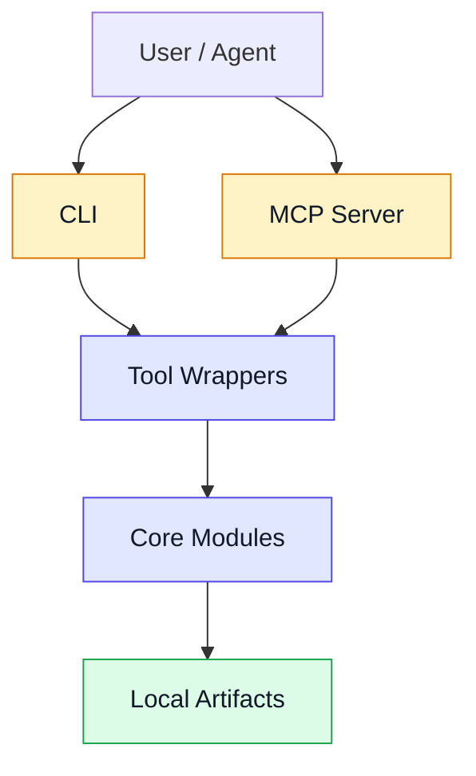

# 架构说明

## 系统定位

`hardening-mcp` 是一个本地优先的 Code Hardening MCP Server + CLI。它面向 AI IDE 和命令行场景，用同一套核心实现完成 Web App 仓库的分析、启动、浏览器探索、测试生成、报告输出、结构化修复计划生成、修复交接、验证复跑和补丁计划生成。

长期架构决策记录在 `docs/adr/README.md`。本文件描述当前架构状态；ADR 描述为什么选择这些架构方向。

## 主流程


| 阶段 | 责任 | 主要产物 |
| --- | --- | --- |
| `analyze_repo` | 识别框架、npm/pnpm/yarn/Bun 包管理器、脚本、启动建议和 env key hints | `.hardening/run/repo-profile.json` |
| `boot_app` | 启动本地 dev server，提取 URL，探测可达性 | `.hardening/run/boot-result.json`、`.hardening/run/app.log` |
| `explore_app` | 探索页面、复用 storageState 登录态、捕获运行时错误、截图、trace、安全交互和表单填充 | `.hardening/run/findings.json`、`.hardening/artifacts/*` |
| `generate_tests` | 将 findings 和 smoke routes 转换为 Playwright regression specs | `tests/hardening/*.spec.ts` |
| `harden_report` | 汇总证据、严重级别、测试和修复指导 | `hardening-report.md`、`.hardening/run/patch.diff` |
| `generate_repair_plan` | 将 findings、测试和启动结果转换为 AI IDE 可执行修复任务 | `.hardening/run/repair-plan.json`、`.hardening/run/repair-plan.md`、`.hardening/runs/<run-id>/repair-task-package.json`、`.hardening/runs/<run-id>/repair-task-package.md` |
| `repair_handoff` | 从 run bundle 汇总失败命令和失败验收项，形成 AI IDE / Agent 交接包 | `.hardening/runs/<run-id>/repair-handoff-package.json`、`.hardening/runs/<run-id>/repair-handoff-package.md`、`.hardening/runs/<run-id>/verification-plan.md` |
| `repair_execute` | 对 repair handoff task 进行 dry-run 或 validation-only 复跑，记录执行证据 | `.hardening/runs/<run-id>/repair-execution-report.json`、`.hardening/runs/<run-id>/repair-execution-report.md` |
| `repair_patch_plan` | 将失败验证证据分类为可审查 patch actions | `.hardening/runs/<run-id>/patch-plan.json`、`.hardening/runs/<run-id>/patch-plan.md` |
| `bundle_artifacts` | 为 AI IDE / Agent 汇总本次 run 的报告、repair plan、task package、handoff、execution report、patch plan、JSON、截图和 generated tests | `.hardening/runs/<run-id>/manifest.json`、`.hardening/latest` |

## ADR cascade map

| ADR | Decision | Cascaded architecture surface |
| --- | --- | --- |
| [ADR-0001](../adr/0001-local-first-mcp-cli.md) | Local-first MCP and CLI | 本文件的系统定位、本地优先与隐私边界、CLI/MCP 分层；README 的本地优先产品说明和脱敏约束 |
| [ADR-0002](../adr/0002-shared-cli-mcp-core.md) | Shared core for CLI and MCP | CLI 与 MCP 共享 `src/tools/*`、`src/domain/*`、`@hardening-mcp/shared`、`@hardening-mcp/browser-explorer` 和 `@hardening-mcp/repair-planner`；README 的入口追踪说明 |
| [ADR-0003](../adr/0003-target-repo-hardening-artifacts.md) | Target repo hardening artifacts | `.hardening/runs/<run-id>/`、`.hardening/latest`、legacy paths、workspace output 和 manifest 消费规则 |
| [ADR-0004](../adr/0004-repair-plan-and-task-package.md) | Repair plan and executable task package | `repair-plan.json`、`repair-plan.md`、`repair-task-package.json`、`repair-task-package.md`、repair handoff、repair execution 和 patch plan 物料链路 |
| [ADR-0011](../adr/0011-private-github-engineering-baseline.md) | Private GitHub engineering baseline | `.github/workflows/ci.yml`、PR/issue templates、`pnpm repo:hygiene` 和 private pre-release merge boundary |
| [ADR-0012](../adr/0012-branch-protection-and-release-boundary.md) | Branch protection and release boundary | `docs/operations/branch-protection-release-boundary-v0.1.md`、public release checklist、PR release boundary confirmation 和 GitHub plan blocker |
| [ADR-0013](../adr/0013-codex-security-and-security-assurance-lane.md) | Codex Security and Security Assurance Lane | `specs/security-assurance-lane-spec-v0.1.md` defines future provider-backed security evidence import, security finding provenance, and repair-plan integration without repositioning RepoAssure as a generic vulnerability scanner |
| [ADR-0014](../adr/0014-distribution-and-repair-loop-readiness.md) | Distribution and repair loop readiness | `docs/product/specs/mvp-spec-v0.3.md` now records the implemented GitHub Action wrapper, AI IDE repair loop agent contracts, and public-release readiness boundary while preserving local-first and no-default-auto-fix constraints |
| [ADR-0015](../adr/0015-public-release-readiness-boundary.md) | Public release readiness boundary | Apache-2.0 `LICENSE`, `CONTRIBUTING.md`, `SECURITY.md`, dependency-license audit, release notes draft, and `pnpm release:check` are readiness materials; public publication still requires manual authorization |
| [ADR-0022](../adr/0022-equivalent-release-control.md) | Equivalent release control | `docs/operations/equivalent-release-control-design-v0.1.md` defines a fallback evidence contract for the branch protection gate when private repo branch protection/rulesets remain unavailable; design does not execute or close public release |
| [ADR-0016](../adr/0016-team-cloud-enterprise-boundary.md) | Team Cloud and Enterprise commercial edition boundary | `specs/team-cloud-enterprise-architecture-v0.1.md` defines Team Cloud and Enterprise as commercial packaging layers over the open artifact contract, with No target repo source upload by default and no hosted paid implementation in the current increment |
| [ADR-0017](../adr/0017-public-website-and-project-intelligence-console.md) | Public website and internal project intelligence console | `docs/product/specs/public-website-spec-v0.1.md` defines the external responsive private-preview site; `specs/project-intelligence-console-architecture-v0.1.md` defines a local-only Project Intelligence Console over generated graph snapshots |
| [ADR-0018](../adr/0018-public-website-localization-strategy.md) | Public website localization strategy | Public website i18n should start with English and Simplified Chinese, keep Japanese and Korean as roadmap locales, and add localized forbidden-claim checks without localizing product artifacts by default |
| [ADR-0024](../adr/0024-autopilot-compatible-documentation-architecture.md) | Autopilot-compatible documentation architecture | `docs/PRD.md`, `docs/SPEC.md`, `docs/DESIGN.md`, and `docs/PLAN.md` are source-of-truth gateways over the existing detailed docs taxonomy; existing detailed documents are not moved |
| [ADR-0025](../adr/0025-ai-ide-repair-evidence-consumer-contract.md) | AI IDE repair evidence bundle consumer contract | `pnpm playbook:contract` converts the local bundle manifest into a consumer contract with artifact read sequence, verification checklist, maintainer review boundary, redaction boundary, non-authorization boundary, and blocked actions |
| [ADR-0028](../adr/0028-target-repo-repair-goal-proposal-package.md) | Target repo repair goal proposal package | `pnpm playbook:proposal` converts replay readiness into a local proposal package with allowed repair scope, artifact read order, repair task breakdown, verification commands, maintainer approval boundary, and blocked actions |
| [ADR-0029](../adr/0029-target-repo-repair-goal-authorization-receipt.md) | Target repo repair goal authorization receipt | `pnpm playbook:authorize` converts a proposal package and maintainer approve/reject/defer/accept_risk decisions into a local receipt with approved scope, rejected/deferred/risk-accepted items, verification requirements, and non-authorization boundaries |
| [ADR-0030](../adr/0030-authorized-target-repo-repair-goal-task-package.md) | Authorized target repo repair goal task package | `pnpm playbook:target-repair-goal` converts an authorization receipt into a local AI IDE task package with approved repair goals, excluded authorization items, verification checklist, maintainer review boundary, and blocked actions |

## Source-of-truth gateways

ADR-0024 adds Autopilot-compatible source-of-truth gateways without replacing the existing detailed documentation taxonomy:

| Gateway | Role | Detailed sources |
| --- | --- | --- |
| `docs/PRD.md` | Product intent | `docs/product/specs/`, `docs/product/strategy/`, `docs/product/research/` |
| `docs/SPEC.md` | Solution and implementation boundary | `docs/architecture/overview.md`, `docs/architecture/specs/`, `docs/product/specs/` |
| `docs/DESIGN.md` | Design direction | `docs/design/`, public website specs, Project Intelligence Console specs |
| `docs/PLAN.md` | Execution order | `docs/goals/`, `docs/acceptance/`, `docs/testing/`, `docs/logs/` |

These gateway documents are current-state indexes and conflict-resolution entrypoints for AI IDEs and Project Autopilot. They do not move authored specs, ADRs, operation records, acceptance outputs, or logs.

## Artifact 布局

`run_hardening` 会保留兼容路径，同时为每次运行创建 run-scoped bundle。AI IDE / Agent 应优先读取最新 manifest。

```text
<repo>/
  .hardening/
    latest -> runs/<run-id>
    runs/
      <run-id>/
        manifest.json
        hardening-report.md
        repo-profile.json
        boot-result.json
        app.log
        findings.json
        test-generation.json
        repair-plan.json
        repair-plan.md
        repair-task-package.json
        repair-task-package.md
        repair-handoff-package.json
        repair-handoff-package.md
        verification-plan.md
        repair-execution-report.json
        repair-execution-report.md
        patch-plan.json
        patch-plan.md
        patch.diff
        artifacts/
        generated-tests/
    run/
      repo-profile.json
      boot-result.json
      app.log
      findings.json
      test-generation.json
      repair-plan.json
      repair-plan.md
      repair-task-package.json
      repair-task-package.md
      patch.diff
    artifacts/
  hardening-report.md
  tests/
    hardening/
      generated-findings*.spec.ts
```

`manifest.json` 中的 `files` 指向 bundle 内的规范化物料，`legacyPaths` 指向原始兼容路径。人类可以继续打开 repo 根目录的 `hardening-report.md`；AI IDE 更适合从 `.hardening/latest/manifest.json` 开始读取，并优先消费 `files.repairPlan`、`files.repairTaskPackage`、repair handoff、repair execution report 和 patch plan。

多 repo 场景可传入 `workspaceOutputDir`，将多个 repo 的 run bundle 复制到同一个中央输出目录。

```text
<workspace-output>/
  manifest.json
  repos/
    <repo-slug>/
      latest -> runs/<run-id>
      runs/
        <run-id>/
          manifest.json
          hardening-report.md
          repo-profile.json
          boot-result.json
          findings.json
          test-generation.json
          repair-plan.json
          repair-plan.md
          repair-task-package.json
          repair-task-package.md
          repair-handoff-package.json
          repair-execution-report.json
          patch-plan.json
          patch.diff
          artifacts/
          generated-tests/
```

workspace 级 `manifest.json` 记录每个 repo 的 `repoSlug`、`repoRoot`、`latestRunId`、`latestRunDir` 和 `latestManifest`。这让 AI IDE 可以先读取一个 workspace manifest，再逐个进入各 repo 的最新 hardening 结果。

## 分层结构



| 层 | 目录 | 说明 |
| --- | --- | --- |
| CLI | `src/adapters/cli/` | 参数解析、stdout/stderr 输出、命令入口 |
| MCP | `src/adapters/mcp/` | stdio MCP Server、tool registry、boot session store |
| Tool Wrappers | `src/tools/` | 将核心能力封装成可调用工具，并写入 artifact |
| Domain | `src/domain/` | 分析、启动、测试生成、报告生成；explore 和 repair plan 旧路径保留为兼容 wrapper |
| Repair Planner | `@hardening-mcp/repair-planner` / `packages/repair-planner/` | repair plan 与 executable repair task package 实现；`src/domain/repair-plan/`、`dist/domain/repair-plan/` 和 `src/types/repair-plan.ts` / `dist/types/repair-plan.*` 保留兼容 wrapper/output |
| Browser Explorer | `@hardening-mcp/browser-explorer` / `packages/browser-explorer/` | fetch route exploration、Playwright browser exploration、安全交互、截图和 trace evidence 实现；`src/domain/explore/` 与 `dist/domain/explore/` 保留兼容 wrapper/output |
| Shared | `@hardening-mcp/shared` / `packages/shared/` | 脱敏、shell quoting、shell word parsing 等共享 helper；`src/shared/` 与 `dist/shared/` 保留兼容 wrapper/output |
| Security Assurance Lane | `@hardening-mcp/security-assurance` / `packages/security-assurance/` | 按 ADR-0013 和 `docs/architecture/specs/security-assurance-lane-spec-v0.1.md` 作为 provider-backed evidence lane；Phase 1 已支持本地 provider scan directory 导入、provider provenance 保留、security artifact 生成和 repair-plan integration，但不运行 scanner、不联网、不上传目标 repo，也不是当前 acceptance workflow 的替代或必需门槛 |
| Internal | `src/internal/` | acceptance、goal audit、benchmark 等项目治理工具 |
| Shared Types | `src/types/` | findings、repair plan 等共享契约 |
| Benchmark | `src/internal/benchmark/`、`scripts/run-benchmark.mjs` | benchmark 汇总与 `docs/logs/spike-results.md` 生成 |

## CLI 与 MCP 共享实现

CLI 和 MCP 不各自实现业务逻辑。它们都调用 `src/tools/*`，而 tool wrappers 再调用 `src/domain/*`、`@hardening-mcp/shared`、`@hardening-mcp/security-assurance`、`@hardening-mcp/browser-explorer` 和 `@hardening-mcp/repair-planner`；迁移窗口内的旧 `src/shared/*` import 会通过 wrapper 指向 `packages/shared/dist/*`，旧 `src/domain/explore/*` import 会通过 wrapper 指向 `packages/browser-explorer/dist/*`，旧 `src/domain/repair-plan/*` 与 `src/types/repair-plan.ts` import 会通过 wrapper 指向 `packages/repair-planner/dist/*`。

这样做的目的：

- 避免 CLI 与 MCP 行为分叉。
- 让测试可以直接覆盖核心逻辑、工具封装和协议层。
- 后续扩展 IDE skill、HTTP server 或其他 Agent runtime 时，可继续复用 tool wrappers。

## 本地优先与隐私边界

- 默认读取本地仓库和本地 artifact。
- 不上传代码、日志、截图、trace 或 env value。
- env 检测只记录 key hint，不读取或输出 secret value。
- benchmark 产物写入 `artifacts/benchmark-runs/`，该目录已加入 `.gitignore`、ESLint ignore 和 Vitest exclude；旧的 `benchmark-runs/` 继续被忽略，避免历史产物被扫描。
- 私有 GitHub CI 通过 `pnpm repo:hygiene` 检查已追踪文件，阻止 generated artifacts、build outputs、local hardening runs、env files、private keys 和 local logs 进入提交；完整规则见 `docs/architecture/specs/private-github-engineering-baseline-v0.1.md`。

## Team Cloud and Enterprise

ADR-0016 将 Team Cloud and Enterprise 定义为未来商业版层，而不是当前 open core 的替代执行路径。当前架构边界见 `docs/architecture/specs/team-cloud-enterprise-architecture-v0.1.md`：Open artifact contract 仍由 CLI、MCP、GitHub Action 和本地 run bundle 生成；Commercial control plane 只能在显式授权下存储、索引、展示、协作、治理和集成这些物料。

默认边界保持不变：No target repo source upload by default；hosted dashboard、team collaboration、Enterprise integrations 和 advanced governance 需要另行实现 goal，不在当前增量写入 paid cloud runtime。

## Public Website and Project Intelligence Console

ADR-0017 将 public website 和 Project Intelligence Console 拆成两个独立 surface。Public website 是外部响应式品牌和 private-preview 转化入口，规划见 `docs/product/specs/public-website-spec-v0.1.md`；它不授权公开发布、不声明 SaaS availability，也不改变当前 private release boundary。

ADR-0018 进一步约束 public website localization strategy：官网默认 English，第一阶段只加入 Simplified Chinese；Japanese and Korean 是 roadmap locales。该决策只覆盖官网 copy 和 i18n 架构，不授权 hardening reports、repair plans、acceptance packages、generated tests、CLI output 或 AI IDE handoff materials 的产品物料多语言化。任何 locale 都必须通过 localized forbidden-claim checks，避免误称 SaaS、Team Cloud、Enterprise、public npm package 或 public repository 已可用。

ADR-0019 定义 public website enterprise design system：RepoAssure 的外部网站和未来内部 console 应向 security-grade、evidence-first、local-first、enterprise-calm 的设计方向演进。`docs/design/design-system-v0.1.md` 是设计系统 source of truth；当前官网 v0.1 可用于 private-preview 功能与证据边界，但不代表最终企业级安全审美。任何 Public Website v0.2 改版都应先对齐该设计系统，再通过 Product Design audit、桌面/移动截图、locale layout checks 和 browser verification。

ADR-0020 定义 public website private preview deployment boundary：官网代码进入 `main` 不等于部署或公开发布。Private preview deployment、production deployment 和 public launch 是三个独立 gate。2026-06-26 的 Vercel deployment execution 已在用户授权后尝试，但当前被 Vercel preview target mismatch 阻塞：CLI / project 返回 `target production` 或不可验证的 `UNKNOWN` preview，Vercel Git integration 曾在 `main` push 后自动创建 production deployment；Git integration 已断开。Resolve Vercel Preview Target Blocker v0.1 复验 `main` 默认 deploy、显式 `--target preview --skip-domain` 和临时非 main 分支 deploy 后仍未得到 accepted preview URL；所有 unintended production deployments and aliases were removed。继续前必须获得 `Ready`、访问受控、非 production alias 的 preview URL，并补齐 smoke、content、screenshot 和 forbidden-claim verification。

ADR-0021 定义 private preview hosting fallback decision：当前现有 Vercel project 在 target mismatch 修复前暂停用于官网 private preview；local static preview bundle 是临时 review surface；远程 fallback 应使用 Cloudflare Pages preview deployments with Cloudflare Access 或等效访问受控静态托管。Cloudflare Pages preview deployments are public by default，只有在 access policy 生效且 URL 未公开分享时才满足 private preview gate。该决策不授权 public launch、production deployment、public custom domain、恢复 Vercel Git integration 或向新 hosting provider 上传代码。

ADR-0022 定义 equivalent release control：当 GitHub private repo branch protection / repository rulesets 仍不可用时，可以把替代门禁设计为 exact release commit SHA、RepoAssure CI / Quality Gates、local full test、release hygiene、sensitive-material scan 和 maintainer closure approval 的证据包。该控制目前只完成设计，未执行 closure；Public Source Release Execution 仍被阻塞，且不能为了启用 branch protection 而公开仓库。

ADR-0024 定义 Autopilot-compatible documentation architecture：`docs/PRD.md`、`docs/SPEC.md`、`docs/DESIGN.md` 和 `docs/PLAN.md` 是 Project Autopilot 与 AI IDE 的稳定 source-of-truth gateway。现有详细文档继续保留在 `docs/product/`、`docs/architecture/`、`docs/design/`、`docs/acceptance/`、`docs/operations/`、`docs/goals/` 和 `docs/logs/`；gateway 只提供权威入口和当前状态摘要，不复制或搬迁全部内容。

ADR-0025 定义 AI IDE repair evidence bundle consumer contract：`pnpm playbook:contract -- --from-dir <dir>` 从本地 `ai-ide-repair-evidence-bundle-manifest.json` 生成 `ai-ide-repair-evidence-consumer-contract.json` / `.md`。该 contract 明确 artifact read sequence、verification checklist、maintainer review boundary、redaction boundary、non-authorization boundary 和 blocked actions；它不授权 target repo mutation、publication、launch、customer contact、pricing/spend 或 commercial availability claims。

Project Intelligence Console 是内部独立站，规划见 `docs/product/specs/project-intelligence-console-spec-v0.1.md` 和 `docs/architecture/specs/project-intelligence-console-architecture-v0.1.md`。它应从本地 docs、code、tests、goals 和 logs 生成 Docs Graph、Code Graph、Project Progress Graph，并把 snapshots 写入 `artifacts/project-graph/`，默认 local-only、No hosted service dependency。

## 进程生命周期

`run_hardening` / `hardening run` 内部自动管理 boot session：


独立 MCP `boot_app` 会返回 `sessionId`。调用方必须使用 `stop_app` 清理该 session。

## 测试金字塔

| 层级 | 当前覆盖 |
| --- | --- |
| Unit | 分析器、启动解析、探索分类、测试生成、报告、repair plan、MCP registry、benchmark report |
| Integration | CLI、tool artifact、boot 子进程、MCP protocol、run 编排 |
| E2E | data URL 完整链路、可选真实 browser hardening run |
| Benchmark | 5 个本地半真实 repo，完整 `run --browser`，并实际执行 generated Playwright specs |
## ADR-0026 Replay Readiness Layer

ADR-0026 adds the AI IDE repair execution replay readiness layer after ADR-0025's consumer contract. The flow is: repair evidence bundle manifest -> consumer contract -> replay readiness report. The replay readiness report is review evidence only; it confirms read-order replay, checklist replay, blocked-action enforcement, redaction, non-authorization, and maintainer review boundaries before any separate target-repo repair goal.

## ADR-0027 Real Campaign Replay Validation

ADR-0027 validates the full AI IDE repair evidence chain against a near-real campaign fixture: campaign-summary -> playbook -> consume -> decide -> approve -> plan-approved -> evidence -> bundle -> contract -> replay. This proves the architecture layers work together before any separate target-repo repair goal and keeps the result local-first and non-authorizing.

## ADR-0028 Target Repo Repair Goal Proposal Package

ADR-0028 adds a proposal layer after replay readiness: replay readiness -> target repo repair goal proposal package. The package is a local maintainer/AI IDE handoff artifact with prerequisites, artifact read order, allowed repair scope, repair task breakdown, verification commands, maintainer approval boundary, redaction boundary, non-authorization boundary, and blocked actions. It does not authorize target repo mutation or public/commercial release actions.
