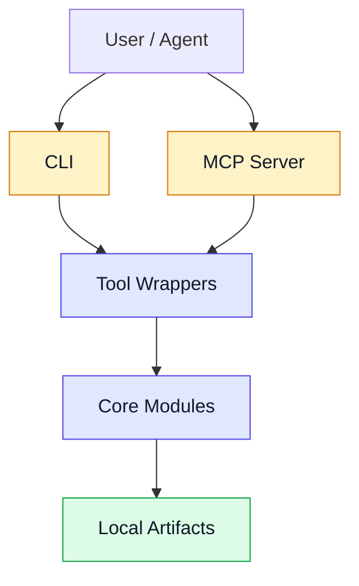

# 架构说明

## Current K1 gate — 2026-08-03

RepoAssure M1 Open Evidence Kernel Candidate Boundary Contract Specification Authorization Intake v0.1 completed with `k1_contract_specification_authorization_intake_prepared_without_inferred_choice_specification_schema_or_runtime_changes`. The next Goal is RepoAssure M1 Open Evidence Kernel Candidate Boundary Contract Specification Authorization Maintainer Decision Recording v0.1 (`ready_to_execute`, `execution_authorization: null`). Original contracts and artifact bytes remain authoritative; K1 remains a non-authoritative, reference-only candidate; M1 remains incomplete; `auth_redirect` remains `request_revision`. No specification, schema, authoritative contract, adapter/runtime, dependency, target, release, or Git architecture changed.

## 当前治理方向

Completed design Goal: RepoAssure M1 Open Evidence Kernel Candidate Boundary Contract Design Planning v0.1.

Conclusion: `k1_non_authoritative_contract_design_plan_prepared_without_schema_authoritative_contract_or_runtime_implementation`.

The subsequent RepoAssure M1 Open Evidence Kernel Candidate Boundary Contract Specification Authorization Intake v0.1 is also completed without a selected decision. Current next Goal: RepoAssure M1 Open Evidence Kernel Candidate Boundary Contract Specification Authorization Maintainer Decision Recording v0.1 (`ready_to_execute`, `execution_authorization: null`).

Preserved K1 governance sequence: RepoAssure M1 Open Evidence Kernel Candidate Boundary Maintainer Decision Intake v0.1 (`m1_open_evidence_kernel_candidate_boundary_decision_intake_prepared_without_selected_decision_or_contract_changes`) → RepoAssure M1 Open Evidence Kernel Candidate Boundary Maintainer Decision Recording v0.1 (`maintainer_approved_k1_for_separately_gated_contract_design_without_schema_or_runtime_implementation_authorization`) → RepoAssure M1 Open Evidence Kernel Candidate Boundary Contract Design Planning v0.1 (`k1_non_authoritative_contract_design_plan_prepared_without_schema_authoritative_contract_or_runtime_implementation`).

K1 设计计划只定义一个可丢弃、可重建、只读、引用型的非权威视图。原始
contracts 与 artifact bytes 继续权威；source、mapping、envelope instance 三层
身份相互分离，raw status/decision 不被静默归一化，loss/unknown 明示，hash 只
证明本地字节一致性，write authorization、observed mutation 与 proof method
相互独立。Contract specification、维护者接受和 implementation 继续是三个
独立门禁，M1 remains incomplete，`auth_redirect` 保持 `request_revision`。

Prior completed Goal: RepoAssure M1 Open Evidence Kernel Contract Gap Planning v0.1, with conclusion `m1_open_evidence_kernel_contract_gap_plan_prepared_with_one_candidate_boundary_without_schema_or_runtime_changes`.

RepoAssure M1 Open Evidence Kernel Candidate Boundary Maintainer Decision
Intake v0.1 已完成，结论为
`m1_open_evidence_kernel_candidate_boundary_decision_intake_prepared_without_selected_decision_or_contract_changes`。
它只为唯一的
`provider_neutral_read_only_evidence_envelope_adapter_boundary` 候选准备了
四个中立、未选择的选项；0/1 decisions recorded、1/1 pending，普通 Goal
执行授权没有被当作候选决定。原契约继续权威，schema、contract、adapter 与
runtime 改动均为 0，M1 remains incomplete；auth redirect 保持
`request_revision`。

RepoAssure M1 Open Evidence Kernel Candidate Boundary Maintainer Decision
Recording v0.1 已完成。维护者明确选择
`approve_for_separately_gated_contract_design`，1/1 decisions recorded、0/1
pending；该决定只允许派生一个单独设门槛的非权威设计规划 Goal。它没有选择或
改变任何运行架构，没有创建 schema，也没有接受或实现 contract/adapter/runtime。

RepoAssure M1 Open Evidence Kernel Candidate Boundary Contract Design Planning
v0.1 已完成；K1 仍为非权威、可丢弃的引用视图，原契约与 artifact bytes 继续
权威。随后 Contract Specification Authorization Intake v0.1 也已完成，但没有
选择答案。当前下一 Goal 是 RepoAssure M1 Open Evidence Kernel Candidate
Boundary Contract Specification Authorization Maintainer Decision Recording
v0.1，`execution_authorization: null`，因此尚未授权记录选择或起草
specification。M1 remains incomplete，`auth_redirect` 保持
`request_revision`。

RepoAssure Remaining Gated Product Work Maintainer Direction Decision Recording v0.1
已完成，结论为
`maintainer_selected_false_positive_detector_runtime_calibration_without_underlying_work_authorization`。
其历史来源 RepoAssure Remaining Gated Product Work Direction Preparation v0.1
的结论仍为
`remaining_gated_product_work_direction_package_prepared_without_decision_or_execution`。
维护者选择 `false_positive_detector_runtime_calibration` 作为优先方向时，
两个校准问题仍为 0/2 已决定、2/2 pending。
RepoAssure False-Positive Detector Runtime Calibration Decision Reopening Preparation v0.1 已完成，结论为
`false_positive_detector_runtime_calibration_decision_reopening_package_prepared_without_per_question_decisions_or_detector_changes`。
它只刷新本地决策包，不改变下述运行架构、检测器或产品入口。

RepoAssure False-Positive Detector Runtime Calibration Per-Question Maintainer Decision Recording v0.1 已完成，结论为
`maintainer_approved_both_false_positive_detector_calibration_questions_for_separately_gated_design_planning_without_detector_implementation_authorization`。
RepoAssure False-Positive Detector Runtime Calibration Bounded Design Planning v0.1 也已完成，结论为
`bounded_false_positive_detector_calibration_design_plan_prepared_without_runtime_implementation_or_behavior_change`。
RepoAssure False-Positive Detector Runtime Calibration Implementation Authorization Intake v0.1 也已完成，结论为
`implementation_authorization_intake_prepared_without_inferred_decisions_or_detector_changes`。
它只准备两道未填写的实现授权题，没有改变运行架构。

RepoAssure False-Positive Detector Runtime Calibration Implementation Authorization Maintainer Decision Recording v0.1 is complete with conclusion
`maintainer_approved_conditional_dead_control_implementation_and_requested_auth_redirect_revision_without_detector_changes`.

RepoAssure Conditional Dead Control Calibration Implementation Gate Evidence
Preparation v0.1 is complete with conclusion
`conditional_dead_control_gate_evidence_package_prepared_with_all_manual_gates_fail_closed`.

RepoAssure Conditional Dead Control Calibration Fixture Evidence Readiness and
Authorization Intake v0.1 is complete with conclusion
`conditional_dead_control_fixture_evidence_readiness_and_authorization_intake_prepared_without_inferred_choice_or_fixture_access`.

RepoAssure Conditional Dead Control Calibration Fixture Evidence Readiness and
Authorization Maintainer Decision Recording v0.1 is complete with conclusion
`maintainer_requested_synthetic_local_fixture_plan_without_fixture_access_or_detector_changes`.

RepoAssure Conditional Dead Control Calibration Synthetic Fixture Bounded
Planning v0.1 is complete with conclusion
`synthetic_fixture_bounded_plan_prepared_without_fixture_creation_execution_or_detector_changes`.

RepoAssure Conditional Dead Control Calibration Synthetic Fixture
Implementation Authorization Intake v0.1 is complete with conclusion
`synthetic_fixture_implementation_authorization_intake_prepared_without_inferred_choice_or_fixture_work`.

RepoAssure Conditional Dead Control Calibration Synthetic Fixture
Implementation Authorization Maintainer Decision Recording v0.1 is complete
with conclusion
`maintainer_approved_synthetic_fixture_implementation_for_separately_authorized_local_fixture_goal_without_fixture_or_detector_work`.

RepoAssure Conditional Dead Control Calibration Bounded Detector
Implementation Authorization Intake v0.1 已完成，结论为
`bounded_detector_implementation_authorization_intake_prepared_without_inferred_choice_or_detector_changes`。
RepoAssure Conditional Dead Control Calibration Bounded Detector
Implementation Authorization Maintainer Decision Recording v0.1 也已完成，
结论为
`maintainer_authorized_bounded_detector_implementation_for_separately_authorized_local_goal_without_detector_changes`。
明确数字选择 `1` 映射为
`authorize_bounded_detector_implementation`；Implementation authorization
decisions recorded: 1/1，pending: 0/1。

RepoAssure Conditional Dead Control Calibration Bounded Detector
Implementation v0.1 已完成，结论为
`conditional_dead_control_bounded_detector_implemented_with_visible_p1_classification_and_fail_closed_prerequisite_evidence`。
Architecture Handoff 在 detector/test 修改前锁定 browser-runtime + private
classifier seam，复用现有 `evidence: string[]`，未改变 public finding schema。
运行时现在只在 HTTP(S) loopback、同一稳定页面、唯一 owner form、唯一且
非敏感字段的直接观察下执行最多一次 fill；disabled submit 始终 0 click / 0
submit，缺失、矛盾、不安全或不稳定证据全部 fail closed。所有分支保持可见
P1 `dead_control`，不推断 form state。

RepoAssure Conditional Dead Control Calibration Bounded Detector
Implementation Completion Audit v0.1 已完成，结论为
`bounded_detector_implementation_audit_qualified_with_material_evidence_drift_without_product_surface_changes`。
审计确认架构与产品边界通过，同时保留 command、SDK 与 provenance 漂移。

RepoAssure Conditional Dead Control Calibration Verification Evidence
Reconciliation v0.1 已完成，结论为
`conditional_dead_control_verification_evidence_reconciled_with_durable_errata_without_product_or_historical_record_changes`。
该 addendum 不改变架构或历史记录，只固定未来 replay 的命令、集合、SDK 和
provenance 解释。

Active Goal: RepoAssure M1 Open Evidence Kernel Candidate Boundary Contract
Specification Authorization Maintainer Decision Recording v0.1。该 Goal 为
`ready_to_execute`，但 `execution_authorization: null`。在单独授权并收到一个
精确 token 前不得记录选择；不得起草 specification，运行 detector/行为测试，
或改变 schema、权威 contract、adapter、runtime、架构、Roadmap、target 与
外部状态。M1 remains incomplete，`auth_redirect` 保持 `request_revision`。

## 系统定位

`hardening-mcp` 是一个本地优先的 Code Hardening MCP Server + CLI。它面向 AI IDE 和命令行场景，用同一套核心实现完成 Web App 仓库的分析、启动、浏览器探索、测试生成、报告输出、结构化修复计划生成、修复交接、验证复跑和补丁计划生成。

长期架构决策记录在 `docs/adr/README.md`。本文件描述当前架构状态；ADR 描述为什么选择这些架构方向。

## 主流程


```mermaid
flowchart LR
  A["analyze_repo"] --> B["boot_app"]
  B --> C["explore_app"]
  C --> D["generate_tests"]
  D --> E["harden_report"]
  E --> F["generate_repair_plan"]
  F --> G["repair_handoff"]
  G --> H["repair_execute"]
  H --> I["repair_patch_plan"]
  I --> J["bundle_artifacts"]

  classDef core fill:#dbeafe,stroke:#2563eb,color:#111827
  classDef output fill:#dcfce7,stroke:#16a34a,color:#111827
  class A,B,C,D core
  class E,F,G,H,I,J output
```

| 阶段 | 责任 | 主要产物 |
| --- | --- | --- |
| `analyze_repo` | 识别框架、npm/pnpm/yarn/Bun 包管理器、脚本、启动建议和 env key hints | `.hardening/run/repo-profile.json` |
| `boot_app` | 启动本地 dev server，提取 URL，探测可达性 | `.hardening/run/boot-result.json`、`.hardening/run/app.log` |
| `explore_app` | 探索页面、复用 storageState 登录态、捕获运行时错误、截图、trace、安全交互和表单填充 | `.hardening/run/findings.json`、`.hardening/artifacts/*` |
| `generate_tests` | 将 findings 和 smoke routes 转换为 Playwright regression specs | `tests/hardening/*.spec.ts` |
| `harden_report` | 汇总证据、严重级别、测试和修复指导 | `hardening-report.md`、`.hardening/run/patch.diff` |
| `generate_repair_plan` | 将 findings、测试和启动结果转换为 AI IDE 可执行修复任务 | `.hardening/run/repair-plan.json`、`.hardening/run/repair-plan.md`、`.hardening/runs/<run-id>/repair-task-package.json`、`.hardening/runs/<run-id>/repair-task-package.md` |
| `repair_handoff` | 从 run bundle 汇总失败命令和失败验收项，形成 AI IDE / Agent 交接包 | `.hardening/runs/<run-id>/repair-handoff-package.json`、`.hardening/runs/<run-id>/repair-handoff-package.md`、`.hardening/runs/<run-id>/verification-plan.md` |
| `repair_execute` | 对 repair handoff task 进行 dry-run 或 validation-only 复跑，记录执行证据 | `.hardening/runs/<run-id>/repair-execution-report.json`、`.hardening/runs/<run-id>/repair-execution-report.md` |
| `repair_patch_plan` | 将失败验证证据分类为可审查 patch actions | `.hardening/runs/<run-id>/patch-plan.json`、`.hardening/runs/<run-id>/patch-plan.md` |
| `bundle_artifacts` | 为 AI IDE / Agent 汇总本次 run 的报告、repair plan、task package、handoff、execution report、patch plan、JSON、截图和 generated tests | `.hardening/runs/<run-id>/manifest.json`、`.hardening/latest` |

## ADR cascade map

| ADR | Decision | Cascaded architecture surface |
| --- | --- | --- |
| [ADR-0001](../adr/0001-local-first-mcp-cli.md) | Local-first MCP and CLI | 本文件的系统定位、本地优先与隐私边界、CLI/MCP 分层；README 的本地优先产品说明和脱敏约束 |
| [ADR-0002](../adr/0002-shared-cli-mcp-core.md) | Shared core for CLI and MCP | CLI 与 MCP 共享 `src/tools/*`、`src/domain/*`、`@hardening-mcp/shared`、`@hardening-mcp/browser-explorer` 和 `@hardening-mcp/repair-planner`；README 的入口追踪说明 |
| [ADR-0003](../adr/0003-target-repo-hardening-artifacts.md) | Target repo hardening artifacts | `.hardening/runs/<run-id>/`、`.hardening/latest`、legacy paths、workspace output 和 manifest 消费规则 |
| [ADR-0004](../adr/0004-repair-plan-and-task-package.md) | Repair plan and executable task package | `repair-plan.json`、`repair-plan.md`、`repair-task-package.json`、`repair-task-package.md`、repair handoff、repair execution 和 patch plan 物料链路 |
| [ADR-0011](../adr/0011-private-github-engineering-baseline.md) | Private GitHub engineering baseline | `.github/workflows/ci.yml`、PR/issue templates、`pnpm repo:hygiene` 和 private pre-release merge boundary |
| [ADR-0012](../adr/0012-branch-protection-and-release-boundary.md) | Branch protection and release boundary | `docs/operations/branch-protection-release-boundary-v0.1.md`、public release checklist、PR release boundary confirmation 和 GitHub plan blocker |
| [ADR-0013](../adr/0013-codex-security-and-security-assurance-lane.md) | Codex Security and Security Assurance Lane | `specs/security-assurance-lane-spec-v0.1.md` defines future provider-backed security evidence import, security finding provenance, and repair-plan integration without repositioning RepoAssure as a generic vulnerability scanner |
| [ADR-0014](../adr/0014-distribution-and-repair-loop-readiness.md) | Distribution and repair loop readiness | `docs/product/specs/mvp-spec-v0.3.md` now records the implemented GitHub Action wrapper, AI IDE repair loop agent contracts, and public-release readiness boundary while preserving local-first and no-default-auto-fix constraints |
| [ADR-0015](../adr/0015-public-release-readiness-boundary.md) | Public release readiness boundary | Apache-2.0 `LICENSE`, `CONTRIBUTING.md`, `SECURITY.md`, dependency-license audit, release notes draft, and `pnpm release:check` are readiness materials; public publication still requires manual authorization |
| [ADR-0016](../adr/0016-team-cloud-enterprise-boundary.md) | Team Cloud and Enterprise commercial edition boundary | `specs/team-cloud-enterprise-architecture-v0.1.md` defines Team Cloud and Enterprise as commercial packaging layers over the open artifact contract, with No target repo source upload by default and no hosted paid implementation in the current increment |
| [ADR-0017](../adr/0017-public-website-and-project-intelligence-console.md) | Public website and internal project intelligence console | `docs/product/specs/public-website-spec-v0.1.md` defines the external responsive private-preview site; `specs/project-intelligence-console-architecture-v0.1.md` defines a local-only Project Intelligence Console over generated graph snapshots |
| [ADR-0018](../adr/0018-public-website-localization-strategy.md) | Public website localization strategy | Public website i18n should start with English and Simplified Chinese, keep Japanese and Korean as roadmap locales, and add localized forbidden-claim checks without localizing product artifacts by default |

## Artifact 布局

`run_hardening` 会保留兼容路径，同时为每次运行创建 run-scoped bundle。AI IDE / Agent 应优先读取最新 manifest。

```text
<repo>/
  .hardening/
    latest -> runs/<run-id>
    runs/
      <run-id>/
        manifest.json
        hardening-report.md
        repo-profile.json
        boot-result.json
        app.log
        findings.json
        test-generation.json
        repair-plan.json
        repair-plan.md
        repair-task-package.json
        repair-task-package.md
        repair-handoff-package.json
        repair-handoff-package.md
        verification-plan.md
        repair-execution-report.json
        repair-execution-report.md
        patch-plan.json
        patch-plan.md
        patch.diff
        artifacts/
        generated-tests/
    run/
      repo-profile.json
      boot-result.json
      app.log
      findings.json
      test-generation.json
      repair-plan.json
      repair-plan.md
      repair-task-package.json
      repair-task-package.md
      patch.diff
    artifacts/
  hardening-report.md
  tests/
    hardening/
      generated-findings*.spec.ts
```

`manifest.json` 中的 `files` 指向 bundle 内的规范化物料，`legacyPaths` 指向原始兼容路径。人类可以继续打开 repo 根目录的 `hardening-report.md`；AI IDE 更适合从 `.hardening/latest/manifest.json` 开始读取，并优先消费 `files.repairPlan`、`files.repairTaskPackage`、repair handoff、repair execution report 和 patch plan。

多 repo 场景可传入 `workspaceOutputDir`，将多个 repo 的 run bundle 复制到同一个中央输出目录。

```text
<workspace-output>/
  manifest.json
  repos/
    <repo-slug>/
      latest -> runs/<run-id>
      runs/
        <run-id>/
          manifest.json
          hardening-report.md
          repo-profile.json
          boot-result.json
          findings.json
          test-generation.json
          repair-plan.json
          repair-plan.md
          repair-task-package.json
          repair-task-package.md
          repair-handoff-package.json
          repair-execution-report.json
          patch-plan.json
          patch.diff
          artifacts/
          generated-tests/
```

workspace 级 `manifest.json` 记录每个 repo 的 `repoSlug`、`repoRoot`、`latestRunId`、`latestRunDir` 和 `latestManifest`。这让 AI IDE 可以先读取一个 workspace manifest，再逐个进入各 repo 的最新 hardening 结果。

## 分层结构


```mermaid
flowchart TB
  U["User / Agent"] --> CLI["CLI"]
  U --> MCP["MCP Server"]
  CLI --> Tools["Tool Wrappers"]
  MCP --> Tools
  Tools --> Core["Core Modules"]
  Core --> Artifacts["Local Artifacts"]

  classDef entry fill:#fef3c7,stroke:#d97706,color:#111827
  classDef logic fill:#e0e7ff,stroke:#4f46e5,color:#111827
  classDef data fill:#dcfce7,stroke:#16a34a,color:#111827
  class CLI,MCP entry
  class Tools,Core logic
  class Artifacts data
```

| 层 | 目录 | 说明 |
| --- | --- | --- |
| CLI | `src/adapters/cli/` | 参数解析、stdout/stderr 输出、命令入口 |
| MCP | `src/adapters/mcp/` | stdio MCP Server、tool registry、boot session store |
| Tool Wrappers | `src/tools/` | 将核心能力封装成可调用工具，并写入 artifact |
| Domain | `src/domain/` | 分析、启动、测试生成、报告生成；explore 和 repair plan 旧路径保留为兼容 wrapper |
| Repair Planner | `@hardening-mcp/repair-planner` / `packages/repair-planner/` | repair plan 与 executable repair task package 实现；`src/domain/repair-plan/`、`dist/domain/repair-plan/` 和 `src/types/repair-plan.ts` / `dist/types/repair-plan.*` 保留兼容 wrapper/output |
| Browser Explorer | `@hardening-mcp/browser-explorer` / `packages/browser-explorer/` | fetch route exploration、Playwright browser exploration、安全交互、截图和 trace evidence 实现；`src/domain/explore/` 与 `dist/domain/explore/` 保留兼容 wrapper/output |
| Shared | `@hardening-mcp/shared` / `packages/shared/` | 脱敏、shell quoting、shell word parsing 等共享 helper；`src/shared/` 与 `dist/shared/` 保留兼容 wrapper/output |
| Security Assurance Lane | `@hardening-mcp/security-assurance` / `packages/security-assurance/` | 按 ADR-0013 和 `docs/architecture/specs/security-assurance-lane-spec-v0.1.md` 作为 provider-backed evidence lane；Phase 1 已支持本地 provider scan directory 导入、provider provenance 保留、security artifact 生成和 repair-plan integration，但不运行 scanner、不联网、不上传目标 repo，也不是当前 acceptance workflow 的替代或必需门槛 |
| Internal | `src/internal/` | acceptance、goal audit、benchmark 等项目治理工具 |
| Shared Types | `src/types/` | findings、repair plan 等共享契约 |
| Benchmark | `src/internal/benchmark/`、`scripts/run-benchmark.mjs` | benchmark 汇总与 `docs/logs/spike-results.md` 生成 |

## CLI 与 MCP 共享实现

CLI 和 MCP 不各自实现业务逻辑。它们都调用 `src/tools/*`，而 tool wrappers 再调用 `src/domain/*`、`@hardening-mcp/shared`、`@hardening-mcp/security-assurance`、`@hardening-mcp/browser-explorer` 和 `@hardening-mcp/repair-planner`；迁移窗口内的旧 `src/shared/*` import 会通过 wrapper 指向 `packages/shared/dist/*`，旧 `src/domain/explore/*` import 会通过 wrapper 指向 `packages/browser-explorer/dist/*`，旧 `src/domain/repair-plan/*` 与 `src/types/repair-plan.ts` import 会通过 wrapper 指向 `packages/repair-planner/dist/*`。

这样做的目的：

- 避免 CLI 与 MCP 行为分叉。
- 让测试可以直接覆盖核心逻辑、工具封装和协议层。
- 后续扩展 IDE skill、HTTP server 或其他 Agent runtime 时，可继续复用 tool wrappers。

## 本地优先与隐私边界

- 默认读取本地仓库和本地 artifact。
- 不上传代码、日志、截图、trace 或 env value。
- env 检测只记录 key hint，不读取或输出 secret value。
- benchmark 产物写入 `artifacts/benchmark-runs/`，该目录已加入 `.gitignore`、ESLint ignore 和 Vitest exclude；旧的 `benchmark-runs/` 继续被忽略，避免历史产物被扫描。
- 私有 GitHub CI 通过 `pnpm repo:hygiene` 检查已追踪文件，阻止 generated artifacts、build outputs、local hardening runs、env files、private keys 和 local logs 进入提交；完整规则见 `docs/architecture/specs/private-github-engineering-baseline-v0.1.md`。

## Team Cloud and Enterprise

ADR-0016 将 Team Cloud and Enterprise 定义为未来商业版层，而不是当前 open core 的替代执行路径。当前架构边界见 `docs/architecture/specs/team-cloud-enterprise-architecture-v0.1.md`：Open artifact contract 仍由 CLI、MCP、GitHub Action 和本地 run bundle 生成；Commercial control plane 只能在显式授权下存储、索引、展示、协作、治理和集成这些物料。

默认边界保持不变：No target repo source upload by default；hosted dashboard、team collaboration、Enterprise integrations 和 advanced governance 需要另行实现 goal，不在当前增量写入 paid cloud runtime。

## Public Website and Project Intelligence Console

ADR-0017 将 public website 和 Project Intelligence Console 拆成两个独立 surface。Public website 是外部响应式品牌和 private-preview 转化入口，规划见 `docs/product/specs/public-website-spec-v0.1.md`；它不授权公开发布、不声明 SaaS availability，也不改变当前 private release boundary。

ADR-0018 进一步约束 public website localization strategy：官网默认 English，第一阶段只加入 Simplified Chinese；Japanese and Korean 是 roadmap locales。该决策只覆盖官网 copy 和 i18n 架构，不授权 hardening reports、repair plans、acceptance packages、generated tests、CLI output 或 AI IDE handoff materials 的产品物料多语言化。任何 locale 都必须通过 localized forbidden-claim checks，避免误称 SaaS、Team Cloud、Enterprise、public npm package 或 public repository 已可用。

ADR-0019 定义 public website enterprise design system：RepoAssure 的外部网站和未来内部 console 应向 security-grade、evidence-first、local-first、enterprise-calm 的设计方向演进。`docs/design/design-system-v0.1.md` 是设计系统 source of truth；当前官网 v0.1 可用于 private-preview 功能与证据边界，但不代表最终企业级安全审美。任何 Public Website v0.2 改版都应先对齐该设计系统，再通过 Product Design audit、桌面/移动截图、locale layout checks 和 browser verification。

ADR-0020 定义 public website private preview deployment boundary：官网代码进入 `main` 不等于部署或公开发布。Private preview deployment、production deployment 和 public launch 是三个独立 gate。2026-06-26 的 Vercel deployment execution 已在用户授权后尝试，但当前被 Vercel preview target mismatch 阻塞：CLI / project 返回 `target production` 或不可验证的 `UNKNOWN` preview，Vercel Git integration 曾在 `main` push 后自动创建 production deployment；Git integration 已断开。Resolve Vercel Preview Target Blocker v0.1 复验 `main` 默认 deploy、显式 `--target preview --skip-domain` 和临时非 main 分支 deploy 后仍未得到 accepted preview URL；所有 unintended production deployments and aliases were removed。继续前必须获得 `Ready`、访问受控、非 production alias 的 preview URL，并补齐 smoke、content、screenshot 和 forbidden-claim verification。

ADR-0021 定义 private preview hosting fallback decision：当前现有 Vercel project 在 target mismatch 修复前暂停用于官网 private preview；local static preview bundle 是临时 review surface；远程 fallback 应使用 Cloudflare Pages preview deployments with Cloudflare Access 或等效访问受控静态托管。Cloudflare Pages preview deployments are public by default，只有在 access policy 生效且 URL 未公开分享时才满足 private preview gate。该决策不授权 public launch、production deployment、public custom domain、恢复 Vercel Git integration 或向新 hosting provider 上传代码。

Project Intelligence Console 是内部独立站，规划见 `docs/product/specs/project-intelligence-console-spec-v0.1.md` 和 `docs/architecture/specs/project-intelligence-console-architecture-v0.1.md`。它应从本地 docs、code、tests、goals 和 logs 生成 Docs Graph、Code Graph、Project Progress Graph，并把 snapshots 写入 `artifacts/project-graph/`，默认 local-only、No hosted service dependency。

## 进程生命周期

`run_hardening` / `hardening run` 内部自动管理 boot session：


```mermaid
flowchart LR
  S["start app"] --> R["run hardening flow"]
  R --> F["finally"]
  F --> X["stop app"]

  classDef lifecycle fill:#fce7f3,stroke:#db2777,color:#111827
  class S,R,F,X lifecycle
```

独立 MCP `boot_app` 会返回 `sessionId`。调用方必须使用 `stop_app` 清理该 session。

## 测试金字塔

| 层级 | 当前覆盖 |
| --- | --- |
| Unit | 分析器、启动解析、探索分类、测试生成、报告、repair plan、MCP registry、benchmark report |
| Integration | CLI、tool artifact、boot 子进程、MCP protocol、run 编排 |
| E2E | data URL 完整链路、可选真实 browser hardening run |
| Benchmark | 5 个本地半真实 repo，完整 `run --browser`，并实际执行 generated Playwright specs |

## AI IDE Repair Workflow MCP Convergence

RepoAssure AI IDE Repair Workflow MCP Convergence Decision and Contract v0.1 is accepted by ADR-0024. The installed CLI remains the complete repair workflow. MCP convergence is staged through four artifact-only candidates: `prepare_repair_handoff`, `preview_repair_execution`, `generate_repair_patch_plan`, and `assemble_repair_evidence_package`.

The architecture preserves existing MCP contracts while separately authorized implementation Goals add candidates one at a time. RepoAssure AI IDE Repair Handoff MCP Tool Implementation v0.1 added `prepare_repair_handoff` as the ninth tool. RepoAssure AI IDE Repair Execution Preview MCP Tool Implementation v0.1 added dry-run `preview_repair_execution` as the tenth tool. RepoAssure AI IDE Repair Patch Plan MCP Tool Implementation v0.1 and RepoAssure AI IDE Repair Evidence Package MCP Tool Implementation v0.1 brought the registry to twelve tools. RepoAssure AI IDE Repair Workflow MCP Convergence Completion Audit v0.1 closed that slice. RepoAssure Product Completion Gap Audit Refresh v0.6 confirmed that the local workspace manifest existed without cross-repository consumption. RepoAssure Multi-Repo Workspace Repair Summary Planning v0.1 defined a package-owned local JSON/Markdown layer above workspace manifests and per-repo task packages, RepoAssure Multi-Repo Workspace Repair Summary Contract Implementation v0.1 implemented its deterministic queue, blocked-state diagnostics, redaction, maintainer review, and no-write proof in `@hardening-mcp/acceptance`, and RepoAssure Multi-Repo Workspace Repair Summary AI IDE Consumption Validation v0.1 added a package-owned read-only validator for ready/partial/blocked/empty, JSON-first order, blocked fail-closed, queue non-authorization, exact maintainer decisions, diagnostics, redaction, and target no-write. RepoAssure Multi-Repo Workspace Repair Summary Completion Audit v0.1 is next. `validation-only` remains CLI-only, MCP resources and prompts are deferred, and the summary slice may not execute commands, apply patches, add entrypoints, or write target source.

RepoAssure Multi-Repo Workspace Repair Summary Completion Audit v0.1 now closes that package-owned local-only architecture slice. The generator and consumer stay library surfaces with root and typed subpath exports; no installed CLI or MCP entrypoint was added. RepoAssure Product Completion Gap Audit Refresh v0.7 is next and may reassess priorities, but it may not silently promote this library contract into a command/tool surface or weaken no-write, review, redaction, detector, acceptance, release, or hosted-product boundaries.

RepoAssure Product Completion Gap Audit Refresh v0.7 confirms that no additional runtime architecture surface is currently safe to add automatically. Public Release Manual Decision Input Review v0.2 then found that the remote repository is public and `main` branch protection is active, superseding the historical private/HTTP-403/defer evidence. Public Repository State and Release Boundary Reconciliation v0.1 is the next read-only governance Goal. It reconciles repository exposure and release-control evidence outside the runtime architecture and cannot change repository controls, publish, deploy, or expand product entrypoints.

Public Repository State and Release Boundary Reconciliation v0.1 is now
complete. It confirms that the public source release on `origin/main` is
complete and verified, while public launch, npm publication, GitHub Release,
deployment, and commercial availability remain separate unauthorized actions.
The current tree contains no known maintainer/reviewer personal identifiers,
but six public-history commits retain historical personal identifiers.
Public Git History Personal-Identifier Remediation Planning v0.1 completed a
redacted comparison of accept-risk, history-rewrite, and repository-replacement
options. It found 6 affected commits and 16 paths, no credential evidence, and
0 current-tree matches. Public Git History Personal-Identifier Remediation Maintainer Decision Recording v0.1 completed with conclusion
`maintainer_explicitly_accepted_historical_personal_identifier_recoverability_risk`.
The explicit `accept_risk` choice leaves public history unchanged; it does not
authorize force push, repository replacement, credential rotation, or
repository-control changes.

RepoAssure Product Completion Gap Audit Refresh v0.8 is complete with
conclusion
`completion_gap_audit_refreshed_with_final_product_acceptance_closure_campaign_next`.
It changes no runtime architecture. The audit counts 12 implemented product
surfaces and preserves every existing manual, external-input, deferred, and
no-write boundary.

RepoAssure Final Product Acceptance Closure Campaign v0.1 is complete with
conclusion
`final_product_acceptance_decision_package_prepared_without_inferred_decision`.
It added governance evidence only, not an architecture or runtime surface.

RepoAssure Final Product Acceptance Maintainer Decision Recording v0.1 records
the explicit `defer` decision without adding a runtime or product architecture
surface. RepoAssure Representative Multi-Mode Acceptance Campaign Planning
v0.1 then defines Web, Python/CLI, and MCP/Agent acceptance architecture, a
shared evidence contract, and a separate execution-authorization intake. The
explicit target and execution decision Goal recorded all three lanes as
`defer`.

RepoAssure Representative Multi-Mode Acceptance Target Readiness and
Acquisition Authorization Package v0.1 is complete with conclusion
`target_readiness_and_acquisition_authorization_package_prepared_without_target_acquisition`.
It adds governance artifacts only: three readiness cards and a future
acquisition-decision template. It does not add runtime, network, installer,
target-analysis, or target-write architecture.

RepoAssure Representative Multi-Mode Acceptance Target Acquisition Authorization Maintainer Decision Recording v0.1 is complete with conclusion
`maintainer_explicitly_deferred_all_representative_target_acquisitions_without_target_access`.
All three acquisitions are `defer`, receipts remain 0, and the record adds no
runtime, network, installer, target-analysis, or target-write architecture.

RepoAssure Product Backlog Reprioritization After Representative Acquisition Defer v0.1 is complete with conclusion
`backlog_reprioritized_to_local_product_completion_gap_audit_after_representative_acquisition_defer`.
It adds no runtime architecture and preserves every target and acceptance
deferral.

RepoAssure Product Completion Gap Audit Refresh v0.9 is complete with
conclusion
`completion_gap_audit_refreshed_with_canonical_narrative_freshness_cleanup_v0.2_next`.
It confirms the existing 12 product surfaces and 3 governance surfaces
without adding runtime architecture.

RepoAssure Canonical Product Narrative Freshness Cleanup v0.2 is complete with
conclusion
`canonical_product_narrative_freshness_cleaned_with_gated_work_direction_preparation_next`.
It changed canonical narrative only and added no runtime, target, network,
installer, release, or hosted architecture.

RepoAssure Remaining Gated Product Work Direction Preparation v0.1
subsequently completed and added no runtime or action architecture. The current
next Goal is RepoAssure Remaining Gated Product Work Maintainer Direction Decision Recording v0.1;
it may record one explicit priority direction only.
