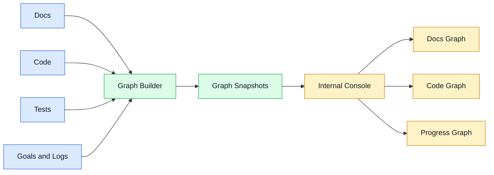

# Project Intelligence Console Architecture v0.1

Status: Draft
Date: 2026-06-25
Source ADR: [ADR-0017](../../adr/0017-public-website-and-project-intelligence-console.md)

## Purpose

Define the implementation boundary for a future internal independent site that renders living Docs Graph, Code Graph, and Project Progress Graph views.

## Architecture



| Layer | Responsibility |
| --- | --- |
| Source readers | Read local docs, code, tests, logs, goals, and git metadata |
| Graph Builder | Normalize nodes, edges, status, provenance, and staleness hints |
| Graph Snapshots | Write JSON outputs under `artifacts/project-graph/` |
| Internal Console | Render graph snapshots as a local-only independent site |

## Snapshot Boundary

Initial generated files should be ignored artifacts, for example:

```text
artifacts/project-graph/
  docs-graph.json
  code-graph.json
  progress-graph.json
  summary.json
```

The snapshots should contain:

- Node id, type, label, path, status, and provenance.
- Edge source, target, relationship, and evidence path.
- Staleness warnings such as "ADR not indexed", "spec not linked from acceptance", or "module lacks test reference".

## Data Boundary

- No hosted service dependency.
- No network calls by default.
- No source upload by default.
- No secrets, env values, private keys, screenshots, traces, or raw logs in graph snapshots.
- Paths should be repo-relative by default when snapshots are intended for review.

## Future Test Strategy

Before runtime implementation:

- Unit tests for markdown/frontmatter/link extraction.
- Unit tests for source tree ownership classification.
- Unit tests for graph node and edge normalization.
- Unit tests for redaction and repo-relative path normalization.
- Integration tests for generating snapshots from fixture docs/code trees.
- E2E tests only after an internal UI exists.

## Non-Implementation Boundary

This architecture spec does not implement the Graph Builder or Internal Console. It defines the boundary required before opening a code implementation goal.
