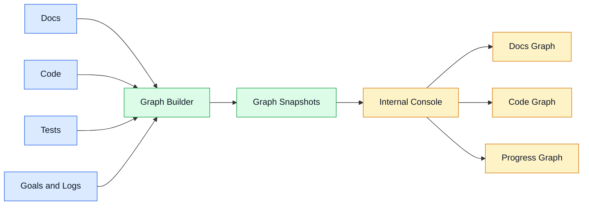

# Project Intelligence Console Architecture v0.1

Status: Draft
Date: 2026-06-25
Source ADR: [ADR-0017](../../adr/0017-public-website-and-project-intelligence-console.md)

## Purpose

Define the implementation boundary for a future internal independent site that renders living Docs Graph, Code Graph, and Project Progress Graph views.

## Architecture


```mermaid
flowchart LR
  Docs["Docs"] --> Builder["Graph Builder"]
  Code["Code"] --> Builder
  Tests["Tests"] --> Builder
  Logs["Goals and Logs"] --> Builder
  Builder --> Snapshot["Graph Snapshots"]
  Snapshot --> Console["Internal Console"]
  Console --> DocsGraph["Docs Graph"]
  Console --> CodeGraph["Code Graph"]
  Console --> ProgressGraph["Progress Graph"]

  classDef source fill:#dbeafe,stroke:#2563eb,color:#111827
  classDef core fill:#dcfce7,stroke:#16a34a,color:#111827
  classDef ui fill:#fef3c7,stroke:#d97706,color:#111827

  class Docs,Code,Tests,Logs source
  class Builder,Snapshot core
  class Console,DocsGraph,CodeGraph,ProgressGraph ui
```

| Layer | Responsibility |
| --- | --- |
| Source readers | Read local docs, code, tests, logs, goals, and git metadata |
| Graph Builder | Normalize nodes, edges, status, provenance, and staleness hints |
| Graph Snapshots | Write JSON outputs under `artifacts/project-graph/` |
| Internal Console | Render graph snapshots as a local-only independent site |
| Findings | Flag stale docs, missing cascades, orphan code entries, missing test links, and progress state mismatches |
| Backlog Generator | Convert selected findings into maintainer-reviewable remediation backlog items |
| Decision Intake Generator | Convert backlog items into pending maintainer decision slots without executing repair |
| Recommendation Draft Generator | Convert pending decision slots into advisory recommended decisions without writing final maintainer decisions |
| Maintainer Decision Recorder | Convert owner-authorized recommendation decisions into final decision records without executing repair |
| Controlled Remediation Planner | Convert repair decisions into file-level remediation plans without mutating source-of-truth documents |
| Controlled Remediation Executor | Apply owner-authorized documentation cascade repairs with file-level rollback and verification evidence |
| Agent Context Exporter | Convert graph snapshot and `.autopilot` state into concise Codex / AI IDE context packages |
| Watch Mode Runner | Poll bounded local source-of-truth paths and refresh snapshot plus agent context artifacts |
| Watch Handoff Exporter | Convert watch status and agent context into AI IDE readable consumption instructions |
| False-Positive Catalog | Define and implement local fixture categories, expected finding snapshots, severity/rationale review fields, maintainer review boundaries, and package-owned contract exports for future detection quality work |

## Snapshot Boundary

Current generated files are ignored artifacts:

```text
artifacts/project-graph/
  project-intelligence-snapshot.json
  project-intelligence-snapshot.md
  project-intelligence-viewer.html
  adr-cascade-remediation-backlog.md
  adr-cascade-remediation-decision-intake.md
  adr-cascade-remediation-decision-intake.json
  adr-cascade-remediation-recommendation-draft.md
  adr-cascade-remediation-recommendation-draft.json
  adr-cascade-maintainer-decision-record.md
  adr-cascade-maintainer-decision-record.json
  adr-cascade-controlled-remediation-plan.md
  adr-cascade-controlled-remediation-plan.json
  project-intelligence-agent-context.md
  project-intelligence-agent-context.json
  project-intelligence-watch-status.json
  project-intelligence-watch-handoff.md
  project-intelligence-watch-handoff.json
```

The snapshots should contain:

- Node id, type, label, path, status, and provenance.
- Edge source, target, relationship, and evidence path.
- Staleness warnings such as "ADR not indexed", "spec not linked from acceptance", or "module lacks test reference".
- Findings with category, severity, title, detail, path, and evidence.

## Data Boundary

- No hosted service dependency.
- No network calls by default.
- No source upload by default.
- No secrets, env values, private keys, screenshots, traces, or raw logs in graph snapshots.
- Paths should be repo-relative by default when snapshots are intended for review.

## Future Test Strategy

Before runtime implementation:

- Unit tests for markdown/frontmatter/link extraction.
- Unit tests for source tree ownership classification.
- Unit tests for graph node and edge normalization.
- Unit tests for redaction and repo-relative path normalization.
- Integration tests for generating snapshots from fixture docs/code trees.
- E2E tests only after an internal UI exists.

## Non-Implementation Boundary

The local Graph Builder is implemented as `pnpm project:intelligence`.

The local static viewer is implemented as `pnpm project:intelligence:view`.

Graph freshness/staleness findings are implemented in the local snapshot and viewer.

The `orphan_code` ownership documentation rule is calibrated to exact app/package root README matching. A nested `docs/README.md` or dependency README does not satisfy the app/package ownership documentation check.

ADR cascade backlog generation is implemented as a local review artifact.

ADR cascade decision intake generation is implemented as a local review artifact.

ADR cascade recommendation draft generation is implemented as a local review artifact.

ADR cascade maintainer decision recording is implemented as a local decision artifact. It consumes the ignored recommendation draft JSON and writes ignored Markdown/JSON decision records without invoking repair execution or mutating source-of-truth documents.

ADR cascade controlled remediation planning is implemented as a local planning artifact. It consumes the ignored maintainer decision record JSON and writes ignored Markdown/JSON plan records with target files, execution order, rollback notes, and verification checklist without invoking repair execution or mutating source-of-truth documents.

Project Intelligence ADR Cascade Controlled Remediation Execution v0.1 has applied 11 owner-authorized ADR documentation cascade repairs by adding explicit `Cascade Evidence` links to canonical product, spec, plan, testing, acceptance, log, and Project Intelligence documents. Post-remediation freshness closure remains a separate goal so residual findings can be reviewed.

Project Intelligence Agent Context Export v0.1 is implemented as `pnpm project:intelligence:agent-context`. It consumes the local snapshot and `.autopilot` state, then writes ignored JSON/Markdown context packages with read order, current goal, recommended goal, product surfaces, blockers, evidence paths, redaction, and non-authorization boundaries.

Project Intelligence Watch Mode Implementation v0.1 is implemented as `pnpm project:intelligence:watch`. It runs a foreground local bounded-polling watcher over docs/code/autopilot source-of-truth paths, ignores generated artifacts/dependencies/dist/cache/secrets, debounces bursts for 1500 ms by default, refreshes `project-intelligence-snapshot` before deriving `project-intelligence-agent-context`, and writes sanitized `project-intelligence-watch-status.json` under `artifacts/project-graph/`.

Project Intelligence Watch Mode Local Smoke Validation v0.1 is completed. The smoke test uses an isolated fixture to validate accepted file-change refresh, ignored path non-refresh, debounce coalescing, snapshot -> agent-context -> status order, and abort/manual stop behavior.

Project Intelligence Watch Mode AI IDE Consumption Handoff v0.1 is implemented as `pnpm project:intelligence:watch-handoff`. It consumes local watch status and agent context artifacts and writes ignored JSON/Markdown handoff artifacts with read order, freshness checklist, stop instructions, and non-authorization boundaries for Codex / AI IDE consumption.

Project Intelligence Watch Mode End-to-End Local Fixture Validation v0.1 is completed. The integration fixture verifies the full local artifact chain: `project-intelligence-snapshot.json`, `project-intelligence-agent-context.json`, `project-intelligence-watch-status.json`, and `project-intelligence-watch-handoff.json` remain mutually consistent. The handoff runner now checks local artifact existence so generated snapshot and agent-context Markdown artifacts are represented as `available` instead of merely `expected`.

Project Intelligence Watch Mode Operator Playbook v0.1 is completed as an operations-layer architecture boundary. It does not add runtime infrastructure; it documents how maintainers, Codex, and AI IDEs operate the existing local watch chain, read artifacts in order, diagnose freshness failures, recover by regenerating source-derived artifacts, stop with `Ctrl+C`, and avoid hosted dashboard, cloud sync, telemetry, deployment, public release, and target repo writes.

Project Intelligence Watch Mode Operator Playbook Consumption Validation v0.1 is completed as an operations-layer consumption guard. It does not add runtime infrastructure; it verifies the playbook and generated handoff are aligned on command order, artifact read order, freshness failure blocking, maintainer review boundaries, and no target repo write behavior.

Project Intelligence Watch Mode Recovery Command UX v0.1 is completed as a handoff-contract enhancement. It adds `recoveryPlan` to the generated watch handoff and mirrors it in Markdown, so AI IDEs can distinguish `not_needed` from `required`, read failed freshness check IDs, run local regeneration / inspection commands, and avoid manual generated-artifact edits, hosted dashboard, telemetry, cloud sync, deployment, and target repo writes.

Project Intelligence Watch Mode Recovery UX Real Workspace Smoke v0.1 is completed as an integration-level architecture check. It validates the real RepoAssure workspace `watch --once` -> handoff path as fresh and not needing recovery, then validates an isolated failing watch status fixture as requiring local recovery commands. This confirms the recovery handoff is actionable without adding hosted infrastructure, telemetry, cloud sync, deployment, or target repo write behavior.

Project Intelligence Watch Mode Completion Audit v0.1 is completed as an architecture closure check. It confirms the current local-only watch-mode architecture is complete for runtime, generated artifacts, operator playbook, recovery UX, tests, docs, and boundaries, with 6/6 freshness checks passed and `recoveryPlan.status=not_needed`.

Product False-Positive Regression Catalog Planning v0.1 is completed as a local quality-governance architecture plan. It defines the future catalog contract for browser hardening findings, Project Intelligence findings, security assurance findings, and repair planner consumption. It does not add suppression logic, does not downgrade severity automatically, does not write target repos, and makes no runtime detection behavior change.

Product False-Positive Regression Catalog Contract Implementation v0.1 is completed as a package-owned local contract. `packages/acceptance/src/false-positive-catalog.ts` implements `falsePositiveRegressionCatalogContract`, `buildFalsePositiveRegressionCatalog`, and `validateFalsePositiveRegressionCatalog`, with root/subpath package exports and contract/package tests. It is still not a detector change, not suppression, not automatic severity downgrade, and not a target repo write path.

Product False-Positive Regression Catalog Artifact Generation v0.1 is completed as a local artifact generation layer above the contract. `packages/acceptance/src/run-false-positive-catalog.ts` writes `artifacts/project-graph/false-positive-regression-catalog.json` and `.md`, and exposes the runner through `@hardening-mcp/acceptance/run-false-positive-catalog` plus `pnpm false-positive:catalog`. These artifacts are ignored local evidence for maintainer and AI IDE consumption. They are not detector configuration, not hosted dashboard data sync, not suppression logic, and not a target repo mutation path.

Product False-Positive Regression Catalog Consumption Validation v0.1 is completed as a local consumption guard above the generated catalog artifacts. `packages/acceptance/src/run-false-positive-catalog-consumption.ts` validates the JSON-first / Markdown-second AI IDE read order, maintainer review boundary, fixture categories, expected finding snapshots, review fields, verification checklist, redaction, no target repo writes, no suppression, no automatic severity downgrade, and no runtime detection behavior change. The runner is exposed through `@hardening-mcp/acceptance/run-false-positive-catalog-consumption` and `pnpm false-positive:catalog:validate`, and emits ignored local evidence files under `artifacts/project-graph/`.

Product False-Positive Regression Catalog Completion Audit v0.1 is completed as an architecture closure check for the current local-only catalog slice. It confirms planning, contract implementation, artifact generation, and consumption validation are complete as `complete_for_current_local_only_catalog_slice`. It adds no runtime detector behavior, no suppression path, no automatic severity downgrade, no target repo mutation path, no hosted dashboard, no cloud sync, no telemetry, no deployment, and no public release action. The next architecture-safe goal is Product False-Positive Regression Catalog Real Fixture Expansion v0.1.

Product False-Positive Regression Catalog Real Fixture Expansion v0.1 is completed as a local evidence expansion above the catalog contract. `packages/acceptance/src/false-positive-catalog.ts` now includes `real_world_fixture_regressions`, 2 near-real public fixture candidates, fixture origin metadata, and non-private/source-free/secret-free privacy metadata. `packages/acceptance/src/run-false-positive-catalog.ts` exposes those fields in local JSON/Markdown artifacts, and `packages/acceptance/src/run-false-positive-catalog-consumption.ts` requires the new category during AI IDE consumption validation. This remains not a detector configuration path, not suppression logic, not automatic severity downgrade, and not a target repo mutation path.

Product False-Positive Regression Catalog Detector Calibration Planning v0.1 is completed as an architecture boundary before future detector changes. It maps near-real fixtures to detector calibration questions, manual review gates, and future implementation authorization. The next architecture-safe goal is Product False-Positive Regression Catalog Detector Calibration Contract v0.1, still local-only and still outside runtime detector behavior.

Product False-Positive Regression Catalog Detector Calibration Contract v0.1 is completed as a local contract artifact layer above the planning record. `packages/acceptance/src/run-false-positive-detector-calibration-contract.ts` emits ignored local JSON/Markdown artifacts under `artifacts/project-graph/`, and exposes the runner through `@hardening-mcp/acceptance/run-false-positive-detector-calibration-contract` plus `pnpm false-positive:calibration-contract`. The contract is not detector configuration, not suppression logic, not automatic severity downgrade, not a confidence-threshold change, and not a target repo mutation path. The next architecture-safe goal is Product False-Positive Regression Catalog Detector Calibration Contract Consumption Validation v0.1.

Product False-Positive Regression Catalog Detector Calibration Contract Consumption Validation v0.1 is completed as a local consumption guard above the generated detector calibration contract artifacts. `packages/acceptance/src/run-false-positive-detector-calibration-contract-consumption.ts` validates AI IDE read order, calibration questions, manual gates, future authorization requirements, maintainer review boundary, Markdown readability, redaction, and fail-closed no runtime detector behavior change / no target repo write rules. It emits ignored local JSON/Markdown validation evidence under `artifacts/project-graph/` through `@hardening-mcp/acceptance/run-false-positive-detector-calibration-contract-consumption` and `pnpm false-positive:calibration-contract:validate`. The next architecture-safe goal is Product False-Positive Regression Catalog Detector Calibration Completion Audit v0.1.

Product False-Positive Regression Catalog Detector Calibration Completion Audit v0.1 is completed as an architecture closure check for the current local-only detector calibration slice. It confirms detector calibration planning, contract generation, and contract consumption validation are complete as `complete_for_current_local_only_detector_calibration_slice`, while preserving no runtime detector behavior change, no suppression path, no automatic severity downgrade, no detector confidence threshold change, no acceptance policy change, no target repo mutation path, no hosted dashboard, no cloud sync, no telemetry, no deployment, and no public release action. The next architecture-safe goal is Product False-Positive Regression Catalog Detector Calibration Authorization Intake v0.1.

Product False-Positive Regression Catalog Detector Calibration Authorization Intake v0.1 is completed as a governance intake layer. It records `authorization_intake_created_pending_maintainer_decisions`, creates pending approve / reject / defer / accept-risk slots for the two calibration questions, and selects Product False-Positive Regression Catalog Detector Calibration Maintainer Decision Recording v0.1 as the next architecture-safe goal. It remains outside runtime detector configuration and does not add suppression logic, automatic severity downgrade, confidence threshold changes, acceptance policy changes, target repo writes, hosted dashboard, cloud sync, telemetry, deployment, or public release action.

Hosted dashboard, cloud sync, telemetry, source-code mutation, target repo writes, deployment, and public release remain separate future goals or explicit confirmation gates.
