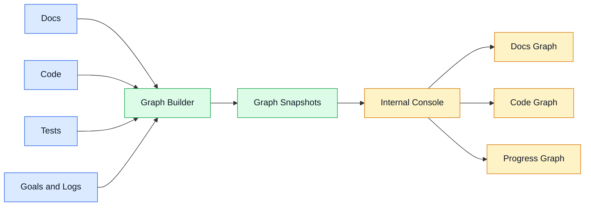

# Project Intelligence Console Architecture v0.1

Status: Draft
Date: 2026-06-25
Source ADR: [ADR-0017](../../adr/0017-public-website-and-project-intelligence-console.md)

## Purpose

Define the implementation boundary for a future internal independent site that renders living Docs Graph, Code Graph, and Project Progress Graph views.

## Architecture


```mermaid
flowchart LR
  Docs["Docs"] --> Builder["Graph Builder"]
  Code["Code"] --> Builder
  Tests["Tests"] --> Builder
  Logs["Goals and Logs"] --> Builder
  Builder --> Snapshot["Graph Snapshots"]
  Snapshot --> Console["Internal Console"]
  Console --> DocsGraph["Docs Graph"]
  Console --> CodeGraph["Code Graph"]
  Console --> ProgressGraph["Progress Graph"]

  classDef source fill:#dbeafe,stroke:#2563eb,color:#111827
  classDef core fill:#dcfce7,stroke:#16a34a,color:#111827
  classDef ui fill:#fef3c7,stroke:#d97706,color:#111827

  class Docs,Code,Tests,Logs source
  class Builder,Snapshot core
  class Console,DocsGraph,CodeGraph,ProgressGraph ui
```

| Layer | Responsibility |
| --- | --- |
| Source readers | Read local docs, code, tests, logs, goals, and git metadata |
| Graph Builder | Normalize nodes, edges, status, provenance, and staleness hints |
| Graph Snapshots | Write JSON outputs under `artifacts/project-graph/` |
| Internal Console | Render graph snapshots as a local-only independent site |
| Findings | Flag stale docs, missing cascades, orphan code entries, missing test links, and progress state mismatches |
| Backlog Generator | Convert selected findings into maintainer-reviewable remediation backlog items |
| Decision Intake Generator | Convert backlog items into pending maintainer decision slots without executing repair |
| Recommendation Draft Generator | Convert pending decision slots into advisory recommended decisions without writing final maintainer decisions |
| Maintainer Decision Recorder | Convert owner-authorized recommendation decisions into final decision records without executing repair |
| Controlled Remediation Planner | Convert repair decisions into file-level remediation plans without mutating source-of-truth documents |
| Controlled Remediation Executor | Apply owner-authorized documentation cascade repairs with file-level rollback and verification evidence |

## Snapshot Boundary

Current generated files are ignored artifacts:

```text
artifacts/project-graph/
  project-intelligence-snapshot.json
  project-intelligence-snapshot.md
  project-intelligence-viewer.html
  adr-cascade-remediation-backlog.md
  adr-cascade-remediation-decision-intake.md
  adr-cascade-remediation-decision-intake.json
  adr-cascade-remediation-recommendation-draft.md
  adr-cascade-remediation-recommendation-draft.json
  adr-cascade-maintainer-decision-record.md
  adr-cascade-maintainer-decision-record.json
  adr-cascade-controlled-remediation-plan.md
  adr-cascade-controlled-remediation-plan.json
```

The snapshots should contain:

- Node id, type, label, path, status, and provenance.
- Edge source, target, relationship, and evidence path.
- Staleness warnings such as "ADR not indexed", "spec not linked from acceptance", or "module lacks test reference".
- Findings with category, severity, title, detail, path, and evidence.

## Data Boundary

- No hosted service dependency.
- No network calls by default.
- No source upload by default.
- No secrets, env values, private keys, screenshots, traces, or raw logs in graph snapshots.
- Paths should be repo-relative by default when snapshots are intended for review.

## Future Test Strategy

Before runtime implementation:

- Unit tests for markdown/frontmatter/link extraction.
- Unit tests for source tree ownership classification.
- Unit tests for graph node and edge normalization.
- Unit tests for redaction and repo-relative path normalization.
- Integration tests for generating snapshots from fixture docs/code trees.
- E2E tests only after an internal UI exists.

## Non-Implementation Boundary

The local Graph Builder is implemented as `pnpm project:intelligence`.

The local static viewer is implemented as `pnpm project:intelligence:view`.

Graph freshness/staleness findings are implemented in the local snapshot and viewer.

ADR cascade backlog generation is implemented as a local review artifact.

ADR cascade decision intake generation is implemented as a local review artifact.

ADR cascade recommendation draft generation is implemented as a local review artifact.

ADR cascade maintainer decision recording is implemented as a local decision artifact. It consumes the ignored recommendation draft JSON and writes ignored Markdown/JSON decision records without invoking repair execution or mutating source-of-truth documents.

ADR cascade controlled remediation planning is implemented as a local planning artifact. It consumes the ignored maintainer decision record JSON and writes ignored Markdown/JSON plan records with target files, execution order, rollback notes, and verification checklist without invoking repair execution or mutating source-of-truth documents.

Project Intelligence ADR Cascade Controlled Remediation Execution v0.1 has applied 11 owner-authorized ADR documentation cascade repairs by adding explicit `Cascade Evidence` links to canonical product, spec, plan, testing, acceptance, log, and Project Intelligence documents. Post-remediation freshness closure remains a separate goal so residual findings can be reviewed.

Hosted dashboard, cloud sync, telemetry, watch mode, source-code mutation, target repo writes, deployment, and public release remain separate future goals or explicit confirmation gates.
