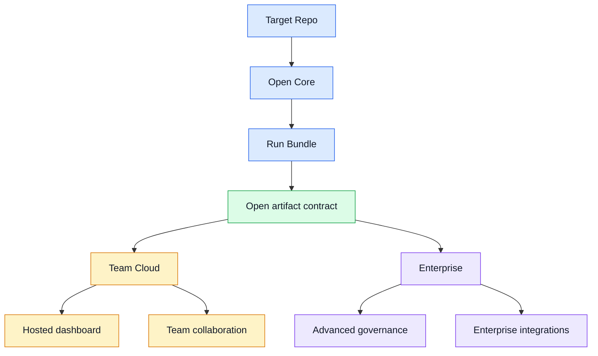

# Team Cloud & Enterprise Architecture v0.1

Status: Draft
Date: 2026-06-25
Source ADR: [ADR-0016](../../adr/0016-team-cloud-enterprise-boundary.md)

## Purpose

Define the architecture boundary for future Team Cloud and Enterprise editions before any hosted paid feature is implemented.

## Core Principle

Team Cloud and Enterprise must sit above the Open artifact contract. They may orchestrate, store, index, compare, visualize, govern, and integrate artifacts, but they must not replace local-first execution or fork the open artifact schema.

## Architecture Map

| Layer | Responsibility | Boundary |
| --- | --- | --- |
| Target Repo | Customer repository under test | Never uploaded by default |
| Open Core | CLI, MCP, GitHub Action, acceptance modes, artifact generation | Runs locally or inside customer-controlled CI |
| Run Bundle | `.hardening/runs/<run-id>` and `.hardening/latest/manifest.json` | Primary handoff unit |
| Open artifact contract | Stable schemas for reports, findings, repair plans, handoff, execution, patch plans, and manifests | Open-core interoperability surface |
| Commercial control plane | Hosted dashboard, collaboration, history, policy, audit, integrations | May ingest explicit artifacts and commercial metadata |

## Data Boundary

Default commercial ingestion may include:

- `manifest.json`
- `hardening-report.md`
- `repo-profile.json` after existing redaction rules
- `findings.json` after existing redaction rules
- `repair-plan.json`
- `repair-task-package.json`
- `repair-handoff-package.json`
- `repair-execution-report.json`
- `patch-plan.json`
- User-entered commercial metadata such as comments, owner, status, policy decision, exception reason, and reviewer approval

Default commercial ingestion must exclude:

- Target repo source files
- Raw logs unless explicitly sanitized and opted in
- Screenshots and traces unless explicitly selected and policy-approved
- Env values, private keys, tokens, cookies, Authorization credentials, and private artifacts
- Any unredacted provider scan output

No target repo source upload by default.

## Commercial Control Plane

The Commercial control plane may add:

- Organization, workspace, repo, and run history.
- Hosted dashboard views over imported run bundles.
- Comments, assignments, status, reviewer decision, and repair workflow tracking.
- Policy evaluation and exception records.
- Audit retention and export.
- Integrations with code hosts, issue trackers, notification systems, SIEM/GRC tools, and enterprise AI platforms.

The control plane must not mutate local artifacts in place. If commercial metadata needs to reference a run, it should store references by repo identity, run id, artifact hash, schema version, and import timestamp.

## Team Cloud Architecture Boundary

Team Cloud is a multi-tenant SaaS packaging layer.

Initial Team Cloud implementation should start with:

- Explicit artifact import.
- Hosted run dashboard.
- Multi-repo history.
- Basic collaboration metadata.
- PR or notification summaries that point back to local artifact evidence.

It should not start with:

- Remote execution of customer code.
- Cloud-only hardening runs.
- Automatic target repo source upload.
- Billing, SSO, or enterprise retention before artifact import value is validated.

## Enterprise Architecture Boundary

Enterprise is a commercial deployment and governance layer.

Enterprise may add:

- SSO/RBAC and identity provider integration.
- Policy center, approvals, and exception workflow.
- Audit retention, data residency, and compliance exports.
- Private deployment, on-prem, or customer cloud packaging.
- Enterprise integrations with GitHub Enterprise, GitLab, Jira, Linear, Slack, Teams, SIEM/GRC, and enterprise AI platforms.

Enterprise must support customer-controlled data boundaries. Regulated deployments should be able to run without sending target repo source to RepoAssure-operated infrastructure.

## Testing Strategy

Current v0.1 uses structure-level tests only because no commercial runtime is implemented.

Future implementation must add tests at the correct pyramid layer:

| Layer | Required before implementation expands |
| --- | --- |
| Unit | Artifact import normalization, schema validation, redaction, policy evaluation |
| Integration | Upload/import command or API, dashboard data loading, PR/issue integration adapter |
| E2E | A fixture run bundle moves through dashboard review, collaboration, policy decision, and export |
| Security | Redaction regression, upload allowlist, tenant isolation, audit log integrity |

## Non-Implementation Boundary

This architecture spec does not authorize hosted paid features, cloud storage, user accounts, billing, or remote artifact ingestion code. It only defines the boundary required before those implementation goals are opened.
