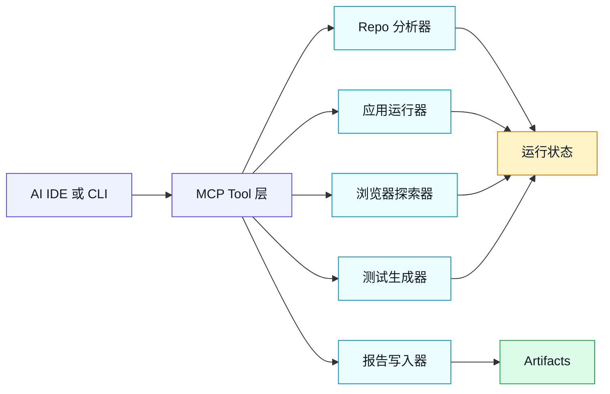

# hardening-mcp 技术 Spike 计划

最后更新：2026年6月18日
状态：草案
关联规格：`docs/product/specs/mvp-spec-v0.1.md`
时间盒：2 周

## TL;DR

本 spike 用于验证 `hardening-mcp` 是否能在本地针对真实的 vibe-coded 现代 Web 应用 repo 运行，并完成以下流程：

```text
analyze_repo -> boot_app -> explore_app -> generate_tests -> harden_report
```

只有当工具能够在 5 个 benchmark repo 中至少 3 个上完成该流程、发现真实用户会遇到的问题、生成可运行的 Playwright 测试，并在 15 分钟内产出可执行报告时，本 spike 才算成功。

## 目标

证明或证伪 MVP 的核心技术假设：

> 一个本地优先的 MCP Server，能够通过启动应用、模拟用户路径、检测真实故障、生成回归测试并产出可执行补丁 diff，对 AI 生成的 Web 应用进行可靠硬化。

这不是产品化 sprint。它应产出一个可运行原型、benchmark 结果，以及针对 PRD v0.2 的 Go/No-go 建议。

## 非目标

不要在 spike 时间内投入以下事项：

- SaaS dashboard
- GitHub App
- 认证、计费或团队管理
- 企业 SSO/RBAC/审计日志
- 云端执行
- 非 Web 技术栈
- 移动端自动化
- 完整安全审计
- 深度架构重构
- 营销网站
- 精致 UI

## 假设

| ID | 假设 | 验证方式 | 通过标准 |
| --- | --- | --- | --- |
| H1 | Repo 分析可以为现代 Web 应用推断框架、包管理器和启动命令 | 在 5 个 benchmark repo 上运行 `analyze_repo` | 5 个中 4 个产出可用 repo profile |
| H2 | 原型可以在本地启动真实 vibe-coded 应用 | 分析后运行 `boot_app` | 5 个中 3 个应用可在浏览器访问 |
| H3 | Playwright 探索可以发现真实用户会遇到的故障 | 在已启动应用上运行 `explore_app` | 每个完成流程的 repo 至少发现 2 个真实问题 |
| H4 | 故障或关键路径可以转换为可运行 Playwright 测试 | 运行 `generate_tests` | 每个完成流程的 repo 至少生成 1 条可运行测试 |
| H5 | 报告可执行，而不是泛泛建议 | 由目标用户或内部评审者评估 | 报告包含证据、复现步骤、严重级别和修复指导 |
| H6 | 首份报告耗时可接受 | 测量端到端运行时间 | 15 分钟内产出首份报告 |

## 原型架构



备用说明：

| 组件 | 职责 |
| --- | --- |
| MCP Tool 层 | 向 AI IDE 暴露 P0 tools，并与 CLI 共享实现 |
| Repo 分析器 | 识别技术栈、包管理器、脚本、应用路径和现有测试 |
| 应用运行器 | 启动应用、监听日志、检测端口并检查健康状态 |
| 浏览器探索器 | 使用 Playwright 探索页面并收集运行时证据 |
| 测试生成器 | 为可复现故障和关键路径写入 Playwright specs |
| 报告写入器 | 产出 Markdown 报告、就绪度评分、问题列表和补丁 diff 指导 |
| 运行状态 | 一次硬化运行过程中在各工具间传递的共享 JSON 状态 |
| Artifacts | 写入 `.hardening/`、`tests/hardening/` 和 `hardening-report.md` 的文件 |

## 实现范围

### 必需工具

| Tool | Spike 要求 | 禁止事项 |
| --- | --- | --- |
| `analyze_repo` | 检查 repo，并返回技术栈 profile、包管理器、脚本、可能的启动命令、应用目录和风险 | 不要求配置文件 |
| `boot_app` | 启动 dev server，检测本地 URL，捕获日志，检测缺失 env 阻塞项 | 不隐藏启动失败 |
| `explore_app` | 爬取可访问路由，与常见元素交互，捕获 console/network/screenshot 证据 | 不在缺少护栏的情况下点击疑似破坏性控件 |
| `generate_tests` | 在 `tests/hardening/` 下创建 Playwright specs | 不覆盖现有测试 |
| `harden_report` | 写入包含发现项、证据、评分、测试和修复指导的 `hardening-report.md` | 不在缺少证据时宣称生产就绪 |

### CLI 命令

CLI 可以保持轻量，并直接映射到 MCP tool 行为。

```text
hardening analyze
hardening boot
hardening explore
hardening generate-tests
hardening report
hardening run
```

`hardening run` 应使用合理默认值执行完整链路。

## 工具契约

### `analyze_repo`

输入：

```json
{
  "root": "/absolute/path/to/repo"
}
```

输出：

```json
{
  "framework": "nextjs | vite | react | unknown",
  "packageManager": "npm | pnpm | yarn | unknown",
  "scripts": {
    "dev": "string | null",
    "build": "string | null",
    "test": "string | null"
  },
  "recommendedStartCommand": "string | null",
  "appDirectories": ["string"],
  "existingTestDirectories": ["string"],
  "envHints": ["string"],
  "blockers": ["string"],
  "confidence": "high | medium | low"
}
```

### `boot_app`

输入：

```json
{
  "root": "/absolute/path/to/repo",
  "startCommand": "npm run dev",
  "timeoutMs": 120000
}
```

输出：

```json
{
  "status": "running | blocked | failed",
  "url": "http://localhost:3000",
  "port": 3000,
  "logsPath": ".hardening/run/app.log",
  "blockers": ["string"],
  "errors": ["string"]
}
```

### `explore_app`

输入：

```json
{
  "url": "http://localhost:3000",
  "criticalPaths": [
    "test login",
    "create a project"
  ],
  "maxRoutes": 20,
  "maxActionsPerRoute": 20
}
```

输出：

```json
{
  "visitedRoutes": ["string"],
  "interactions": ["string"],
  "findings": [
    {
      "severity": "P0 | P1 | P2",
      "type": "white_screen | broken_route | dead_control | form_failure | console_error | network_error",
      "title": "string",
      "reproSteps": ["string"],
      "evidence": ["string"]
    }
  ],
  "artifactsDir": ".hardening/artifacts"
}
```

### `generate_tests`

输入：

```json
{
  "findingsPath": ".hardening/run/findings.json",
  "outputDir": "tests/hardening",
  "smokeRoutes": ["/login", "/projects/new"]
}
```

输出：

```json
{
  "createdFiles": ["tests/hardening/smoke.spec.ts"],
  "testCommand": "npx playwright test tests/hardening",
  "validationStatus": "passed | failed | skipped",
  "errors": ["string"]
}
```

### `harden_report`

输入：

```json
{
  "runDir": ".hardening/run",
  "outputPath": "hardening-report.md"
}
```

输出：

```json
{
  "reportPath": "hardening-report.md",
  "readinessScore": 0,
  "issueCounts": {
    "P0": 0,
    "P1": 0,
    "P2": 0
  },
  "patchDiffPath": ".hardening/run/patch.diff"
}
```

## Artifact 布局

```text
.hardening/
  latest -> runs/<run-id>
  runs/
    <run-id>/
      manifest.json
      hardening-report.md
      repo-profile.json
      boot-result.json
      app.log
      findings.json
      test-generation.json
      patch.diff
      artifacts/
      generated-tests/
  run/
    repo-profile.json
    app.log
    findings.json
    test-generation.json
    patch.diff
  artifacts/
    screenshots/
    traces/
tests/
  hardening/
    smoke.spec.ts
hardening-report.md
```

AI IDE / Agent 优先读取 `.hardening/latest/manifest.json`。`.hardening/run`、`.hardening/artifacts`、`tests/hardening` 和根目录 `hardening-report.md` 作为兼容路径继续保留。

## 探索护栏

Spike 阶段，浏览器探索器应避免明显破坏性行为。

允许：

- 访问已发现链接。
- 点击导航、标签页、菜单以及带有中性标签的按钮。
- 使用安全占位数据填写文本输入框。
- 仅当操作看起来是本地、演示或非破坏性时提交表单。
- 捕获截图、console 消息和网络失败。

避免或要求用户显式指定关键路径：

- 删除、移除、归档、扣款、支付、转账、发送生产邮件、邀请真实用户。
- 涉及真实支付方式的操作。
- 涉及生产环境管理权限的操作。

## 发现项严重级别

| 严重级别 | 定义 | 示例 |
| --- | --- | --- |
| P0 | 阻塞上线或核心路径 | 应用无法启动、首页白屏、登录路由崩溃 |
| P1 | 重要用户可见故障 | 表单损坏、主 CTA 失效、常见路径 API 500 |
| P2 | 有明确证据的质量问题 | Console 错误、缺少 fallback、非关键路由损坏 |

## 就绪度评分公式

初始评分应与 MVP 规格保持一致：

| 维度 | 权重 |
| --- | ---: |
| 启动健康度 | 25 |
| 路由健康度 | 20 |
| 交互健康度 | 20 |
| 运行时错误健康度 | 15 |
| 可测试性 | 20 |

报告中必须用支撑证据解释评分。没有发现项和证据的评分没有价值。

## Benchmark 协议

### Benchmark 集合

使用五个真实或接近真实的 vibe-coded repo：

| ID | Repo 类型 | 必备特征 |
| --- | --- | --- |
| B1 | 带 auth 的 Next.js landing page | 至少 3 个页面和一个类似 auth 的路径 |
| B2 | CRUD dashboard | 列表/详情/创建/编辑路径 |
| B3 | AI chat app | 消息输入、响应区域、API route 或 mock |
| B4 | Payment 或 checkout mock app | 类 checkout 流程，但不包含真实支付凭证 |
| B5 | Supabase 或 Firebase app | 需要 env 检测和清晰的阻塞项报告 |

### 每个 repo 的运行日志

为每个 repo 记录：

| 字段 | 含义 |
| --- | --- |
| Repo ID | B1-B5 |
| 检测到的技术栈 | 框架和包管理器 |
| 启动状态 | running、blocked、failed |
| 首份报告耗时 | 从开始到报告的分钟数 |
| 访问路由 | 数量 |
| 尝试交互 | 数量 |
| P0/P1/P2 发现项 | 数量 |
| 生成测试 | 数量 |
| 测试通过 | 数量 |
| 人工有用性评分 | useful、mixed、not useful |
| 备注 | 阻塞项和意外情况 |

## 2 周执行计划

### 第 1 周：构建最窄主链路

| 日期 | 重点 | 交付物 |
| --- | --- | --- |
| Day 1 | Repo 搭建和共享核心模型 | Tool interfaces、run state schema、artifact layout |
| Day 2 | `analyze_repo` | 支持 Next.js、Vite、React、npm、pnpm、yarn 的技术栈检测 |
| Day 3 | `boot_app` | Dev server 启动、端口检测、日志捕获、超时处理 |
| Day 4 | 基础 `explore_app` | 访问首页、爬取链接、捕获 console/network 错误 |
| Day 5 | 首次完整本地链路 | 在 1 个 benchmark repo 上跑通 `analyze -> boot -> explore -> report` |

### 第 2 周：在 Benchmarks 上证明流程

| 日期 | 重点 | 交付物 |
| --- | --- | --- |
| Day 6 | 交互探索 | 按钮、表单、简单关键路径 prompt |
| Day 7 | `generate_tests` | 面向 smoke paths 和可复现故障的 Playwright specs |
| Day 8 | `harden_report` | Markdown 报告、严重级别、评分、证据、补丁 diff 指导 |
| Day 9 | Benchmark 运行 | 在全部 5 个 benchmark repo 上执行并收集运行日志 |
| Day 10 | 决策包 | 结果总结、Go/No-go 建议、PRD v0.2 输入 |

## 验收标准

只有当以下条件全部满足时，spike 才算通过：

- 5 个 benchmark repo 中有 3 个完成完整流程。
- 每个完成流程的 repo 至少有 2 个真实发现项。
- 每个完成流程的 repo 至少获得 1 条可运行 Playwright 测试。
- `hardening-report.md` 包含复现步骤、证据、严重级别和修复指导。
- 对于完成流程的 repo，15 分钟内产出首份报告。
- 启动阻塞项被清晰报告，而不是被隐藏为泛泛失败。

## 失败标准

如果出现以下任一情况，应停止或转向：

- 5 个 repo 中少于 2 个可以被分析并启动。
- Playwright 探索主要产生噪声或不可复现发现。
- 生成的测试持续不可运行。
- 报告主要是缺少证据的泛泛建议。
- 系统需要过多针对单个 repo 的手工配置，导致实用性不足。

## Go/No-go 决策

| 决策 | 标准 | 下一步 |
| --- | --- | --- |
| Go | 满足验收标准 | 编写 PRD v0.2 并开始 MVP 实现 |
| Narrow | 核心可行，但范围过宽 | 缩小支持技术栈或路径类型，然后重新运行 spike |
| Pivot | 浏览器探索较弱，但 repo 分析有价值 | 先围绕 repo hardening/reporting 重新定位 |
| Stop | 工具无法可靠产出可执行结果 | 不进入 PRD 或产品化 |

## 风险与缓解

| 风险 | 影响 | 缓解措施 |
| --- | --- | --- |
| 缺失 env vars 阻塞大多数应用 | 高 | 将 env 检测和阻塞项报告作为一等输出 |
| Package install 慢或不稳定 | 中 | 优先复用已有 `node_modules`；安装应显式触发而不是静默执行 |
| Dev server 端口检测失败 | 中 | 解析日志、探测常见端口、允许覆盖 |
| 探索点击不安全控件 | 高 | 使用标签启发式规则并避开破坏性词汇 |
| 测试变脆弱 | 高 | 优先使用 role/text/test-id locators 和简单 smoke assertions |
| 发现项缺乏可信度 | 高 | 要求截图、trace、console log、network log 或复现步骤 |
| 补丁 diff 越界 | 中 | 保持补丁 diff 可选且可人工审查 |

## 决策包内容

Spike 结束时产出：

- `docs/logs/spike-results.md`
- 5 份按 repo 记录的运行日志
- 示例 `hardening-report.md`
- 示例生成的 Playwright 测试
- 示例补丁 diff
- 建议：Go、Narrow、Pivot 或 Stop
- PRD v0.2 输入

## 开放工程决策

- MCP Server 实现使用 TypeScript 还是 Python。
- 应用启动和浏览器探索使用单进程还是 worker process。
- Playwright 是内置，还是使用项目本地 Playwright。
- CLI 应作为一等入口，还是共享核心函数的轻量封装。
- 如何在本地沙箱化应用执行。
- 如何存储 traces，同时避免污染目标 repo。

## 推荐的立即下一步

创建原型 repo 骨架，并优先实现 `analyze_repo`。该工具运行复杂度最低，同时会为 spike 的其余部分建立共享数据模型。
