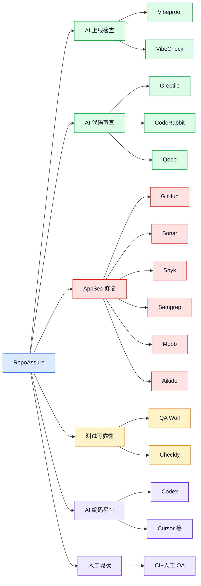
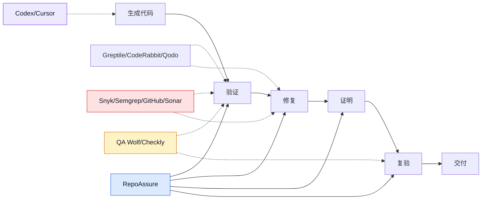

# RepoAssure 全球竞品调研报告

日期：2026-07-05  
状态：ready  
调研对象：RepoAssure，一个本地优先的 AI 代码验收与交付保障层  
调研范围：全球公开产品、官方文档、官网定价页、仓库内产品文档。价格和页面主张是 2026-07-05 的公开可见信息，后续需复核。

## 0. 结论先行

RepoAssure 当前没有一个完全同构的全球竞品。最接近的竞争压力来自四个方向：

1. **AI 应用上线安全/检查工具**：Vibeproof、VibeCheck 抢占“AI/vibe-coded app 是否能上线”的心智，但多数仍停在安全扫描或人工 checklist。
2. **AI 代码审查/验证层**：Greptile、CodeRabbit、Qodo 正在把“PR 审查、修复提示、测试生成、agent loop”合并成代码变更验证层，是 RepoAssure 在团队场景里最强的近邻。
3. **AppSec + 自动修复平台**：GitHub CodeQL/Copilot Autofix、SonarQube、Snyk、Semgrep、Mobb、Aikido 已经成熟覆盖 SAST/SCA/secrets/修复建议/修复 PR。它们会压缩 RepoAssure 的 Security Assurance Lane 空间。
4. **Agentic QA / 可靠性平台**：QA Wolf、Checkly 正在把 Playwright、synthetic monitoring、AI agent workflow 纳入测试与可靠性闭环，会竞争“交付前后证据”的预算。

RepoAssure 的可守差异化不是“更强 scanner”或“更强 code reviewer”，而是：

- local-first，不默认上传目标 repo/source/log/screenshot/trace/env；
- repo-level acceptance，而不是只看 URL、PR diff 或 SAST alert；
- run bundle、manifest、hardening report、repair plan、repair task package、handoff、execution report、patch plan 等机器可读 artifact；
- 为 Cursor、Codex、Claude Code、GitHub Copilot 等 AI IDE/agent 提供修复任务合同，而不是替代 AI IDE；
- 同时覆盖 Web app browser acceptance 与 Python/CLI acceptance 的交付验收路径。

## 1. 产品边界

仓库内文档把 RepoAssure 定义为“本地优先的 AI 代码验收与交付保障层”，目标是把 AI 生成的 repo 变成可验收、可修复、可交付的工程资产。当前实现仍以 `hardening-mcp` 为内部包和 CLI/MCP 名称，能力包括 repo 分析、应用启动、浏览器探索、测试生成、硬化报告、修复计划、修复交接、patch plan 和 Security Assurance Lane provider evidence import。证据见 [README.md](../../../README.md)。

MVP v0.3 明确一句话定位：面向 AI IDE 和 CI 的本地优先交付保障层，把 repo 验收证据转化为可执行、可验证、可分发的修复闭环；同时明确非目标：不默认自动改目标 repo、不创建 PR、不上传目标 repo、不实现 hosted dashboard、不把产品改造成通用 deep vulnerability scanner。证据见 [mvp-spec-v0.3.md](../specs/mvp-spec-v0.3.md)。

商业化文档要求 RepoAssure 集成 Cursor、Codex、Claude Code、GitHub Copilot 等 AI coding surfaces，而不是与它们竞争；并把 Snyk/Semgrep/GitHub/CodeQL 这类安全扫描工具看作安全证据 provider 或相邻平台，而不是直接模仿对象。证据见 [commercialization-strategy-v0.1.md](../strategy/commercialization-strategy-v0.1.md)。

已有竞品草稿已经识别 Vibeproof、VibeCheck、AgentProof、CodeGate、AgentGate、CodeAsure 等命名/定位风险，并确认 RepoAssure 应坚持 repo-level acceptance、repair evidence、AI IDE task contracts。证据见 [competitive-landscape-v0.1.md](competitive-landscape-v0.1.md)。

## 2. 市场地图

| 图中区域 | 对 RepoAssure 的意义 |
| --- | --- |
| AI 上线检查 | 抢“AI 生成应用能不能上线”的早期独立开发者入口。 |
| AI 代码审查 | 抢“所有 agent 产出都需要第二双眼睛”的团队入口。 |
| AppSec 修复 | 抢安全预算、自动修复预算、合规证据预算。 |
| 测试可靠性 | 抢 Playwright/E2E/monitoring 证据预算。 |
| AI 编码平台 | 是入口和集成对象，也是潜在内置替代。 |
| 人工现状 | 仍是最大替代方案：人审、脚本、CI、checklist。 |

## 3. competitor / alternative set

本报告的 competitor / alternative set 定义为：帮助用户回答“AI 生成或 AI 辅助修改的 repo 是否可交付、哪里坏、如何修、如何证明已经修好”的全球产品和替代流程。

### direct competitors

| 竞品 | 类型 | 证据 | 与 RepoAssure 的重叠 | 威胁等级 |
| --- | --- | --- | --- | --- |
| Vibeproof | AI-built app 安全 scanner | 官网定位为 AI-built apps security scanner，支持 live URL/public GitHub repo，检测 leaked keys、open DB、vulnerable libraries、headers、GDPR 等；Deep Scan 标价 $39/scan。来源：[vibeproof.sh](https://vibeproof.sh/) | 上线前检查、AI fix prompt、vibe-coded app 心智 | 高 |
| VibeCheck.software | 本地 launch checklist | 官网称 private/local、面向 solo dev/vibe coders，$79 一次性，Mac only。来源：[vibecheck.software](https://vibecheck.software/) | AI 应用 launch readiness、local/private 心智 | 中 |
| Greptile | AI code review / validation layer | 官网称 AI agents review and test PRs with full codebase context；构建 repo graph、agent swarm、/greploop、TREX writes and runs tests；Pro $30/seat/month。来源：[greptile.com](https://www.greptile.com/)、[pricing](https://www.greptile.com/pricing) | 代码验证、测试生成、AI agent 修复循环 | 高 |
| CodeRabbit | AI code review / finishing layer | 官网称 cut code review time and bugs in half；支持 PR/IDE/CLI、linters/security scanners、pre-merge checks、unit test generation、Fix with AI；Pro $24/user/mo annual。来源：[coderabbit.ai](https://www.coderabbit.ai/)、[pricing](https://www.coderabbit.ai/pricing) | PR 审查、修复提示、测试生成、质量门禁 | 高 |
| Qodo | AI code review + governance | 官网称 AI PR review system，find real issues、enforce standards、agent prompt、requirement validation；Pro Team $30 起，Enterprise 支持 on-prem/air-gapped。来源：[qodo.ai](https://www.qodo.ai/products/qodo-merge/)、[pricing](https://www.qodo.ai/pricing/) | 需求验证、agent prompt、治理与审查标准 | 高 |
| GitHub CodeQL + Copilot Autofix + Copilot code review | 平台原生安全/审查 | GitHub docs 称 CodeQL 用于发现漏洞和错误，Copilot Autofix 为 CodeQL alerts 自动生成修复建议；Copilot code review comments 不计入 required approval，可触发 Fix with Copilot。来源：[CodeQL](https://docs.github.com/en/code-security/concepts/code-scanning/codeql/codeql-code-scanning)、[Autofix](https://docs.github.com/en/code-security/responsible-use/security-and-quality-ai-features)、[Code Review](https://docs.github.com/en/copilot/how-tos/use-copilot-agents/request-a-code-review/use-code-review) | CI/PR 内置安全扫描、修复建议、代码审查 | 高 |
| SonarQube | AI code verification / static analysis | 官网定位为 AI era code verification，覆盖 quality/security/remediation/CI，SaaS 和 self-hosted，AI CodeFix 生成上下文修复建议。来源：[SonarQube](https://www.sonarsource.com/products/sonarqube/) | AI code quality/security verification、企业质量门禁 | 高 |
| CodeGate | 企业 AI AppSec / local zero-day hunting | 官网称 local perimeter execution、data sovereignty、threat-informed hunting、sandbox exploit verification、one-click sovereign patch delivery preview。来源：[codegate.app](https://codegate.app/) | local-first enterprise AppSec、自动验证、patch delivery | 高 |
| Mobb | 自动漏洞修复 | 文档称 ingest SAST results from Checkmarx/CodeQL/Fortify/Snyk/SonarQube/Semgrep and produces code fixes；官网称 ready-to-merge PR、bulk fix、continuous monitoring。来源：[Mobb docs](https://docs.mobb.ai/mobb-user-docs)、[mobb.ai](https://mobb.ai/) | security findings -> 修复 PR/开发者修复 | 中高 |

### indirect competitors

| 竞品 | 类型 | 证据 | 为什么是间接 |
| --- | --- | --- | --- |
| Snyk Code / DeepCode AI | AI-powered SAST + Agent Fix | Snyk Code 称 find, prioritize, auto-fix；DeepCode AI 使用 25M+ data flow cases、19+ languages、security-specific context，强调 never customer data for training。来源：[Snyk Code](https://snyk.io/product/snyk-code/)、[DeepCode AI](https://snyk.io/platform/deepcode-ai/) | 强在代码安全和自动修复，不覆盖完整 repo acceptance artifact。 |
| Semgrep Code / Multimodal / Guardian | SAST + AI reasoning + AI-generated code scan | 官网称 Semgrep Code 是 AI AppSec Engineer；Multimodal combines AI reasoning with rule-based analysis；Guardian scans and fixes AI-generated code when written。来源：[Semgrep Code](https://semgrep.dev/products/semgrep-code/) | 强在 security detection/triage/remediation，不是交付验收包。 |
| Aikido | Unified security from code to runtime | 官网覆盖 SAST、AI code quality、secrets、malware、AI pentest、runtime；AutoFix 可生成 reviewable PR。来源：[aikido.dev](https://www.aikido.dev/) | 安全面更宽，但不是 AI IDE repair artifact contract。 |
| QA Wolf | Agentic E2E testing | 官网称 map workflows、automate Playwright/Appium tests、run fully in parallel；AI explores app and writes production-grade tests。来源：[qawolf.com](https://www.qawolf.com/) | 强在测试执行/托管 QA，不做 repo hardening repair package。 |
| Checkly | Reliability layer for developers & agents | 官网称 create/manage tests, monitors, alerts, status pages in AI-native workflow；用 Playwright checks 和 deploy monitors。来源：[checklyhq.com](https://www.checklyhq.com/) | 强在生产/预生产可靠性监控，不做本地 repo acceptance bundle。 |
| OpenAI Codex | AI coding agent / integration surface | OpenAI 介绍 Codex 是 cloud-based software engineering agent，可写功能、修 bug、运行测试、提交环境内改动，并提供 terminal logs/test outputs citations。来源：[OpenAI Codex](https://openai.com/index/introducing-codex/) | 是 RepoAssure 主要消费方/集成入口，也可能内置部分验证。 |
| AgentProof | AI agent observability | 官网称 real-time observability and monitoring for autonomous tools，含 behavioral monitoring、cost analytics、drift detection、certification。来源：[agentproof.ai](https://agentproof.ai/) | 监控运行中 agent，不验证 AI 生成 repo 的交付状态。 |

### status quo alternatives

| 替代方案 | 用户为什么选择 | RepoAssure 的反制点 |
| --- | --- | --- |
| 人工 code review + QA checklist | 成本低、无新工具采购、流程熟悉 | 缺少机器可读证据、可复验 run bundle、AI IDE task contract。 |
| Playwright/Jest/ESLint/TypeScript/CI 脚本拼装 | 技术团队可自建，控制力强 | 拼装成本高，难覆盖探索、报告、修复计划、handoff、patch plan。 |
| 让 Cursor/Codex/Claude Code “帮我检查并修” | 低摩擦、无需切换工具 | 结果不可标准化，缺少验收证据、manifest、修复优先级和复验合同。 |
| 安全 scanner + ticket backlog | 企业已有采购 | 通常只输出 alert/ticket，不输出交付验收和 AI repair loop。 |

## 4. positioning comparison

| 维度 | RepoAssure | 最接近竞品 |
| --- | --- | --- |
| 一句话心智 | AI-generated repo 的验收、修复、交付证据层 | Sonar：AI code verification；Greptile：code validation layer；Vibeproof：AI-built app safe to ship |
| 输入对象 | 本地 repo、运行中的 app、CLI app、provider evidence | URL、PR diff、SAST alert、repo graph、runtime checks |
| 主要输出 | run bundle、manifest、report、repair plan、task package、handoff、execution report、patch plan | review comments、alerts、fix suggestions、generated tests、PRs、dashboards |
| 信任模型 | local-first，不默认上传目标 repo | 多数为 SaaS；部分支持 self-host/on-prem |
| 关键买点 | 可复验 artifact contract + AI IDE repair loop | 更成熟的 SAST、PR review、E2E 执行、团队 dashboard |

## 5. feature / workflow comparison

| 能力 | RepoAssure | Vibeproof | Greptile | CodeRabbit | Qodo | GitHub | Sonar | Snyk | Semgrep | Mobb | Aikido | QA Wolf |
| --- | --- | --- | --- | --- | --- | --- | --- | --- | --- | --- | --- | --- |
| Local-first 默认执行 | High | Low | Low | Low | Med | Low | Med | Low | Low | Low | Low | Low |
| Repo-level acceptance | High | Med | Med | Med | Med | Low | Med | Low | Low | Low | Low | Low |
| Live app/browser exploration | High | Med | Low | Low | Low | Low | Low | Low | Low | Low | Med | High |
| PR/diff review | Low | Low | High | High | High | High | Med | Med | Med | Low | Med | Low |
| SAST/security depth | Med | Med | Med | Med | Med | High | High | High | High | High | High | Low |
| AI fix suggestions | High | Med | High | High | High | High | High | High | High | High | High | Low |
| Ready-to-merge fix PR | Low | Low | Low | Med | Low | Med | Med | Med | Med | High | High | Low |
| Generated E2E tests | Med | Low | High via TREX | Med | Low | Low | Low | Low | Low | Low | Low | High |
| Machine-readable handoff artifacts | High | Low | Med | Med | Med | Low | Med | Med | Med | Low | Low | Med |
| Patch plan / validation-only loop | High | Low | Med | Med | Low | Low | Low | Low | Low | Low | Low | Med |
| Hosted dashboard | Planned | Yes | Yes | Yes | Yes | Yes | Yes | Yes | Yes | Yes | Yes | Yes |
| Enterprise governance | Planned | Low | High | High | High | High | High | High | High | High | High | Med |

Interpretation:

- RepoAssure 的强项集中在 **repo acceptance artifact + repair handoff + validation-only + patch plan**。
- Greptile/CodeRabbit/Qodo 的强项是 **PR-level code review + agent context + developer workflow**。
- GitHub/Sonar/Snyk/Semgrep/Mobb/Aikido 的强项是 **security findings + fix suggestions/PR + enterprise adoption**。
- QA Wolf/Checkly 的强项是 **E2E test execution + reliability operations**。

## 6. pricing / packaging comparison

| 产品 | 当前公开包装 | 公开价格信号 | 证据 |
| --- | --- | --- | --- |
| RepoAssure | Open-core CLI/MCP/GitHub Action 规划；Team Cloud/Enterprise 仍为 roadmap | 当前未公开定价 | [commercialization-strategy-v0.1.md](../strategy/commercialization-strategy-v0.1.md) |
| Vibeproof | Free scan + Deep scan | Free；Deep scan $39/scan | [Vibeproof pricing section](https://vibeproof.sh/) |
| VibeCheck | Mac 本地 app，一次性购买 | $79 one-time | [VibeCheck](https://vibecheck.software/) |
| Greptile | Starter/Pro/Enterprise | Free starter；Pro $30/seat/month；$1/additional credit | [Greptile pricing](https://www.greptile.com/pricing) |
| CodeRabbit | Free/Pro/Pro Plus/Enterprise/usage add-on | Pro $24/user/mo annual；Pro Plus $48/user/mo annual；Slack agent $0.50/agent minute | [CodeRabbit pricing](https://www.coderabbit.ai/pricing) |
| Qodo | Pro Team + Enterprise | Pro Team $30 起；credit packs；Enterprise custom | [Qodo pricing](https://www.qodo.ai/pricing/) |
| AgentProof | scan + monitoring + enterprise | $299 one-time scan；$99/mo monitoring；$299/mo enterprise monitoring | [AgentProof](https://agentproof.ai/) |
| SonarQube | Cloud + Server + IDE + Advanced Security | Pricing by plan/sales; page emphasizes SaaS/self-hosted | [SonarQube](https://www.sonarsource.com/products/sonarqube/) |
| Snyk | Free/Team/Enterprise | Public page shows Free/Team/Enterprise and Agent Fix availability; exact pricing varies by plan | [Snyk Code](https://snyk.io/product/snyk-code/) |
| Semgrep | Free trial / enterprise AppSec platform | Pricing page exists; product packaging by Code/Supply Chain/Secrets/Guardian/Multimodal | [Semgrep Code](https://semgrep.dev/products/semgrep-code/) |
| QA Wolf | Platform + managed Coverage-as-a-Service | Sales-led / try free | [QA Wolf](https://www.qawolf.com/) |
| Checkly | Reliability SaaS + CLI/MCP | Free start / plan pricing | [Checkly](https://www.checklyhq.com/) |

## 7. 逐类评估

### 7.1 AI 应用上线安全/检查工具

Vibeproof 是最直接抢夺“AI-built app 是否安全上线”心智的产品。它把 Lovable、Bolt、v0、Cursor、Replit、Supabase 等 AI builder 场景写得很明确，覆盖 URL 扫描、public GitHub repo 扫描、live key verification、Supabase/Firebase open DB、vulnerable libraries、headers、GDPR、Nuclei/testssl.sh/Nikto/AI review，并为每个 finding 给 copy-paste AI fix prompt。来源：[Vibeproof](https://vibeproof.sh/)。

VibeCheck 是更轻的本地 launch checklist，卖点是 private/local、solo dev、one-time purchase、BYOK deeper review，但其主要价值是结构化清单和清晰度，不是机器可读修复证据。来源：[VibeCheck](https://vibecheck.software/)。

对 RepoAssure 的启示：

- 独立开发者市场更容易理解 “safe to ship” 和 “what did AI miss”。
- RepoAssure 不应把首页写成单纯 SAST/security scanner，否则会与 Vibeproof 和成熟 AppSec 平台直接撞线。
- 更好的表述是 “turn AI-generated repos into testable, repairable, shippable software”，并展示完整 run bundle 和 repair handoff。

### 7.2 AI 代码审查/验证层

Greptile 最接近 RepoAssure 的“validation layer”叙事。它用 repo graph、agent swarm、team learning、custom rules、MCP、Claude Code plugin、/greploop、TREX 测试 agent 形成 PR 级验证闭环。来源：[Greptile](https://www.greptile.com/)。

CodeRabbit 在市场声量、安装便利性、PR/IDE/CLI 覆盖、linters/security scanner 集成、unit test generation、custom pre-merge checks 和 “Fix with AI” 上很强。它的威胁不是完整替代 RepoAssure，而是让团队认为“AI review + pre-merge checks 已经足够”。来源：[CodeRabbit](https://www.coderabbit.ai/)。

Qodo 强调 real issues、standards enforcement、context engine、agent prompt、requirement validation、enterprise deployment 和 governance，容易进入工程管理/SDLC governance 预算。来源：[Qodo](https://www.qodo.ai/products/qodo-merge/)。

对 RepoAssure 的启示：

- PR-level 工具天然贴近开发者日常，RepoAssure 需要把 GitHub Action/MCP/CLI 的入口做得非常低摩擦。
- RepoAssure 的“任务包 + validation-only + patch plan”要比普通 review comment 更可执行、更可复验。
- 未来 Team Cloud 若实现，应避免只做“另一个 AI code review dashboard”，而应做跨 repo acceptance evidence history。

### 7.3 AppSec + 自动修复平台

GitHub 的 CodeQL、Copilot Autofix、Copilot code review 是平台原生威胁。CodeQL 结果直接显示为 GitHub code scanning alerts；Copilot Autofix 可基于 CodeQL alert 自动生成修复建议；Copilot code review 可以在 PR 和 VS Code 中给建议，并可触发 cloud agent 修复。来源：[CodeQL](https://docs.github.com/en/code-security/concepts/code-scanning/codeql/codeql-code-scanning)、[Copilot Autofix](https://docs.github.com/en/code-security/responsible-use/security-and-quality-ai-features)、[Copilot code review](https://docs.github.com/en/copilot/how-tos/use-copilot-agents/request-a-code-review/use-code-review)。

SonarQube 正在把自己定位成 AI era 的 code verification layer，覆盖 automated code review、static analysis、security analysis、AI CodeFix、SaaS/self-hosted、enterprise compliance。来源：[SonarQube](https://www.sonarsource.com/products/sonarqube/)。

Snyk Code/DeepCode AI、Semgrep Multimodal/Guardian、Mobb、Aikido 都在沿着 “detect -> prioritize -> fix” 方向推进：

- Snyk 强调 dev-focused SAST、auto-fix、DeepCode AI、25M+ data flow cases、security-specific context。来源：[Snyk Code](https://snyk.io/product/snyk-code/)、[DeepCode AI](https://snyk.io/platform/deepcode-ai/)。
- Semgrep 强调 deterministic SAST + AI reasoning、complex flaws、noise reduction、developer remediation、Guardian 扫描并修复 AI-generated code。来源：[Semgrep Code](https://semgrep.dev/products/semgrep-code/)。
- Mobb 专注从多家 SAST 输入生成开发者可 review/commit 的修复，能直接吃掉“security finding -> fix”工作流。来源：[Mobb docs](https://docs.mobb.ai/mobb-user-docs)。
- Aikido 覆盖 code/cloud/attack/protect，AutoFix 可为 code/dependency/IaC/container 生成 reviewable PR。来源：[Aikido](https://www.aikido.dev/)。

对 RepoAssure 的启示：

- Security Assurance Lane 应坚持 provider-backed evidence import，优先让这些扫描结果变成 RepoAssure evidence 和 repair planning input。
- 不要承诺“比 Snyk/Semgrep/GitHub/Sonar 更会找漏洞”；应承诺“把扫描、探索、测试、CLI 验收证据组织成可交付闭环”。
- 未来如做企业版，应支持 SARIF、CodeQL、Snyk、Semgrep、SonarQube、Mobb 等 evidence provider。

### 7.4 Agentic QA / 可靠性平台

QA Wolf 覆盖 map workflows、AI automates Playwright/Appium tests、parallel run infra、managed coverage-as-a-service，并明确“AI software development demands agentic QA”。来源：[QA Wolf](https://www.qawolf.com/)。

Checkly 把自己定义为 developers & agents 的 active reliability layer，支持 tests、monitors、alerts、status pages、Playwright checks、AI root cause analysis、CLI、MCP。来源：[Checkly](https://www.checklyhq.com/)。

对 RepoAssure 的启示：

- RepoAssure 的浏览器探索和 generated tests 不应被包装成完整 QA platform。
- 应突出“交付前 acceptance evidence”和“修复任务复验”，而不是长期 test infra/monitoring。
- 与 QA/monitoring 工具的集成应以 evidence import/export 为主。

### 7.5 AI coding surfaces 和 agent observability

OpenAI Codex 是典型 AI coding surface。OpenAI 官方介绍它可并行执行软件工程任务、读写文件、运行测试、提供 terminal logs/test outputs evidence，并通过 AGENTS.md 获取仓库指令。来源：[OpenAI Codex](https://openai.com/index/introducing-codex/)。

AgentProof 是运行中 AI agent observability/trust 产品，关注行为监控、成本、drift、agent certification、compliance，而不是 repo acceptance。来源：[AgentProof](https://agentproof.ai/)。

对 RepoAssure 的启示：

- Codex/Cursor/Claude Code/GitHub Copilot 是 RepoAssure 的消费渠道，不是应直接对抗的 UI。
- Agent observability 是未来相邻市场，除非 RepoAssure 进入运行时 agent governance，否则不宜混淆定位。

## 8. differentiation opportunities

1. **Evidence-first positioning**  
   把 RepoAssure 定义为 “AI-generated repo acceptance evidence layer”，避开“scanner”和“review bot”红海。

2. **Local-first trust wedge**  
   对比大多数 SaaS review/security/testing 平台，RepoAssure 应强调目标 repo、logs、screenshots、traces、env values 默认不上传。

3. **AI IDE repair contract**  
   将 `repair-task-package.json`、`repair-handoff-package.json`、`verification-plan.md`、`patch-plan.json` 包装成“AI coding agent 的任务接口”，让 Cursor/Codex/Claude Code 能直接消费。

4. **Provider-backed Security Assurance Lane**  
   与 Snyk/Semgrep/GitHub/Sonar/Mobb/Aikido 互补：导入它们的 findings，而不是重建它们的 detection engine。

5. **Multi-mode acceptance**  
   继续强化 Web app + Python/CLI acceptance，这是很多 PR reviewer 和 AppSec scanner 不覆盖的交付维度。

6. **Before/after case-study artifacts**  
   用真实 run bundle 展示 “AI-generated repo -> findings -> repair plan -> validation-only -> patch plan -> accepted”。

## 9. differentiation risks

| 风险 | 触发信号 | 应对 |
| --- | --- | --- |
| PR review 工具吞并 repair loop | Greptile/CodeRabbit/Qodo 的 agent loop、test generation、fix prompts 继续增强 | RepoAssure 要进入 CI/MCP，并强调跨 PR 的 run bundle 和交付验收，不只评论 diff。 |
| AppSec 平台吞并 Security Assurance Lane | GitHub/Sonar/Snyk/Semgrep/Mobb/Aikido 的 Autofix/PR 修复更成熟 | 把它们作为 provider，避免检测能力正面硬刚。 |
| QA 平台吞并 browser acceptance | QA Wolf/Checkly 让团队把 Playwright/E2E 证据全部放在它们系统里 | RepoAssure 做 pre-delivery acceptance 和 repair evidence，支持导出/导入测试结果。 |
| 独立开发者只买廉价 scanner/checklist | Vibeproof/VibeCheck 已能满足“上线前看一下” | 免费/开源 CLI 要低摩擦，报告样例要比 checklist 更有说服力。 |
| 平台原生内置 | GitHub/Codex/Cursor 把 acceptance/report/repair evidence 内置 | RepoAssure 需要成为它们的 artifact provider，而不是独立 UI 孤岛。 |
| 定位稀释 | 同时说 scanner、reviewer、QA、dashboard、agent | 对外只说“repo acceptance and repair evidence”；其他能力作为 evidence lanes。 |

## 10. 建议定位

建议主定位：

> RepoAssure turns AI-generated repositories into testable, repairable, shippable software.

中文表达：

> RepoAssure 把 AI 生成的仓库变成可验收、可修复、可交付的软件资产。

推荐三句支撑：

- Run it locally before you trust generated code.
- Produce evidence humans can review and agents can act on.
- Turn findings into repair tasks, validation plans, and patch decisions.

避免表达：

- “最强 AI 安全扫描器”
- “替代 Snyk/Semgrep/GitHub Advanced Security”
- “替代 Cursor/Codex/Claude Code”
- “自动修好所有问题并创建 PR”
- “hosted dashboard / team cloud available now”

## 11. 推荐路线

### 近期 0-3 个月

1. 发布 3 个 proof artifacts：Web app、Python/CLI、Security provider import。
2. 把 GitHub Action + MCP + CLI 路径做成一页式 quickstart。
3. 建一个 “RepoAssure vs scanner/reviewer/test platform” 对比页，只比较工作流，不做贬低式竞品营销。
4. 增强 `repair-task-package` 对 Cursor/Codex/Claude Code 的 prompt 质量和验证命令质量。

### 中期 3-6 个月

1. 支持 SARIF / CodeQL / Semgrep / Snyk / Sonar / Mobb evidence import。
2. 增加 multi-run history，但仍保持 local-first 文件系统作为默认存储。
3. 做 Team Cloud 前先验证“团队愿意为 report history、cross-repo evidence、collaboration、policy gates”付费。

### 长期 6-12 个月

1. Team Cloud 做 evidence history and collaboration，不做代码托管替代。
2. Enterprise 做 on-prem/private deployment、SSO/RBAC、retention、policy center、provider integrations。
3. 与 AI IDE/agent 平台建立 artifact contract，成为它们的验收插件或 evidence lane。

## 12. sources

### 内部产品资料

- [README.md](../../../README.md)
- [RepoAssure MVP 规格 v0.3](../specs/mvp-spec-v0.3.md)
- [Commercialization Strategy v0.1](../strategy/commercialization-strategy-v0.1.md)
- [Competitive Landscape v0.1](competitive-landscape-v0.1.md)

### 外部官方来源

- [Vibeproof](https://vibeproof.sh/)
- [VibeCheck.software](https://vibecheck.software/)
- [CodeGate](https://codegate.app/)
- [AgentProof](https://agentproof.ai/)
- [OpenAI Codex](https://openai.com/index/introducing-codex/)
- [GitHub CodeQL code scanning](https://docs.github.com/en/code-security/concepts/code-scanning/codeql/codeql-code-scanning)
- [GitHub security and quality AI features / Copilot Autofix](https://docs.github.com/en/code-security/responsible-use/security-and-quality-ai-features)
- [GitHub Copilot code review](https://docs.github.com/en/copilot/how-tos/use-copilot-agents/request-a-code-review/use-code-review)
- [SonarQube](https://www.sonarsource.com/products/sonarqube/)
- [Snyk Code](https://snyk.io/product/snyk-code/)
- [Snyk DeepCode AI](https://snyk.io/platform/deepcode-ai/)
- [Semgrep Code](https://semgrep.dev/products/semgrep-code/)
- [Semgrep Supply Chain](https://semgrep.dev/products/semgrep-supply-chain/)
- [Qodo Git / Qodo Merge](https://www.qodo.ai/products/qodo-merge/)
- [Qodo pricing](https://www.qodo.ai/pricing/)
- [CodeRabbit](https://www.coderabbit.ai/)
- [CodeRabbit pricing](https://www.coderabbit.ai/pricing)
- [Greptile](https://www.greptile.com/)
- [Greptile pricing](https://www.greptile.com/pricing)
- [Mobb](https://mobb.ai/)
- [Mobb docs](https://docs.mobb.ai/mobb-user-docs)
- [Aikido](https://www.aikido.dev/)
- [QA Wolf](https://www.qawolf.com/)
- [Checkly](https://www.checklyhq.com/)

## 13. evidence quality

| 证据类型 | 质量 | 说明 |
| --- | --- | --- |
| 官方产品页/文档 | High | 本报告的功能、包装、定位、价格信号优先引用官方来源。 |
| 仓库内产品文档 | High | 用于确定 RepoAssure 自身边界和非目标。 |
| 官网营销 claim | Medium | 如客户数、效果百分比、benchmark claim，未做第三方审计验证，仅作为市场叙事信号。 |
| 定价页 | Medium | 价格会变，需在对外材料发布前重查。 |
| 无法完整抓取页面 | Low | 未进入核心判断；仅在来源可打开时纳入。 |

## 14. Competitive Brief

Status: ready

Category: AI-generated repository acceptance, repair evidence, and delivery assurance.

Competitor / alternative set: global tools and workflows that help teams decide whether AI-generated or AI-modified code is ready to ship, identify defects/security issues, create or guide fixes, and produce reviewable evidence.

Direct competitors:

- Vibeproof: AI-built app security scanner with free/deep scan and AI fix prompts.
- VibeCheck: local/private launch checklist for solo AI builders.
- Greptile: AI code validation layer with codebase graph, agents, agent loops, and TREX test generation.
- CodeRabbit: AI code review across PR/IDE/CLI with scanners, pre-merge checks, unit test generation, and autofix.
- Qodo: AI code review and governance platform with agent prompts, requirement validation, and enterprise deployment.
- GitHub CodeQL/Copilot Autofix/Copilot code review: platform-native scanning, fixes, and review.
- SonarQube: AI-era code verification, static analysis, AI CodeFix, SaaS/self-hosted.
- CodeGate: local enterprise AI security and zero-day hunting with sandbox validation and patch delivery preview.
- Mobb: SAST finding ingestion and automatic security fixes for developer review.

Indirect competitors:

- Snyk, Semgrep, Aikido: AppSec platforms with AI remediation.
- QA Wolf, Checkly: agentic E2E testing and reliability evidence platforms.
- OpenAI Codex, Cursor, Claude Code, GitHub Copilot: AI coding surfaces and repair executors.
- AgentProof: AI agent runtime observability and certification.

Status quo alternatives:

- Manual review plus QA checklist.
- Existing CI scripts and static analysis stack.
- Ad hoc AI IDE review prompts.
- Security scanner backlog plus ticket workflow.

Positioning comparison:

- RepoAssure should own local-first repo acceptance evidence and AI IDE repair handoff.
- Competitors own PR review, SAST/AppSec detection, E2E infrastructure, or coding execution.

Feature / workflow comparison:

- RepoAssure is strongest in run bundle, manifest, repair plan, repair task package, repair handoff, validation-only, patch plan, and local-first execution.
- Competitors are stronger in hosted dashboard, PR review convenience, enterprise AppSec depth, and managed E2E infrastructure.

Pricing / packaging comparison:

- Low-end AI launch tools price per scan or one-time app purchase.
- AI code review tools price by seat/credits.
- AppSec/security platforms price by plan/sales motion.
- RepoAssure should keep open-core local CLI/MCP/GitHub Action as adoption wedge before Team Cloud.

Differentiation opportunities:

- Evidence-first artifacts.
- Local-first trust.
- AI IDE repair contracts.
- Provider-backed security evidence.
- Multi-mode acceptance.
- Before/after proof artifacts.

Differentiation risks:

- PR review tools annex repair loops.
- AppSec platforms annex security remediation.
- QA platforms annex browser evidence.
- AI coding platforms internalize acceptance.
- Positioning dilution.

Sources:

- Listed in section 12.

Residual competitive risks:

- Public pricing and features can change quickly; re-check before publication.
- Some official claims are marketing claims and need user/customer validation.
- Trademark/naming risk remains separate from this product-market analysis.
