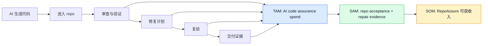

# RepoAssure TAM / SAM / SOM 科学调研报告

日期：2026-07-05  
状态：ready  
对象：RepoAssure 所在的 AI-generated repository acceptance / repair evidence / delivery assurance 赛道  
方法：bottom-up 为主，top-down / competitor pricing / adoption evidence 交叉校验  
币种：USD，年化收入口径 ARR

## 0. 结论

RepoAssure 所在赛道不宜按“AI 编程工具总市场”直接估算，因为 RepoAssure 不是 Cursor / Copilot / Codex 的替代品，也不是通用 AppSec scanner。更科学的口径是：

> **AI 生成代码进入 repo 后，团队为验收、验证、修复证据、交付治理支付的年度软件预算。**

基于公开采用率、竞品价格带、AI 代码质量风险研究和当前产品边界，本报告给出三层估算：

| 指标 | 定义 | 2026 低位 | 2026 基准 | 2026 高位 | 解释 |
| --- | --- | ---: | ---: | ---: | --- |
| TAM | 全球 AI-assisted developer 中愿意为“AI code assurance / validation / acceptance”付费的年度收入池 | $2.3B | $7.5B | $20.4B | 以 GitHub 全球开发者规模、AI 工具采用率和 $10-$30/月价格带推导 |
| SAM | RepoAssure 当前定位可服务的 repo acceptance + repair evidence 子市场 | $0.35B | $2.3B | $9.2B | 从 TAM 中扣除纯代码生成、纯聊天、纯 AppSec、纯长期监控等不匹配工作流 |
| SOM, 3 年 | 当前开源/CLI/MCP/GitHub Action 到 Team Cloud/Enterprise 的现实可获收入 | $0.34M | $3.2M | $18.6M | 按独立付费用户、团队客户、企业客户的 bottom-up GTM 估算 |
| SOM, 5 年 upside | 若 Team Cloud / Enterprise 成立，获得 SAM 的 0.5%-1.0% | $5M-$10M | $11M-$23M | $46M-$92M | 需要公开发布、案例、Team Cloud、企业集成和销售能力成立 |

核心判断：

- **TAM 足够大**：AI coding 已经成为主流，验证/审查/治理正成为下游瓶颈。
- **SAM 取决于定位清晰度**：RepoAssure 必须坚持“repo-level acceptance + repair evidence”，避免卷入完整 AI IDE、AppSec scanner 或 QA platform。
- **SOM 当前主要受产品化和渠道约束**：仓库文档显示 Team Cloud/Enterprise 仍是 roadmap，当前 paid cloud runtime 尚未实现，因此近期 SOM 不能按成熟 SaaS 捕获率估算。

## 1. 市场定义



| 层级 | 本报告包含 | 本报告排除 |
| --- | --- | --- |
| TAM | AI 代码审查、AI 代码验证、AI test generation、AI-assisted AppSec remediation、repo readiness、delivery evidence、governance evidence | 纯 LLM API 消费、纯 IDE/editor、纯代码生成、非开发者办公 Copilot、传统 QA 外包全量市场 |
| SAM | RepoAssure 能直接服务的本地优先 repo 验收、browser/CLI acceptance、repair artifacts、AI IDE handoff、Team Cloud artifact history、Enterprise governance | 完整 AI IDE、完整 SAST/DAST/SCA detection engine、长期 synthetic monitoring、代码托管平台 |
| SOM | RepoAssure 在 3-5 年内通过 open-core、CLI/MCP/GitHub Action、Team Cloud、Enterprise 可现实捕获的 ARR | 当前尚未实现或未授权发布的收入 |

## 2. 核心事实

### AI coding 已成为主流开发工作流

Stack Overflow 2025 Developer Survey 显示，**84%** 受访者正在使用或计划使用 AI 开发工具，较 2024 年的 76% 上升；专业开发者中 **50.6% 每天使用 AI 工具**。同一页还显示，所有受访者当前至少低频使用 AI 工具的比例为 47.1% + 17.7% + 13.7% = **78.5%**。来源：[Stack Overflow Developer Survey 2025 - AI](https://survey.stackoverflow.co/2025/ai)。

GitHub/Copilot 的公开价格也说明 AI coding 已经形成成熟付费锚点：GitHub Copilot Pro 为 **$10/user/month**，Pro+ 为 **$39/user/month**，Max 为 **$100/user/month**；且 Pro 及以上包含 code review、cloud agent、Copilot CLI 等 agentic workflow。来源：[GitHub Copilot plans](https://github.com/features/copilot/plans)。

### 验证、审查、治理是 AI coding 的下游瓶颈

Stack Overflow 2025 显示，开发者对 AI 输出准确性的信任不足：**46%** 对 AI 输出准确性持某种程度的不信任，只有 **33%** 信任，且只有约 **3%** 高度信任。来源：[Stack Overflow Developer Survey 2025 - accuracy of AI tools](https://survey.stackoverflow.co/2025/ai)。

同一调查显示 AI 已进入关键验证工作流，但渗透率低于写代码：当前“mostly/partially AI”的任务中，testing code 为 17.9% + 27.5% = **45.4%**，committing and reviewing code 为 10.2% + 22.6% = **32.8%**。这支持本报告将 SAM 设为 TAM 的 15%-45%，而不是把所有 AI coding spend 都算入 RepoAssure。来源：[Stack Overflow Developer Survey 2025 - AI in workflow](https://survey.stackoverflow.co/2025/ai)。

GitLab AI Accountability 相关公开报道显示，GitLab 调研的 1,500+ 开发者中，**85%** 认为 AI 已把瓶颈从写代码转移到 review / validation；**92%** 组织面临 AI-generated code governance challenges；**91%** 计划投资 governance。该来源是媒体转述，不是本报告的核心人口基数，但可作为需求方向佐证。来源：[TechRadar / GitLab study summary](https://www.techradar.com/pro/speed-without-control-is-a-liability-not-an-advantage-gitlab-study-reveals-ai-code-generation-is-outpacing-controls)。

### AI 生成代码确实带来可验证的质量与维护风险

2026 年 arXiv 论文 *Debt Behind the AI Boom* 在 6,275 个 GitHub repo 中识别 304,362 个 verified AI-authored commits，发现每个 AI coding assistant 至少 **15% commits** 引入至少一个 issue；被跟踪的 AI-introduced issues 中 **24.2%** 在最新 revision 仍然存在。来源：[arXiv: Debt Behind the AI Boom](https://arxiv.org/abs/2603.28592)。

2026 年纵向研究显示，专业工程师的工作正在从 creation 转向 verification、evaluation、correction，作者将其称为 supervisory engineering work；这与 RepoAssure 的“验收与修复证据层”定位一致。来源：[arXiv: The Impact of AI Coding Assistants on Software Engineering](https://arxiv.org/abs/2605.23135)。

### 竞品价格带给出 ARPU 边界

AI code review / validation 竞品公开价格集中在 **$24-$30/user/month**：

- Greptile Pro：**$30/seat/month**，含 50 credits/seat，additional credits $1。来源：[Greptile pricing](https://www.greptile.com/pricing)。
- CodeRabbit Pro：**$24/user/month annual**，Pro Plus **$48/user/month annual**，Slack agent $0.50/agent minute。来源：[CodeRabbit pricing](https://www.coderabbit.ai/pricing)。
- Qodo Pro Team：页面显示 **$30** 起，并强调 agentic PR code review、rules system、Git + IDE integrations、dashboard & analytics。来源：[Qodo pricing](https://www.qodo.ai/pricing/)。

因此，本报告对 RepoAssure 使用三个 ARPU 档：

| 档位 | 年 ARPU | 来源逻辑 |
| --- | ---: | --- |
| 低位 | $120/year | 类似 $10/month 的 add-on 或个人版 |
| 基准 | $240/year | 低于 Greptile/Qodo/CodeRabbit team 价，适合 acceptance evidence add-on |
| 高位 | $360/year | 接近 $30/month 的团队 seat 价格 |

## 3. TAM 测算

### 3.1 公式

```text
TAM = developer universe
    × AI adoption / intent rate
    × monetizable commercial share
    × annual assurance ARPU
```

### 3.2 输入

| 输入 | 低位 | 基准 | 高位 | 证据/假设 |
| --- | ---: | ---: | ---: | --- |
| Developer universe | 150M | 150M | 180M | 150M 采用 2025 年 GitHub 规模媒体/二级来源口径；180M 来自 Octoverse 2025 媒体转述，作为 upside，不作为基准 |
| AI adoption / intent | 64.8% | 83.8% | 90.0% | 64.8% = Stack Overflow 2025 daily+weekly；83.8% = use or plan；90% 为高位情景 |
| Monetizable commercial share | 20% | 25% | 35% | GitHub 注册用户包含学生、hobby、低活跃用户；该项是 paid addressable share 假设 |
| Annual assurance ARPU | $120 | $240 | $360 | 由 Copilot、Greptile、CodeRabbit、Qodo 价格带反推 |

### 3.3 结果

| 场景 | 计算 | TAM |
| --- | --- | ---: |
| 低位 | 150M × 64.8% × 20% × $120 | **$2.3B** |
| 基准 | 150M × 83.8% × 25% × $240 | **$7.5B** |
| 高位 | 180M × 90.0% × 35% × $360 | **$20.4B** |

解释：

- 低位接近“高频 AI 开发者中较小比例愿意付费买 assurance add-on”。
- 基准代表“AI 开发已主流化，约 1/4 developer universe 有商业付费可能，按 $20/month 级别定价”。
- 高位需要 AI coding agent 更深进入专业团队，并且 assurance / review / governance 工具能接近 $30/month 的成熟团队定价。

## 4. SAM 测算

RepoAssure 当前不服务所有 TAM。它服务的是 repo-level acceptance、repair evidence、AI IDE handoff、artifact history、governance evidence。因此 SAM 使用工作流适配比例来收窄：

```text
SAM = TAM × workflow-fit share
```

workflow-fit share 的证据边界：

- Stack Overflow 2025 中当前使用 AI testing code 的比例为 **45.4%**。
- 当前使用 AI committing/reviewing code 的比例为 **32.8%**。
- RepoAssure 的工作流还要求 repo artifacts、acceptance bundle、repair handoff，范围比“AI review/testing”更窄。

因此使用：

| 场景 | Workflow-fit share | SAM |
| --- | ---: | ---: |
| 低位 | 15% | **$0.35B** |
| 基准 | 30% | **$2.3B** |
| 高位 | 45% | **$9.2B** |

解释：

- **15% 低位**：仅 AI delivery teams、独立 AI builders、少数高风险团队愿意单独购买 acceptance evidence。
- **30% 基准**：AI review/testing/governance 成为多数团队的独立预算项，但 RepoAssure 只捕获其中 repo evidence 子集。
- **45% 高位**：AI 生成代码导致 review/validation/governance 成为广泛硬门槛，RepoAssure 与 PR review、AppSec、QA 工具形成互补预算。

## 5. SOM 测算

### 5.1 当前现实边界

当前仓库文档显示，RepoAssure open core 是 local execution 和 artifact-generation layer；Team Cloud 和 Enterprise 仍是 roadmap，且“no paid cloud implementation in this increment”。来源：[Team Cloud & Enterprise Spec v0.1](../specs/team-cloud-enterprise-spec-v0.1.md)。

所以 SOM 不能按成熟 SaaS 市占率直接估算。更合理的是以 GTM 单元构建：

```text
3-year SOM = individual paid users ARR
           + Team Cloud ARR
           + Enterprise ARR
```

### 5.2 3 年 bottom-up SOM

| 收入线 | 低位 | 基准 | 高位 |
| --- | ---: | ---: | ---: |
| Individual paid users | 1,000 × $120 = $0.12M | 5,000 × $120 = $0.60M | 20,000 × $180 = $3.60M |
| Team Cloud | 50 teams × 8 seats × $180 = $0.07M | 300 teams × 15 seats × $240 = $1.08M | 1,000 teams × 25 seats × $300 = $7.50M |
| Enterprise | 5 orgs × $30k = $0.15M | 25 orgs × $60k = $1.50M | 75 orgs × $100k = $7.50M |
| **3-year SOM** | **$0.34M ARR** | **$3.2M ARR** | **$18.6M ARR** |

3 年 SOM 关键前提：

- public release / package / GitHub Action distribution 被授权并稳定；
- 至少 3-5 个真实 before/after hardening case studies；
- Team Cloud prototype 实现 hosted artifact history、comments、repair status、review decision；
- 企业版至少支持 SSO/RBAC、audit retention、GitHub/GitLab/Jira/Linear integration 中的 1-2 个高价值入口；
- Security Assurance Lane 能导入 SARIF / CodeQL / Semgrep / Snyk / Sonar / Mobb 等 provider evidence。

### 5.3 5 年 upside SOM

若 Team Cloud/Enterprise 成立，可用 SAM share 交叉校验：

| 情景 | 假设 | ARR |
| --- | --- | ---: |
| 保守 upside | 捕获基准 SAM 的 0.25%-0.5% | $5.6M-$11.3M |
| 基准 upside | 捕获基准 SAM 的 0.5%-1.0% | $11.3M-$22.6M |
| 高位 upside | 捕获高位 SAM 的 0.5%-1.0% | $46M-$92M |

这个 upside 不是当前阶段承诺。它需要产品从 open-core artifact 工具演进为团队/企业 evidence system，而不是只停留在本地 CLI。

## 6. 敏感性分析

| 变量 | 对估算影响 | 为什么重要 | 需要验证 |
| --- | --- | --- | --- |
| Monetizable commercial share | 极高 | GitHub developer universe 很大，但可付费比例决定 TAM 是否是 $2B 还是 $20B | 真实用户画像：solo、agency、SMB、enterprise 占比 |
| ARPU | 极高 | $10/mo 与 $30/mo 对 TAM/SAM 相差 3 倍 | 价格实验、竞品替换预算、Team Cloud 愿付费 |
| Workflow-fit share | 高 | RepoAssure 只捕获 validation/acceptance/evidence，不捕获所有 AI coding spend | 用户是否把 RepoAssure 看成必需 gate，而非可选报告 |
| Team Cloud conversion | 高 | open-core 工具不自动转化为团队收入 | 私有预览 waitlist、团队 pilot、case study 转化 |
| Enterprise governance pull | 高 | Enterprise ACV 决定 SOM 上限 | SSO/RBAC/audit/policy center 是否有强需求 |

最敏感的两个变量是 **commercial share** 和 **workflow-fit share**。这意味着下一步最有价值的调研不是继续找宏观市场报告，而是验证：

1. 真实 AI delivery teams 是否愿意把 acceptance evidence 作为交付标准；
2. 小团队是否愿意为 hosted artifact history 付费；
3. 企业是否把 AI-generated code governance 纳入安全/合规预算。

## 7. 结论解释

### 为什么 TAM 可以超过 $7B

TAM 的基准 $7.5B 并不是假设 RepoAssure 替代 Copilot/Cursor，而是假设：

- 全球有足够大的 AI-assisted developer population；
- 其中一部分商业开发者愿意购买 AI code assurance / validation / acceptance 工具；
- 市场价格锚点已经由 Copilot、Greptile、CodeRabbit、Qodo 等产品证明在 $10-$30/user/month 区间存在。

### 为什么 SAM 不应等于 TAM

RepoAssure 不覆盖完整代码生成、完整 AppSec、完整 E2E testing、完整 observability。因此 SAM 使用 15%-45% 的 workflow-fit share，而不是把 AI coding 全量预算纳入。这个范围由 Stack Overflow 中 AI testing / reviewing adoption 的 32.8%-45.4% 作为上界参照。

### 为什么 SOM 要保守

当前 RepoAssure 强项是 local-first artifact contract、CLI/MCP/GitHub Action、repair handoff、validation-only、patch plan；但付费扩展 Team Cloud/Enterprise 还未实现。商业化文档也明确第一阶段应通过 open-core adoption 和 proof artifacts 验证，再进入 Team Cloud。来源：[Commercialization Strategy v0.1](../strategy/commercialization-strategy-v0.1.md)。

## 8. 市场进入建议

1. **把 TAM 叙事写成“AI code assurance”而非“AI coding tools”**  
   这样不会与 Cursor/Copilot/Codex 正面冲突，也更符合验证、证据、交付保障定位。

2. **把 SAM 锁定在 AI delivery teams + small engineering teams + regulated teams**  
   独立 AI builder 是增长入口，但更大收入来自团队 artifact history 和企业 governance。

3. **用 proof artifacts 验证付费意愿**  
   每个 case study 都应展示：before repo、hardening run、findings、repair plan、validation-only、patch plan、accepted decision。

4. **优先做 Team Cloud 最小闭环**  
   不要先做大而全 dashboard。先做 hosted run history、review comments、repair status、decision record。

5. **把 AppSec 平台作为 provider，而不是敌人**  
   支持 SARIF / CodeQL / Semgrep / Snyk / Sonar / Mobb import，会扩大 SAM，而不是与成熟 scanner 正面竞争。

## 9. 证据质量

| 证据 | 质量 | 用途 |
| --- | --- | --- |
| Stack Overflow Developer Survey 2025 | High | AI adoption、trust gap、workflow adoption |
| GitHub/Copilot official pricing | High | AI coding paid price anchor |
| Greptile/CodeRabbit/Qodo pricing | High | AI code review / validation price anchor |
| arXiv empirical studies | Medium-High | AI code risk、verification work shift |
| GitLab study media summary | Medium | Review/validation/governance bottleneck directional evidence |
| GitHub developer universe media/secondary figures | Medium | Developer population upper bound |
| RepoAssure internal docs | High for product boundary | SAM/SOM scope and current implementation boundary |

## 10. 主要来源

- [Stack Overflow Developer Survey 2025 - AI](https://survey.stackoverflow.co/2025/ai)
- [GitHub Copilot plans](https://github.com/features/copilot/plans)
- [Greptile pricing](https://www.greptile.com/pricing)
- [CodeRabbit pricing](https://www.coderabbit.ai/pricing)
- [Qodo pricing](https://www.qodo.ai/pricing/)
- [Debt Behind the AI Boom: A Large-Scale Empirical Study of AI-Generated Code in the Wild](https://arxiv.org/abs/2603.28592)
- [The Impact of AI Coding Assistants on Software Engineering: A Longitudinal Study](https://arxiv.org/abs/2605.23135)
- [TechRadar summary of GitLab AI Accountability research](https://www.techradar.com/pro/speed-without-control-is-a-liability-not-an-advantage-gitlab-study-reveals-ai-code-generation-is-outpacing-controls)
- [Times of India summary of GitHub Octoverse 2025 developer universe](https://timesofindia.indiatimes.com/city/bengaluru/github-projects-57-5-million-developers-in-india-by-2030/articleshow/124880956.cms)
- [Commercialization Strategy v0.1](../strategy/commercialization-strategy-v0.1.md)
- [Team Cloud & Enterprise Spec v0.1](../specs/team-cloud-enterprise-spec-v0.1.md)
- [Global Competitive Landscape 2026-07-05](global-competitive-landscape-2026-07-05.md)

## 11. 下一步验证计划

为了把估算从“科学可辩护”推进到“投资/定价可决策”，建议做 4 个小实验：

1. **10 个 AI builder 访谈**：验证个人是否愿意为 local hardening report / repair plan 付费，价格锚点 $10-$15/mo。
2. **5 个 AI delivery team pilot**：验证交付团队是否愿意把 RepoAssure artifact 作为客户验收材料，价格锚点 $200-$500/team/month。
3. **3 个企业安全/平台工程访谈**：验证 SARIF/provider import + audit retention + policy center 是否能进入安全/合规预算，ACV 锚点 $30k-$100k。
4. **公开 proof artifact 转化测试**：发布 3 个 before/after case studies，跟踪 GitHub star、install、CLI run、waitlist、team demo request 的漏斗。

如果这些验证通过，基准 3 年 SOM 的 $3M-$5M ARR 是合理目标；若 Team Cloud 与 Enterprise 同时出现强 pull，5 年 $20M+ ARR 才有依据。
