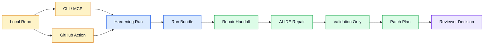

# RepoAssure MVP 规格 v0.3

最后更新：2026年6月25日
状态：规划中
范围：v0.2 之后的分发与修复闭环就绪增量

关联决策：

- [ADR-0004](../../adr/0004-repair-plan-and-task-package.md)：Repair plan and executable task package
- [ADR-0009](../../adr/0009-commercialization-and-licensing-strategy.md)：Commercialization and licensing strategy
- [ADR-0011](../../adr/0011-private-github-engineering-baseline.md)：Private GitHub engineering baseline
- [ADR-0012](../../adr/0012-branch-protection-and-release-boundary.md)：Branch protection and release boundary
- [ADR-0013](../../adr/0013-codex-security-and-security-assurance-lane.md)：Codex Security and Security Assurance Lane
- [ADR-0014](../../adr/0014-distribution-and-repair-loop-readiness.md)：Distribution and repair loop readiness

## TL;DR

v0.2 已证明 RepoAssure 可以完成真实项目验收，并把 findings 转化为 AI IDE 可消费的 repair artifacts。v0.3 的目标是让这条链路更容易被真实用户和 AI IDE 反复使用：从本地 CLI/MCP 扩展到 GitHub Action 分发入口，并把 repair handoff、validation-only、patch plan 打磨成稳定的修复闭环。

v0.3 不默认自动修改目标 repo 代码，不创建 PR，不上传目标 repo 内容，也不实现 hosted dashboard。

## 产品定位

### 一句话定位

RepoAssure v0.3 是面向 AI IDE 和 CI 的本地优先交付保障层，把 repo 验收证据转化为可执行、可验证、可分发的修复闭环。

### v0.3 与 v0.2 的区别

| 版本 | 核心问题 | 主要输出 |
| --- | --- | --- |
| v0.1 | 真实用户路径哪里会坏 | findings、generated tests、hardening report |
| v0.2 | AI IDE 应按什么顺序修 | repair plan、repair task package、repair handoff、execution report、patch plan |
| v0.3 | 用户和 AI IDE 如何稳定运行、消费、复验这条链路 | GitHub Action wrapper、分发示例、修复闭环强化、发布前检查 |

## 背景

当前 MVP v0.2 已完成：

- CLI / MCP P0 hardening flow。
- Web App browser acceptance mode。
- Python/CLI acceptance mode。
- `.hardening/runs/<run-id>` 与 `.hardening/latest/manifest.json`。
- Repair plan、repair task package、repair handoff、verification plan、repair execution report 和 patch plan。
- Security Assurance Lane Phase 1 本地 provider evidence import。
- 真实项目 accepted 用户验收和 33/33 goal audit。

剩余主要问题不在“能不能生成材料”，而在“能不能低摩擦地分发、复用、集成和形成修复闭环”。

## 目标用户

| 用户 | v0.3 价值 |
| --- | --- |
| 独立 AI builder | 用 CLI/MCP/GitHub Action 反复验证 AI 生成 repo 是否可交付 |
| AI 交付团队 | 把 RepoAssure 输出作为客户交付前的标准质量证据 |
| AI IDE / Agent | 从稳定 manifest 和 repair task package 读取下一步修复任务 |
| 小型工程团队 | 在 CI 中保留本地优先的验收证据，为 Team Cloud 前验证需求 |

## 核心工作流

| 步骤 | 说明 |
| --- | --- |
| Local Repo | 用户本地仓库或 CI checkout 后的工作区 |
| CLI / MCP | 本地入口和 AI IDE 入口 |
| GitHub Action | 对本地 CLI 的 CI wrapper，不上传目标 repo 到外部服务 |
| Hardening Run | 复用现有 analyze、boot、explore、generate tests、report、repair plan 链路 |
| Run Bundle | `.hardening/latest/manifest.json` 作为 AI IDE 入口 |
| Repair Handoff | 生成任务包、验证计划和 agent prompt |
| AI IDE Repair | Cursor、Codex、Claude Code 等按任务修复 |
| Validation Only | 对修复任务复跑验证命令，生成执行报告 |
| Patch Plan | 将失败验证证据转成可审查补丁动作计划 |
| Reviewer Decision | 人类决定接受、继续修复或进入后续自动修改能力设计 |

## P0 能力

| 能力 | 优先级 | 验收产物 |
| --- | --- | --- |
| GitHub Action wrapper | P0 | `.github/actions` 或 action entrypoint、usage example、CI fixture |
| CLI/MCP 分发示例 | P0 | README / user guide 中可复制的安装、配置和运行示例 |
| Repair task package 强化 | P0 | 更稳定的 task priority、evidence、verification、agent prompt |
| Validation-only 闭环强化 | P0 | 每个 task 可追踪验证命令、exit code、stdout/stderr 摘要和通过标准 |
| Patch plan 可读性强化 | P0 | 失败证据到 patch action 的分类更清晰，保持不写源码 |
| Public release checklist 可执行化 | P0 | 依赖 license scan、secret/artifact hygiene、release boundary checks 的脚本或文档门禁 |
| Safe examples | P0 | 不含私有数据的示例报告、repair plan、repair handoff 和 patch plan |
| Goal audit 扩展 | P0 | v0.3 交付物进入 goal audit 或等价验收审计 |

## P1 能力

| 能力 | 优先级 | 说明 |
| --- | --- | --- |
| `packages/core` 后续抽取 | P1 | 仅在降低分发和 repair loop 风险时推进 |
| Security provider schema 扩展 | P1 | 增强 Codex Security 之外的 provider import 兼容性 |
| 多 repo workspace repair summary | P1 | 为未来 Team Cloud 验证跨 repo 聚合价值 |
| 产品误报回归集 | P1 | 覆盖 dashboard、图表、下载、剪贴板、分页、筛选、响应式重复布局 |

## 非目标

v0.3 不包含：

- 默认自动修改目标 repo 源码。
- 自动运行 formatter 后写回文件。
- 自动创建 Git branch、commit、issue 或 pull request。
- Hosted dashboard、Team Cloud、SSO/RBAC、组织级策略中心。
- 远程上传目标 repo、截图、trace、日志、env value 或私有 artifact。
- 将 RepoAssure 改造成通用 deep vulnerability scanner。
- 发布公开 package 或添加仓库级 `LICENSE`，除非 public release checklist 完成并另行授权。

## 验收标准

| 类别 | 通过标准 |
| --- | --- |
| 分发 | GitHub Action wrapper 可在 fixture repo 或本仓库 CI 中调用本地 CLI |
| 本地优先 | Action 和文档明确不上传目标 repo 内容，不依赖 hosted service |
| AI IDE 消费 | repair task package、handoff、execution report、patch plan 的入口和字段稳定 |
| 修复闭环 | 至少一个 fixture 或真实 repo 能完成 handoff -> validation-only -> patch-plan 的可复现流程 |
| 安全 | 输出继续脱敏 token、cookie、Authorization、env value、URL 敏感参数 |
| 文档 | README、user guide、testing strategy、release checklist 和 architecture docs 与实现一致 |
| 门禁 | repo hygiene、unit、typecheck、lint、build、goal audit 通过；涉及浏览器/本地端口的完整验证按 blocker 规则记录或提权运行 |

## 决策边界

如果后续要加入以下能力，必须先新增或更新 ADR：

- 默认自动修改目标 repo 源码。
- 自动创建 PR、issue、advisory 或 release。
- Hosted dashboard、Team Cloud 或远程 artifact storage。
- 改变 open-core / commercial 模块边界。
- 改变 RepoAssure 的安全定位，让它成为 scanner runtime 而不是 provider-backed evidence lane。
