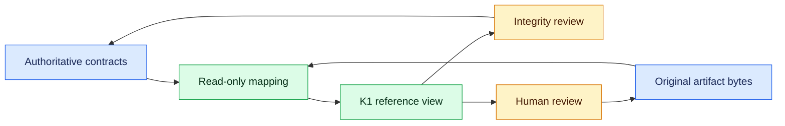

# RepoAssure M1 Open Evidence Kernel Candidate Boundary Contract Design Plan v0.1

Status: `planning_complete_non_authoritative`

Conclusion: `k1_non_authoritative_contract_design_plan_prepared_without_schema_authoritative_contract_or_runtime_implementation`

Candidate: `provider_neutral_read_only_evidence_envelope_adapter_boundary`

## Authority And Scope

This document is one local-only design plan for K1. It is neither a schema nor
an accepted contract, serialized artifact, adapter, runtime, implementation
specification, compatibility claim, authorization receipt, or M1 completion
record.

- Original contracts and artifact bytes remain authoritative.
- K1 is a disposable, rebuildable, non-authoritative projection.
- Repository-owned local evidence is the only design input.
- External standards or provider research performed: no.
- Schema files created: 0.
- Adapter or runtime implementations created: 0.
- Existing producers, consumers, package exports, CLI/MCP entrypoints, and
  artifact bytes changed: 0.
- Roadmap milestones advanced: 0; M1 remains incomplete.

## First Principles

K1 may make heterogeneous local evidence easier to inspect, but it may never
become a shadow source of truth. Every projected fact must retain a path back to
the authoritative source, every omission or conversion must remain visible,
and every consumer must inspect loss and unknown state before reading a
convenience summary. K1 cannot issue a decision, grant authority, make a write,
or convert incomplete evidence into confidence.

## Conceptual Layers

| Layer | Responsibility | Explicit non-responsibility |
| --- | --- | --- |
| Authoritative sources | Define current meaning and retain original bytes | Do not depend on K1 |
| Future read-only mapping | Extract supported metadata and expose omissions | Do not normalize silently or mutate sources |
| K1 reference view | Index references, raw tokens, integrity state, and boundaries | Do not copy domain payload or grant authority |
| Review | Return to the originals to resolve meaning | Do not treat K1 as independent proof |

## Identity And Versioning Proposal

This plan separates three identities. It does not choose a JSON shape, schema
ID, filename, package owner, persistence path, or wire format.

1. **Source-contract identity** preserves the source's actual identity value,
   version, identity location, and artifact type. `schemaVersion: 1`, nested
   identities, descriptor-only identities, and absent identities remain
   distinguishable.
2. **Mapping identity** identifies a future accepted mapping rule set. It must
   change whenever interpretation changes, even if the source does not.
3. **Envelope-instance identity** may be stable only when the source identity,
   redacted authoritative reference, and verified digest are all present.
   Otherwise it remains absent with `incomplete` or `unknown` state.

The future contract version and source-contract version must remain separate.
Additive optional semantics may be considered compatible only after review;
renames, changed meanings, new required semantics, raw-token normalization, or
changed loss behavior require a new major contract and separate acceptance.
Mapping-version drift must never be silent.

## Proposed Semantic Groups

These are responsibilities, not concrete fields or a schema.

| Group | Proposed responsibility | Fail-closed rule |
| --- | --- | --- |
| `sourceContract` | Preserve identity value, version, identity location, artifact type, and identity state | Missing, conflicting, nested-only, or descriptor-only identity stays explicit |
| `subject` | Carry only source-supported, redacted repository, workspace, run, revision, or lane references | Never synthesize a subject from checkout path, environment, or provider data |
| `producer` | Distinguish the source producer from a future K1 mapping component, including versions only when present | Missing provider or producer version remains unknown and is not inferred |
| `evidenceIndex` | Deterministically order relative references, artifact type, optional SHA-256/bytes, proof source, and verification state | Never embed source payload; missing or unchecked digest never becomes match |
| `outcome` | Preserve raw source status first; any normalized disposition is secondary, mapping-versioned, and marked exact, lossy, or unmapped | Unmapped or lossy outcome cannot become pass, acceptance, or authorization |
| `reviewBoundary` | Preserve review requirement, raw decision vocabulary, decision reference, authority reference, and required-before actions | Missing review, decision, authority, or reference remains unknown and blocks derived approval |
| `writeBoundary` | Keep write authorization, observed mutation, and proof method independent | Assertion-only evidence cannot claim independently verified no-write |
| `privacyAndRedaction` | Record local-only scope, redaction state, prohibited content, private-source restrictions, and no-payload-copy intent | Absolute paths, secrets, environment values, unrestricted logs, and private provider output are prohibited |
| `compatibility` | Identify source contract/version, mapping version, authoritative artifact reference, unmapped fields, and loss warnings | Unknown source version or unreviewed mapping is incompatible or unknown, never silently compatible |

Raw statuses and decisions always remain available exactly as recorded. In
particular, `accept-risk`, `accept_risk`, `accepted`, and `approved` are not
synonyms unless a separately accepted mapping explicitly says so and records
the conversion as potentially lossy.

## Unknown, Loss, And Authority

Each future projection must keep a loss ledger that identifies source elements
as preserved, derived, omitted, unmapped, or lossy. Derived values must point to
their mapping version. Missing identity, hash, review, authorization,
observation, proof method, redaction state, or compatibility information stays
explicit.

For this plan, unknown is not pass, fail, defer, or authorization. It cannot be
filled from defaults, neighboring artifacts, timestamps, filenames, provider
assumptions, or ordinary Goal execution authorization. A convenience outcome
can never override a raw token or authorize a later action.

## Integrity Semantics

Future verification states must distinguish at least `match`, `mismatch`,
`missing`, `not_provided`, and `not_checked`. SHA-256 and byte counts, when
available, show only consistency with the referenced local bytes at the time of
verification. They do not prove authenticity, authorship, signature validity,
provenance trust, or an external trust root.

A digest mismatch, missing authoritative reference, or inaccessible original
must remain visible and block any derived confidence. K1 must not rewrite,
rehash, or replace the authoritative source.

## Review And No-Write Semantics

Human review remains bound to the original artifact. The future view may carry
the raw review requirement, decision vocabulary, references, authority, and
required-before actions, but it cannot issue or infer the decision.

No-write evidence uses three separate axes:

| Axis | Examples | Rule |
| --- | --- | --- |
| Authorization | allowed, prohibited, absent, unknown | Authorization is not observation |
| Observation | changed, unchanged, not observed, unknown | Absence of a report is not unchanged |
| Proof method | assertion, hash comparison, snapshot diff, mtime/inventory comparison, unknown | Assertion alone is not independent verification |

Any conflict between axes remains explicit. A no-write summary is admissible
only after the consumer inspects all three axes and their referenced evidence.

## Privacy And Determinism

- References must be local, relative, redacted, and limited to what the source
  contract already supports.
- Payload copying is prohibited; the future semantic intent is
  `payloadCopied=false`.
- Credentials, tokens, environment values, absolute checkout paths, private
  source, unrestricted logs, and provider output must not enter K1.
- Ordering must be deterministic and independent of input enumeration order.
- Generated timestamps, checkout root, host identity, and volatile runtime
  values must be excluded from equality or stable-identity claims.

## Local Validation Matrix For A Future Specification

| Case | Expected design behavior |
| --- | --- |
| Complete source identity and verified digest | Stable reference may be proposed; originals remain authoritative |
| Missing, nested-only, or conflicting identity | Preserve location/state; no synthesized formal ID |
| Missing digest or `not_checked` | Keep explicit state; do not report match |
| Digest mismatch | Fail closed and retain reference to original bytes |
| Unmapped source field | Record in loss ledger; consumer returns to source |
| Lossy status mapping | Preserve raw token and mark normalized value lossy |
| Missing review or authority reference | No derived approval or acceptance |
| Authorization present but mutation unobserved | Do not infer unchanged or no-write |
| Assertion-only no-write | Label assertion; do not claim verified proof |
| Unknown redaction state or prohibited content | Reject projection or fail closed |
| Unknown source version | Incompatible or unknown; no optimistic fallback |
| Different input order | Same deterministic reference ordering |
| Deleted K1 projection | Original contracts and consumers remain unchanged |

Future tests must also prove lossless round-trip of raw outcome and decision
tokens, separation of all integrity states, separation of review and authority,
the write-boundary combination matrix, privacy rejection, deterministic
ordering, and consumer return to authoritative artifacts.

## Review, Acceptance, And Execution Gates

The current design plan is complete, but contract specification, maintainer acceptance, and implementation remain three separate gates:

1. A separately authorized intake may prepare neutral choices about whether to
   draft a contract specification. It must not draft the specification or infer
   a choice.
2. If explicitly approved later, a separately gated Goal may draft a candidate
   specification and validation artifacts. That still does not accept it.
3. Maintainer acceptance or revision of that specification requires an explicit
   decision record.
4. Implementation requires another separately authorized Goal after acceptance.

No authority flows automatically between these gates. Evidence success does
not equal product acceptance, write authority, target authority, or Roadmap
completion.

## Rollback And Abandonment

This plan can be abandoned by deleting or ignoring this non-authoritative
document. No migration, rollback command, compatibility shim, source rewrite,
or consumer change is needed because no schema or implementation exists.

A future proposal must be abandoned if it creates a shadow source of truth,
normalizes raw tokens silently, synthesizes missing identities, copies payloads,
leaks prohibited data, conflates authorization and observation, turns hashes
into authenticity claims, changes existing contracts or bytes, or cannot be
removed without affecting existing consumers.

## Preserved Product State

- Original contracts remain authoritative; K1 remains non-authoritative.
- M1 and M2 remain incomplete; M3-M5 remain strategy-only.
- `auth_redirect` remains `request_revision`.
- Final acceptance remains `defer`.
- Web, Python/CLI, and MCP/Agent acquisition and execution all remain `defer`.
- Authorization receipts, target actions, publication, deployment, launch,
  commit, push, and pull-request actions remain 0.
