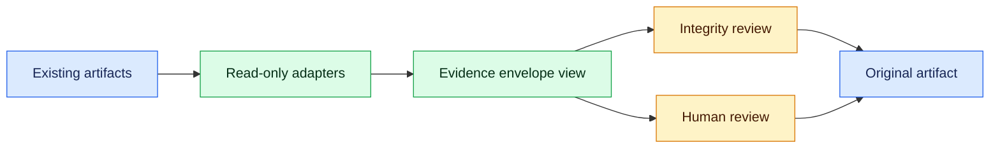

# RepoAssure M1 Open Evidence Kernel Contract Gap Plan v0.1

Status: `planning_complete_candidate_not_accepted`

Conclusion:
`minimal_provider_neutral_local_evidence_envelope_adapter_boundary_identified_without_schema_creation_or_roadmap_advancement`

## Scope And Authority

This record inventories current repository-owned evidence contracts and proposes
one semantic candidate boundary. It is not a schema, accepted specification,
runtime implementation, compatibility claim, or M1 completion record.

- Evidence source: current local repository files only.
- External standards or provider research performed: no.
- Original contracts remain authoritative.
- Schema files created: 0.
- Runtime, adapter, CLI, MCP, detector, or provider integrations implemented: 0.
- M1 remains incomplete and was not advanced.

## M1 Exit-Evidence Basis

The owner-confirmed candidate Roadmap requires five evidence categories before
M1 may advance: versioned contracts, deterministic local evidence, integrity,
human review, and no-write proof. Existing artifacts contribute useful pieces,
but no current contract spans all five categories with one stable identity and
one lossless producer-consumer boundary.

## Local Contract Inventory

The rows group related artifacts into eight product evidence families. The
grouping is for planning only and does not merge, rename, or replace contracts.

| Contract family | Identity/version | Producer | Consumer | Integrity | Human review | No-write |
| --- | --- | --- | --- | --- | --- | --- |
| Hardening run and workspace manifests | Top-level `schemaVersion: 1`; no stable named top-level ID | `runHardeningTool` / `writeRunArtifactBundle` / workspace bundle writer | repair planner, repair handoff, workspace summary, CLI integrity verifier | Local run manifest has SHA-256 and byte counts; rewritten workspace bundle omits the integrity block | Indirect through downstream review flows | No common manifest-level proof |
| Security evidence normalization | Four outputs use `schemaVersion: 1` only | `importSecurityEvidence` / security import tool | repair planner, false-positive catalog, goal audit | Deterministic fallback finding IDs exist; artifact hashes do not | Provenance and validation status exist, but no common decision reference | No structured common proof |
| Repair plan and task package | `schemaVersion: 1` only | `generateRepairPlan` | repair handoff and workspace summary | Covered only when an enclosing run manifest indexes the files | Review is added downstream | No common proof on the source contracts |
| AI IDE repair evidence chain | Top-level `schemaVersion: 1`; nested `.v1` identities for handoff, execution, patch plan, and evidence package | repair handoff, execution-preview, patch-plan, and evidence-package runners plus existing CLI/MCP wrappers | later repair stages, AI IDE, maintainer | Artifact index stores references and schema/status, not hashes | Structured `requiredBefore` and allowed decisions | Execution, patch-plan, and evidence-package records expose no-write assertions and prohibited actions |
| Workspace repair summary | `repoassure.workspace-repair-summary.v1` plus `schemaVersion: 1`; consumer uses separate `@1` identity | `runWorkspaceRepairSummary` | consumption validator and AI IDE | Structural validation only; no artifact hash | Required review, reasons, decisions, and decision-before-action boundary | Structured authorization, observed-action flags, output allowlist, and fixture-level source comparisons |
| False-positive and calibration evidence | Catalog body uses `schemaVersion: 1`; bundle and calibration contracts use `@1`; catalog descriptor names an ID absent from the body | catalog builder/runner and calibration builder | consumption validators and maintainer gate workflow | No artifact hash | Review fields, privacy metadata, pending decisions, and five manual gates | Local-only and target/runtime-change boundaries are explicit, but mostly assertion-level |
| Project Intelligence and ADR decision evidence | Snapshot uses `schemaVersion: 1`; context, watch, handoff, intake, recommendation, decision, and plan records use separate `@1` IDs | snapshot and staged governance runners | viewer, backlog, context, watch handoff, next governance stage | No common hash | Explicit staged maintainer decision boundaries | Local-only/target-write flags exist on selected artifacts, not one common proof contract |
| Core, user, and representative acceptance evidence | Core/user acceptance is Markdown-only and unversioned; representative multi-mode `@1` is an accepted future spec without current instances | acceptance runners and future lane producers | goal audit, human reviewer, future representative consumer | No common hash; representative spec requires future hash/bytes | User decision and notes exist; representative review is specified but has no current instance | No common current proof; all representative acquisition/execution remains deferred |

Control-plane Goal, index, and Progress Snapshot state is excluded from the
candidate product envelope. It remains governance source of truth rather than
provider evidence payload.

## Four-State M1 Gap Matrix

`reuse` means a current primitive can be retained as-is. `gap` means required
coverage is missing. `conflict` means implemented families express the same
concept incompatibly. `unknown` is reserved for evidence that cannot be
established from authorized local sources.

| M1 exit category | Primary state | Reusable basis | Blocking reason |
| --- | --- | --- | --- |
| Versioned contract | `conflict` | Existing `schemaVersion: 1`, nested `.v1`, and top-level `@1` identifiers | Identity location and dialect are inconsistent; user acceptance is unversioned; a catalog descriptor names an ID absent from the embedded body |
| Deterministic local evidence | `reuse` | Stable sorting, caller-supplied timestamps in multiple runners, local JSON-first read order, deterministic finding IDs, and repeatable validators | A later design must still define which volatile fields are excluded from equality claims |
| Integrity | `gap` | SHA-256, byte counts, relative paths, and match/mismatch/missing verification on local run manifests | Coverage is not shared by workspace rewrites or most evidence families; integrity is not authenticity or an external trust root |
| Human review | `conflict` | Required-before boundaries, decision records, notes, manual gates, and fail-closed pending states | Vocabularies differ (`accept-risk`, `accept_risk`, `accepted`, domain-specific choices) and are not bound through one lossless decision reference |
| No-write proof | `gap` | Authorization flags, commands/patches/source-changed fields, prohibited actions, output allowlists, and source hash/mtime/inventory fixture checks | Assertions and independently observed proofs are mixed; several families expose no structured proof method |

Primary-state counts: `reuse=1`, `gap=2`, `conflict=2`, `unknown=0`.
Unknowns still remain inside individual rows: missing hashes cannot be treated as
passes, and representative or external-provider instances do not exist under
current authorization.

## Single Minimal Candidate Boundary

Candidate ID:
`provider_neutral_read_only_evidence_envelope_adapter_boundary`

Candidate name: **K1 — Provider-Neutral Local Evidence Envelope Adapter
Boundary**.

K1 is an additive, read-only, reference-only semantic layer for a future
separately accepted design. It would index original artifacts without copying
their domain payload or turning an evidence summary into execution authority.

### Candidate Semantic Fields

| Field group | Minimum semantic responsibility |
| --- | --- |
| `sourceContract` | Preserve the original identity value, version, identity location, artifact type, and unmapped identity state. |
| `subject` | Carry only redacted repository, workspace, run, revision, and lane references that the source already supports. |
| `producer` | Record component, capability, provider/provider version when present, and source-generated timestamp. |
| `evidenceIndex` | Reference relative artifact paths, media/artifact type, available SHA-256/bytes, and explicit verification status. |
| `outcome` | Preserve raw status and expose only a versioned normalized disposition; lossy or absent mappings become `unknown`. |
| `reviewBoundary` | Preserve review requirement, raw decision vocabulary, decision reference, authority, and required-before actions. |
| `writeBoundary` | Separate write authorization from observed mutation and record proof kind as assertion, hash comparison, snapshot diff, mtime/inventory comparison, or unknown. |
| `privacyAndRedaction` | Preserve local-only status, redaction state, prohibited content, and private-source restrictions. |
| `compatibility` | Record adapter version, unmapped fields, loss warnings, and a reference back to the authoritative artifact. |

### Compatibility Constraints

- Do not change any existing schema ID, field, filename, serialization byte,
  package export, CLI command, MCP tool, resource, prompt, or twelve-tool
  registry entry.
- Do not require existing producers or consumers to understand the candidate.
- Do not promote a nested `agentContract.schema` or descriptor-only identity
  into a top-level identity silently.
- Preserve raw statuses and decision tokens. Never silently merge
  `accept-risk`, `accept_risk`, `accepted`, or domain-specific decisions.
- Missing identity, hash, review, authorization, observation, or proof method
  must remain `unknown` or fail closed; it must not be filled as passing.
- Verify only existing hash evidence against original bytes. Hash consistency
  does not prove authenticity, authorship, or an external trust root.
- Keep references relative and redacted; do not copy source code, credentials,
  environment values, private provider output, or unrestricted logs.
- Treat the candidate as local-only and non-authoritative. It can never issue
  a decision, authorization receipt, command, patch, target write, or milestone
  transition.

### Non-Goals

- No schema creation, promotion, migration, or implementation.
- No adapter, reference engine, runtime, CLI/MCP entrypoint, provider, or
  external-standard implementation.
- No universal finding taxonomy, detector, suppression, severity change, or
  replacement of domain contracts.
- No SARIF, SLSA, in-toto, or other compatibility/conformance claim.
- No auth-redirect revision, fixture work, target discovery/acquisition,
  target execution/write, contribution pilot, Team Cloud, or Enterprise work.
- No publication, deployment, launch, contact, pricing, spend, commit, push,
  pull request, history rewrite, or force push.
- No M1 advancement or completion claim.

## Roadmap And Decision Preservation

- M1 remains incomplete; K1 is a non-authoritative candidate only.
- M2 remains incomplete because Web, Python/CLI, and MCP/Agent acquisition and
  execution decisions remain six explicit `defer` decisions.
- M3–M5 remain strategy-only.
- `auth_redirect` remains `request_revision`; no missing named change is
  inferred.
- Final product acceptance remains `defer`.
- Authorization receipts and target actions remain 0.

## Conditional Next Governance Gate

Because exactly one coherent candidate exists, the next acceptance-sized Goal
may prepare an unfilled maintainer decision intake for K1. Its choices are:

- `approve_for_separately_gated_contract_design`
- `request_revision`
- `defer`
- `reject`

The intake may not select or infer a choice. Approval, if later supplied, would
authorize only a separately gated design Goal—not a schema, adapter, runtime,
M1 advancement, or external action.

## Residual Risks

- The dirty and untracked worktree supports current-byte evidence only, not a
  clean-baseline or historical-authorship claim.
- Existing integrity blocks prove local consistency, not signed provenance.
- Existing no-write booleans vary between assertions and observed fixture
  comparisons.
- K1 can become a shadow source of truth unless every future projection keeps
  an explicit authoritative-artifact reference and loss marker.

