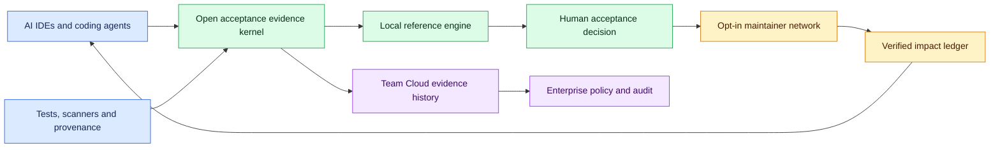

# RepoAssure Unified Long-Term Product Strategy v0.1

Status: owner_confirmed_direction
Decision date: 2026-08-02
Conclusion: `unified_long_term_strategy_recorded_without_execution_authorization`

This record defines RepoAssure's owner-confirmed long-term direction. It is a
strategic roadmap, not a claim about current availability, a formal industry
standard, an implementation Goal, or authorization to access an external
repository or system.

## Canonical Vision

> RepoAssure's long-term vision is to become provider-neutral, local-first
> acceptance infrastructure for AI-generated software and AI-assisted
> contributions, so software can be verified, repaired, accepted, and safely
> delivered across coding agents, repository platforms, and evidence
> providers.

In owner-facing language:

> RepoAssure 的长期愿景，是成为跨 AI Agent、代码托管平台和证据提供方的
> 本地优先软件验收基础设施，让 AI 生成的软件能够被验证、修复、接受并安全
> 交付。

The current product truth remains narrower: RepoAssure is a local-first AI code
delivery assurance layer. The global infrastructure language describes a
direction to validate, not a present market-reach or product-completion claim.

## First-Principles Thesis

1. AI makes code generation abundant; trustworthy acceptance is the scarce
   resource.
2. The durable product is not one universal detector. It is the contract that
   turns heterogeneous test, scanner, provenance, runtime, and human-review
   evidence into a reviewable acceptance decision.
3. Open-source impact is earned through maintainer trust and accepted outcomes,
   not through scan volume or pull-request count.
4. Organization-level willingness to pay concentrates in longitudinal evidence,
   collaboration, policy, retention, audit, and private control—not in removing
   credible local verification from individual developers.

## Three Long-Term Pillars

| Pillar | Strategic direction | Explicit boundary |
| --- | --- | --- |
| Open acceptance evidence kernel | Keep the artifact contract and local reference engine open, normalize evidence from multiple providers, and evolve toward a provider-neutral acceptance-attestation contract. | Not a universal detector, not a replacement for every testing or security tool, and not yet a formal external standard. |
| Maintainer-first contribution network | Discover opportunities only within explicit repository policy, prepare evidence-backed changes, require human or policy approval, and learn from accepted outcomes. | Not a bulk-PR robot, not permission to crawl the world, and not authorization to clone, analyze, contact, or write any repository. |
| Open-core adoption with commercial control planes | Use Open Core for local adoption and ecosystem trust; validate Team Cloud for shared evidence history and collaboration; validate Enterprise for policy, audit, identity, retention, and private deployment. | Team Cloud and Enterprise remain planned, not available; this record sets no price and authorizes no hosted runtime, sales action, deployment, or launch. |

The phrase “scan the world's known open-source repositories” is therefore
treated as a long-term discovery ambition. Any future implementation must be
opt-in or policy-authorized, rate-limited, license/privacy reviewed, reversible,
and separated from the authority to open a pull request.

## Strategic Architecture

Fallback reading:

| Flow | Meaning |
| --- | --- |
| Providers and agents -> evidence kernel -> local engine | RepoAssure normalizes evidence and keeps the default execution path local. |
| Local engine -> human decision -> opt-in network | A contribution becomes eligible only after evidence and an explicit acceptance boundary. |
| Verified outcomes -> ecosystem adoption | Impact is measured by accepted, useful outcomes rather than generated PR volume. |
| Evidence kernel -> Team Cloud -> Enterprise | Commercial value layers on shared history, collaboration, policy, and audit without replacing the open local contract. |

## Three-Year Candidate Roadmap

The horizons are directional sequencing, not delivery dates or executable
commitments. Every milestone requires its own accepted spec, Goal, evidence,
and authorization.

| Milestone | Directional horizon | Outcome to validate | Exit evidence before advancing |
| --- | --- | --- | --- |
| M1 — Open evidence kernel | 0–6 months | Consolidate current local artifacts into a stable provider-neutral acceptance model and reference engine. | Versioned contracts, deterministic local evidence, integrity checks, human-review boundary, and no-write proof. |
| M2 — Representative real-world proof | 6–12 months | Demonstrate useful Web, Python/CLI, and MCP/Agent acceptance across separately authorized representative targets. | Lane-specific passes, false-positive cost, repair usefulness, maintainer review, and explicit acquisition/execution receipts. |
| M3 — Maintainer-first contribution pilot | 12–18 months | Pilot opt-in, evidence-backed contributions with repository policies, contribution budgets, deduplication, cooldowns, and human approval. | Maintainer consent, accepted-outcome rate, complaint/retraction rate, and zero unauthorized target actions. |
| M4 — Open-core impact and Team Cloud validation | 18–27 months | Publish consented outcome evidence and validate optional shared history, collaboration, and review workflows. | At least three real team workflows, repeat use, willingness-to-pay evidence, artifact-only cloud boundary, and no source upload by default. |
| M5 — Enterprise control plane and ecosystem standardization | 27–36 months | Validate private policy, identity, retention, audit, deployment, and interoperability with mature evidence ecosystems. | Design partners, control evidence, private-deployment proof, and compatibility mappings accepted through separate governance. |

Current stage assessment: RepoAssure has meaningful M1 local evidence,
repair, integrity, CLI/MCP, and governance foundations. M2 remains incomplete
because representative target acquisition decisions are 3/3 `defer` and
representative target execution decisions are separately 3/3 `defer`.
M3–M5 are strategy directions only; no contribution network, public impact
ledger, Team Cloud runtime, or Enterprise runtime is authorized or claimed.

## Impact and Commercial Flywheel

The primary impact loop is:

`trusted local evidence -> maintainer-approved improvement -> verified outcome
-> consented public proof -> open-core adoption -> more provider integrations
-> better evidence quality`.

The commercial loop is:

`open-core adoption -> repeated team workflow -> shared evidence history and
collaboration -> policy/audit need -> Team Cloud or Enterprise validation`.

The product should optimize for verified acceptance outcomes, not activity
volume.

| Metric family | Preferred signal | Guardrail |
| --- | --- | --- |
| Product trust | Evidence-backed acceptance decisions and useful repairs | False-positive, rollback, and unresolved-blocker rate |
| Maintainer network | Accepted contributions, maintainer opt-in, repeat participation | Unsolicited-PR complaints, retractions, and policy violations |
| Open-core adoption | Active local repositories and repeat local workflows | No forced cloud dependency or default source upload |
| Commercial validation | Retained team workflows and policy/audit adoption | No availability, pricing, or revenue claim without real evidence |

## Competitive Position

RepoAssure should compete as the acceptance and governance layer between code
generation, evidence providers, repository workflows, and production delivery.
Its intended moat is the combination of:

- an open, portable evidence contract;
- a credible local reference engine and evidence graph;
- maintainer-trust controls for contributions;
- consented longitudinal acceptance outcomes; and
- organization policy, audit, and private-control integration.

It should integrate with AI IDEs, coding agents, Git hosts, tests, scanners, and
provenance systems rather than attempt to replace all of them. SARIF, SLSA,
in-toto, and similar ecosystems are compatibility-research candidates only;
this record does not claim current conformance or implementation.

## Safety and Authorization Boundaries

Before any future target discovery, acquisition, execution, contribution, or
publication, a dedicated approved workflow must resolve:

- repository opt-in or machine-readable policy;
- license, privacy, terms, and rate-limit review;
- exact target revision and bounded data access;
- dry-run evidence and maintainer-review responsibility;
- separate authorization for acquisition, execution, and write/PR actions;
- deduplication, contribution budgets, cooldowns, rollback, and incident stop;
- consent for any public impact record.

This strategy record does not authorize target access, cloning, acquisition,
installation, analysis, execution, mutation, pull requests, external contact,
public claims, publication, deployment, launch, telemetry, customer outreach,
pricing, or spend changes.

## Current Goal Separation

The active Autopilot Goal remains RepoAssure Conditional Dead Control
Calibration Bounded Detector Implementation Authorization Intake v0.1 with
status `ready_to_execute`. This strategy decision does not replace, complete,
skip, or execute that Goal and does not modify `.autopilot` state.

## Related Sources

- [Canonical PRD](../../PRD.md)
- [Canonical SPEC](../../SPEC.md)
- [Canonical PLAN](../../PLAN.md)
- [Product Applicability Boundary](product-applicability-boundary-v0.1.md)
- [Commercialization Strategy](commercialization-strategy-v0.1.md)
- [Open-Core Packaging Spec](open-core-packaging-spec-v0.1.md)
- [Team Cloud and Enterprise Spec](../specs/team-cloud-enterprise-spec-v0.1.md)
